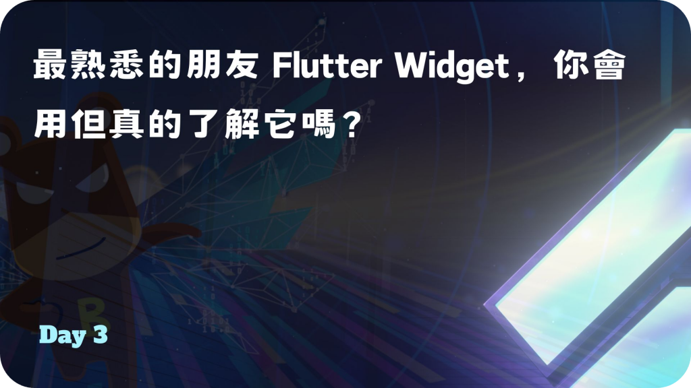
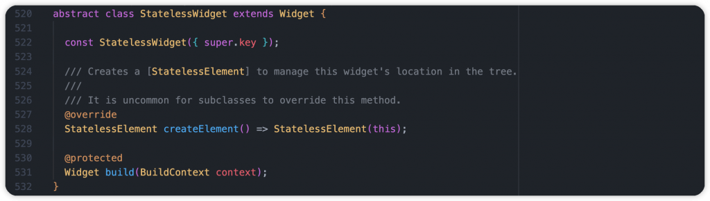
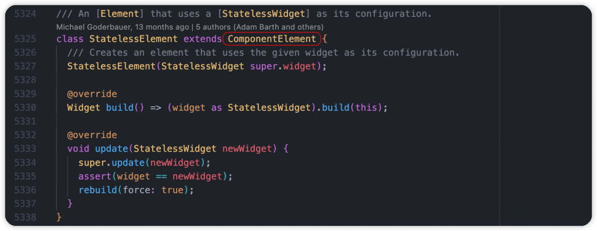
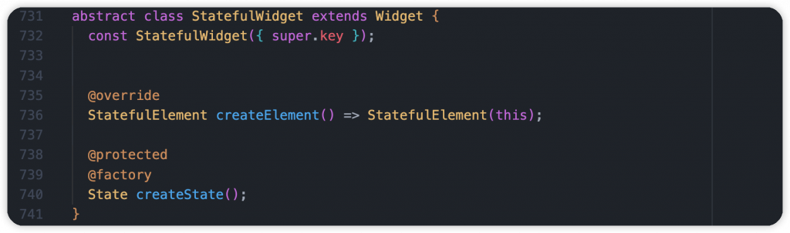
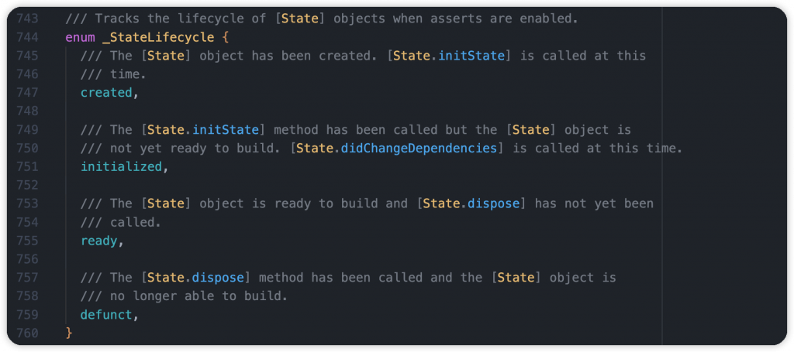
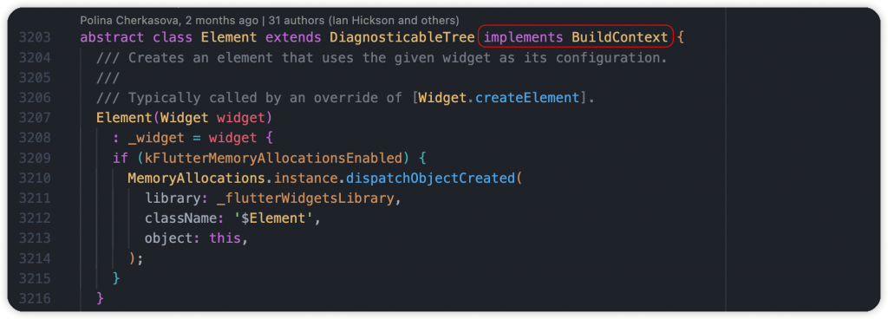
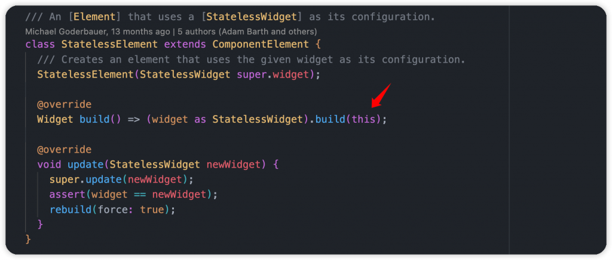
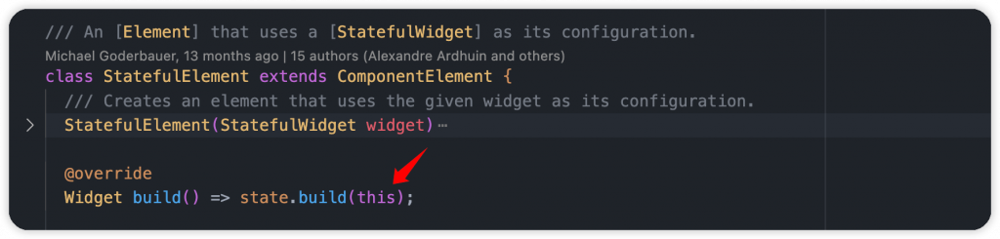
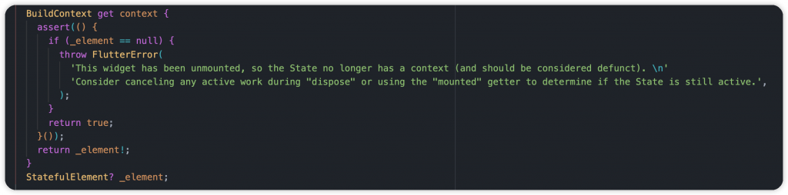

# Day 3: 最熟悉的朋友 Flutter Widget，你會用但真的了解它嗎？

- 發布時間：2023-09-18 22:01:58
- 原文連結：<https://ithelp.ithome.com.tw/articles/10321643>
- 系列標記：探索 Flutter 由裡到外，三十天帶你前往進階系列 第 3 篇



所有 Flutter 開發者從 Widget 開始，通過嵌套的方式來完成聲明式 UI，可以讓我們輕易實現腦中的畫面與效果，大家一定跟它非常熟悉吧。但它除了是畫面上的一個元素外，大家是否了解它的核心概念，它的特性、能力、如何刷新、在什麼情況下對整體性能最好，當深入了解它後我們就能更輕鬆的去建置 UI，APP 的品質也能更完整。

以下整理了有關 Widget 的幾個重點角色與說明，我們一起來認識它吧！

------------------------------------------------------------------------

## Widget


- Widget 顧名思義就是元件，也是畫面的一部分，實際上是一個不可變的配置、描述。描述一個 UI 元素的配置，就是 Widget 接收的參數。例如對於 Text 來講，文字內容、顏色、對齊方式、風格樣式都是它的配置參數
- 創建 Widget 時同時會創建一個對應的 Element，接著 Widget 會被 `inflate()` 到 Element，由 Element 控制，管理生命週期。當 Widget 發生變化，新舊 Widget 會透過 `canUpdate()` 進行比較，主要觀察 `runtimeType` 以及 `key`，由 Element 決定更新或是重建
- Widget Class 上的註解 `@immutable` ，代表是不可變的實體，屬性都為 **final**。如果需要 mutable 則會使用 StatefulWidget
- `Key` → 設置 LocalKey 與 GlobalKey。決定是否在下一次 build 的時候使用舊的 Element 與 RenderObject
- `createElement()` → 在創建 Widget 時，會先使用此方法生成對應節點的 Element，Element 為元件的核心、管理者。在 Flutter 裡 Element 有幾種，包含 StatelessElement、StatefulElement、InheritedElement、RenderObjectElement
- `canUpdate()` → 靜態方法，當兩個元件刷新時，決定是否使用舊 Widget 對應的 Element 更新配置，只要 `runtimeType` 和 `key` 同時相等時就會更新，否則就會銷毀並創建新的 Element
- `_debugConcreteSubtype()` → 在開發時會使用，當進行 hot reload 會導致 Element 執行 `updateChild()`，過程中用來辨別 Widget 類型  
  

## StatelessWidget

- 不需要狀態的元件，創建之後就不會再更改外觀，適合不需要維護狀態的場景去使用
- 核心為 `StatelessElement`， 由 override `createElement()` 創建，也因為是 ComponentElement 所以不用創建 RenderObject
- 生命週期相當簡單，初始化到 `build()` 渲染
- 相關元件：Text、Container  
    
  

## StatefulWidget

- 有狀態的元件，適合需要保存、更新狀態的場景
- 與 StatelessWidget 相同， 由 `createElement()` 創建 `StatefulElement`，管理 Widget 以及 State。也因為是 ComponentElement 所以不用創建 RenderObject
- 在初始化時必須要在 `createState()` 提供一個 State 物件，通常會與元件名稱相同，後綴加上 State，讓它幫忙紀錄狀態。`State` 本身會保持與 `context` 永久性的關聯，而 context 實際上就是 Element
- 一個 StatefulWidget 對應一個 State 與一個 Element，State 與 Element 實體不會被多個元件同時使用
- 相關元件：MaterialApp、Image  
    
  

## State

- 掌握元件需要的狀態，當狀態更新時可以使用 `setState()` 方法進行刷新，會再次執行最重要的 `build()` 方法，讓新的 Widget Tree 可以根據新的狀態給予不同的效果呈現
- 當 Parent 節點刷新時，當前 State 會透過 Widget 的 `canUpdate()` 檢查新舊元件的 **runtimeType** 和 **key**，相同時會使用新配置更新原本的 Element 配置，並觸發 `didUpdateWidget()` 方法，參數為舊元件的配置，可以進行一些處理
- State 相關操作都由 Element 掌控
- 生命週期，以下提供簡易說明
  - `createState()` → 創建 State。此時的狀態為 **created**
  - `initState()` → 初始化 State
  - `didChangeDependencies()` → 依賴的數據、狀態有更新。此時的狀態為 **initialized**
  - `didUpdateWidget()` → 新舊元件更新、替換的時候
  - `reassemble()` → 執行 hot reload
  - `build()` → 建立 Widget Tree。此時的狀態為 **ready**
  - `deactivate()` → 停止活躍，當被移出 Widget Tree 的時候
  - `dispose()` → 銷毀 Widget、State 和 Element，釋放資源。此時的狀態為 **defunct**

> 詳細的生命週期解說可以閱讀另一篇文章 (等待發布)



### setState()

- 基礎認知就是觸發元件刷新。告訴 Flutter Framework 有狀態改變了需要執行 rebuild，根據狀態呈現不同內容
- 背後主要透過 Element 觸發 `markNeedsBuild()`，標記 Widget 需要更新，並將 `_dirty` 屬性設置為 true，代表待會進行處理
- 需要注意 callback 不能是 async 非同步操作，因為整個 Rendering pipeline 是同步進行，需確保即時與高效能，否則會出錯

> 如果想要更深入的了解 `setState()`，可以閱讀此篇文章 (等待發布)

### 為什麼 Flutter 要將 StatefulWidget 和 State 分開？

- 一切為了高效。只要配置、屬性更新， StatefulWidget 就會被丟棄並重新創建，它實際上只是一個 Element 掌握的外觀配置，消耗成本很低。最重要的是 **State** 和 **Element**，需確保兩者能持續被使用，不要被銷毀
- `State` 會持續存在，由於不會在每次 StatefulWidget 重建時都被丟棄，避免了昂貴的成本消耗，可以不斷地透過重建 `Widget` 以響應新的配置並保持狀態、效果可以連貫，這也是 Flutter 動畫存在的原因

## BuildContext

- BuildContext 本身是一個抽象介面，對於 Widget 來說它實際上是 `Element`，能避免直接對 Element 進行操作，只暴露開發需要的 API
- `build()` 方法的 `BuildContext` 參數，表示元件在 Widget Tree、Element Tree 中的上下文、位置，能進行樹上操作的一個核心，可以直接存取樹上的資料  
    
  

從 **StatelessElement** 來看，在 `build()` 執行時，使用 `StatelessWidget-build()`，並將自己 `this` 當參數給予，化身為 Widget 裡的 **BuildContext**。  
  
從 **StatefulElement** 來看，在 `build()` 執行時，使用 `State-build()`，並將自己 `this` 當參數給予，化身為 Widget 裡的 **BuildContext**。  
  
  
by Flutter

當我們在 StatefulWidget 使用 `context` 時，它實際上就是檢查 `_element` 屬性是否為 null，並進行回傳。在存取的情況下必須確保 context 有綁定到 Element Tree 樹上，才能讓相關操作正常運行。  


### mounted

- 一個布林值 getter，代表 Widget、State 與 Element 是否有連結並在樹上了，這時候才可以執行 `setState()`
- 最好的習慣是在執行 `setState()` 方法進行刷新時，可以先透過 `mounted` 檢查是否 State 和 Element 在樹上，因為過程會需要 Element 執行樹上操作，避免當下處在和 `dispose()` 階段。實際上就是確認 Element 是否為空值  
  

``` dart
// StatelessWidget usage
context.mounted

// StatefulWidget usage
mounted
```

在另一篇文章我們有提到了 **Synchronous BuildContexts** 觀念，基本上在處理任何的非同步操作後，如果要存取 context，都必須先使用 `mounted` 確認樹上狀態，否則可能會出錯哦。  


> 詳細說明可閱讀此篇文章 (等待發布)

### findAncestorWidgetOfExactType()

- 允許從當前元件開始向上遍歷 **Widget Tree**，查找父級元件的方法
- 使用前需確保 context 在樹上的位置，否則會找不到東西。最簡易的方式是使用 **Builder** 進行子原件包裝

實際範例，當我們使用 `findAncestorWidgetOfExactType()` 時有可能會找不到實際的元件，有可能父節點沒有提供，會是 nullable 變數，這時候就可以使用 Dart 3 提供的 **if-case matching** 來處理，方便我們存取資料。

``` dart
class DemoPage extends StatelessWidget  {

  @override
  Widget build(BuildContext context) {
    return Scaffold(
      appBar: AppBar(
        backgroundColor: Theme.of(context).colorScheme.inversePrimary,
        title: Text(widget.title),
      ),
      body: Center(
        child: Builder(
          builder: (context) {
            final scaffold = context.findAncestorWidgetOfExactType<Scaffold>();

            if (scaffold case final Scaffold scaffold) {
              return ColoredBox(
                color: scaffold.backgroundColor ?? Colors.transparent,
                child: const Text('Hello'),
              );
            }

            return const SizedBox.shrink();
          },
        ),
      ),
    );
  }

}
```

提醒：建議先熟悉 BuildContext 與 Element 兩者的關係，再使用 findXXX 和 dependXXX 相關 API 會比較合適，否則盡量減少使用，避免發生錯誤時不知道原因。  


------------------------------------------------------------------------

本文主要跟大家分享什麼是最根本的 Widget，以及常見的 StatelessWidget、StatefulWidget、State、BuildContext，當了解他們的能力以及關係後，在開發時就能更有感覺。當元件 rebuild 的時候，可以很清楚知道原因、過程，以及是否有效率的在處理這些任務。先有個基本概念，也不需要死記它們，多看多了解，自然就能越來越熟悉。

另外， InheritedWidget 以及 RenderObjectWidget 沒有在這裡提到，細節很多會造成篇幅太長，有需要的朋友可以留言或讓我知道，我會再額外撰寫其他文章來介紹它們。

------------------------------------------------------------------------

## 延伸閱讀

[Day 4: Flutter 高效核心，了解 Element 生命週期與使用](https://ithelp.ithome.com.tw/articles/10322382)
