# Day 4: Flutter 高效核心，了解 Element 生命週期與使用

- 發布時間：2023-09-19 18:47:02
- 原文連結：<https://ithelp.ithome.com.tw/articles/10322382>
- 系列標記：探索 Flutter 由裡到外，三十天帶你前往進階系列 第 4 篇

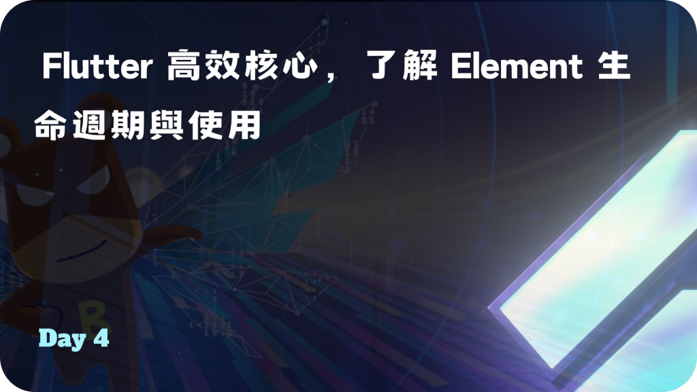

相信大家對於 Widget 的接觸已經很熟悉了，那 Widget 是誰在管理的？這時候要幫忙請出背後的主角了，也就是 **`Element`**，身為 Flutter 高效的核心支柱，它管理著 Widget 和 RenderObject，包含 Pipeline 的 build、layout、paint 幾個工作階段，所以它非常重要。

本文主要說明 Element 身份、生命週期，以及正確的使用方式，希望可以幫大家建立良好的觀念，有效提升開發品質。那我們就不多話了，直接往下開始吧！

------------------------------------------------------------------------

- Element 身為三棵樹的核心，擁有 Widget 和 RenderObject 的實體，是兩者的管理者與溝通管道。掌管 Widget 的生命週期、管理 State 狀態的儲存與更新、操控 RenderObject 佈局與繪製
- 跟 Widget 有著一對一的對應關係，當 Widget 創建時相對應就會有一個 Element 被創建，Widget 本身是 Element 的配置，而 Element 實際上就是 Widget 裡的 `BuildContext`
- Element 創建起來很昂貴，通常建議頻繁更新並持續使用它，盡量避免銷毀和重建。除非 `runtimeType` 和 `Key` 不同，當 `Widget-canUpdate()` 返回 false，這時候就會重建

與 Widget 的初始互動。以 StatelessWidget 為例，在創建 Element 的同時，會將自己交給 Element 管理。實際上 Widget 就是一個描述配置。  
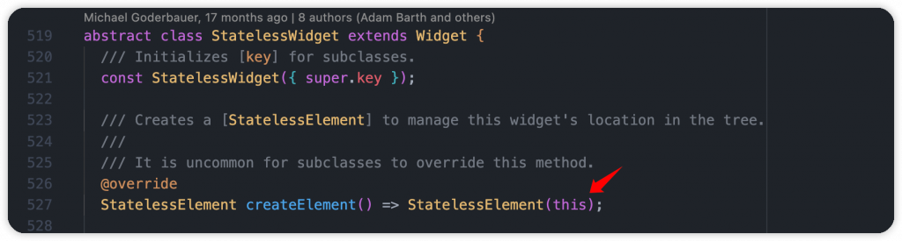  
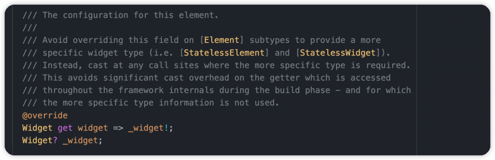

與 RenderObject 的初始互動。以 ErrorWidget 為例，它就是我們在開發時遇到錯誤的紅色畫面。本身沒有 child 所以使用 **LeafRenderObjectWidget**，本身的 RenderObject 為 **RenderErrorBox**，那它什麼在什麼時候被創建呢？在 RenderObjectElement 綁到樹上的時候，會透過 Widget 使用 `createRenderObject()` 產生 原本設置好的 RenderObject，也就是 **RenderErrorBox**  
  
  


Element 的特殊 `slot` 屬性，主要給 Parent 節點用來辨別 child 在 List 的位置。當使用 `Element-updateChild()` 時，過程中會進行 `Element-inflateWidget()`，參數為子元件跟它的 slot 所屬位置。  


而前面我們有提到 Element 實際上是 `BuildContext`，可以從 **StatelessElement** 和 **StatefulElement** 來確認 。  
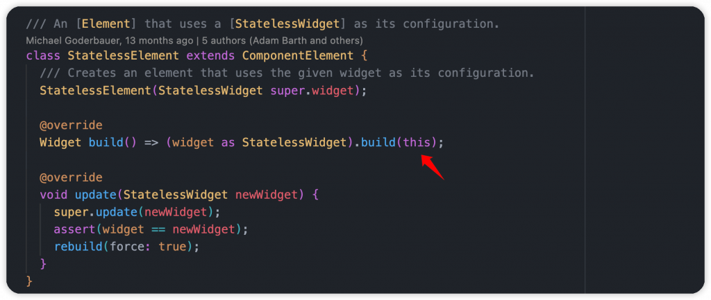  
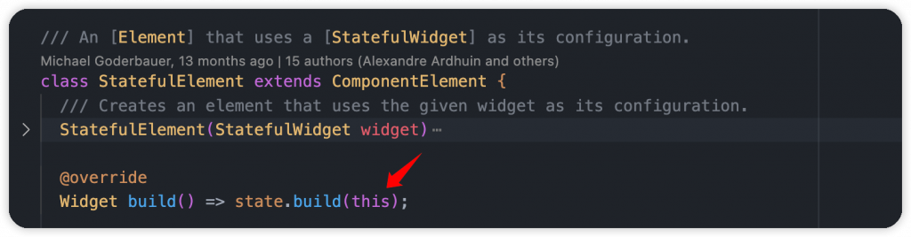  
Element 本身實作了 `BuildContext` 。  


## Element 生命週期

### 1. mount()

當 Element 第一次添加到樹時，進行狀態的初始化。狀態從預設的 **`initial`** 轉為 **`active`**。  


以 StatefulWidget 的 **ComponentElement** 為例，一開始都會先呼叫父類的基礎操作，在進行個別處理。會先確保 `_lifecycleState` 為 `active` 才進行初始 build。  
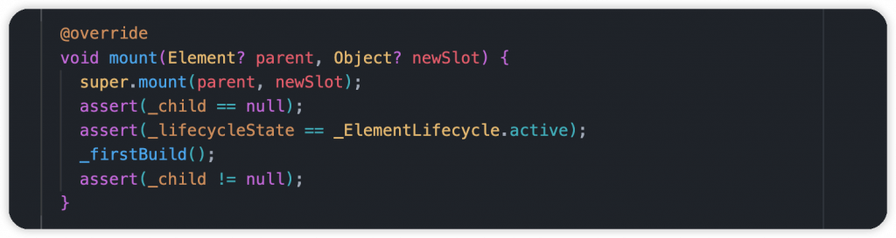

StatefulElement 覆寫了`_firstBuild()`，過程中會陸續檢查和變更 State 的生命週期狀態，接著執行 `didChangeDependencies()`，然後透過父類的 `_firstBuild()` 觸發 `ComponentElement-performRebuild()` 和 `Element-performRebuild()`，最終執行 State 裡的 `build()`，將 Widget Tree 創建出來。  
  
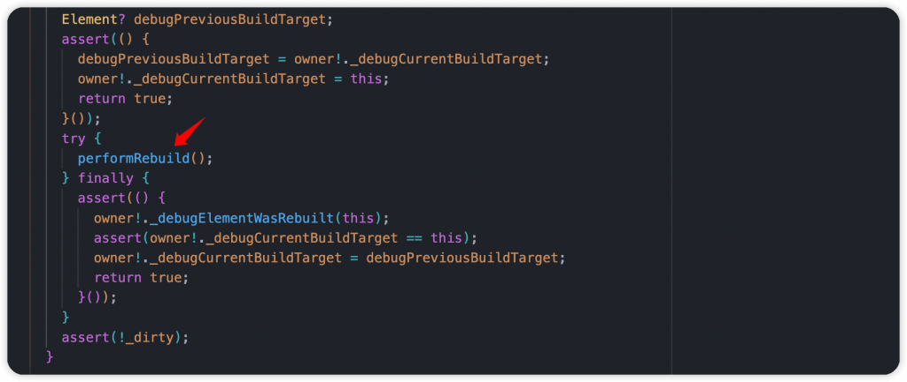  
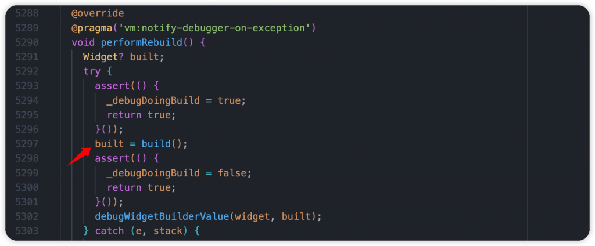

### 2. activate()

激活之前經過 `deactivate()` 釋放的元素，它們的特點是擁有 **GlobalKey**，狀態從 **`inactive`** 轉為 **`active`**。重新分配舊有的 State 和 Element 給新的 StatefulWidget。

從 StatefulElement 來看，一開始執行 `Element-activate()`，當中會檢查狀態是否為 `inactive`，將它更新成 `active` 狀態。最後安排此 Element 和 Widget 進行 rebuild。  
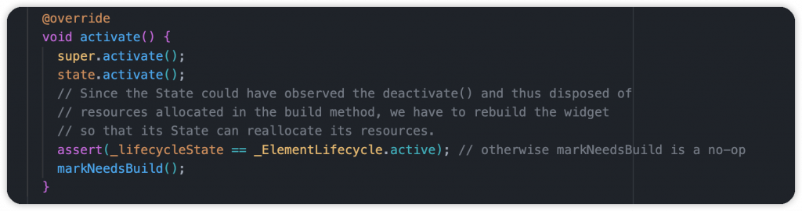  


在開發時，我們也可以在 State 裡覆寫 `activate()`，但通常不太需要用到。  


### 3. update()

透過新的元件更新 Element 配置，這也是最理想的操作，盡可能地讓 Element 使用 `update()`，實現最小消耗。

從 StatefulElement 來看，當使用新的元件更新時，會先執行父類別 `Element-update()`，檢查實體不同並且在透過 Widget 的 `canUpdate()` 檢查 **runtimeType** 和 **key**，確保都相同後才會更新配置。

  


接著更新 State 的 `_widget` 屬性，並執行 `didUpdateWidget(oldWidget)` 參數為舊的元件配置，我們在開發時就能透過此方法進行一些狀態操作或是資源釋放。最後執行 `rebuild()`  


### 4. deactivate()

當 Element 從 Element Tree 中移除或移動時觸發，狀態從 **`active`** 轉為 **`inactive`**。可能 Widget 的 runtimeType 或 key 發生了變化，當其中一個條件不符合時，Element 會從樹上被移除，最終被銷毀是放掉。

不過 Element 還有機會被再次使用，可以經由 **Tree Surgery** 實現。當元件本身設置 GlobalKey 時，如果元件替換階層或是移動到其他 Widget Tree，Element 和 State 可以再次被激活。在當前幀觸發 `activate()` 和 `update()`，最終回歸 **`active`** 狀態。如果沒有被 reactivated 就會被銷毀。

從 StatefulElement 來看，首先會觸發 State 的 `deactivate()`，跟 `activate()` 一樣我們可以做一些處理。  
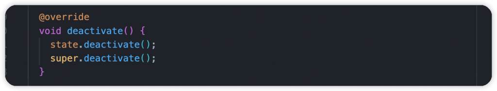  


接著呼叫父類 `Element-deactivate()`，確保為 active 狀態，最終更新成 **`inactive`**。  
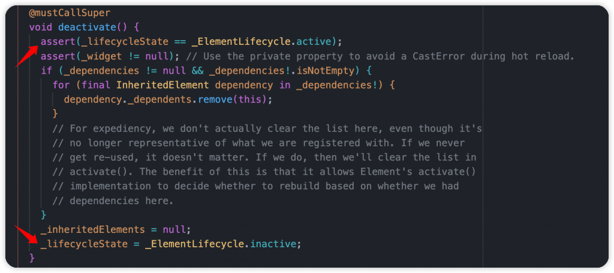

### 5. unmount()

如果 Element 在當前 frame 期間沒有被重新激活，它將從 Element Tree 解綁並且不能再重複使用，狀態從 **`inactive`** 轉為 **`defunct`**。

從 StatefulElement 來看，會先執行父類的 `unmount()`，檢查是否已經 deactivate 並且狀態為 **`inactive`**，接著針對有設置 GlobalKey 的 Element 進行釋放，不需要再保存在清單裡，最終將 `_lifecycleState` 更新成 **`defunct`**。

接著呼叫 State 的 `dispose()`，也是我們很熟悉的方法，負責用來釋放資源。最後將 State 實體和 element 物件都更新成 null，完整地避免記憶體洩漏。這時候 State 也無法在執行 build 了  
  


## BuildContext Access Correctly

此範例有一個 HomePage，按鈕打開 BottomSheet 進行顯示，透過 `Scaffold.of(context)` 取得 ScaffoldState(藉此可以知道 Scaffold 本身是一個 StatefulWidget)，使用 `showBottomSheet()` 開啟，但是這時候會出現無法存取 **Scaffold** 的相關訊息。  


``` dart
class HomePage extends StatelessWidget {
  @override
  Widget build(BuildContext context) {
    return Scaffold(
      body: TextButton(
        onPressed: () {
          Scaffold.of(context).showBottomSheet(
            (context) => const SizedBox(
              height: 200,
              child: Text('Dash!'),
            ),
          );
        },
        child: const Text('Hi!'),
      ),
    );
  }
}
```

錯誤訊息：`Scaffold.of() called with a context that does not contain a Scaffold.`

``` dart
======== Exception caught by gesture ===============================================================
The following assertion was thrown while handling a gesture:
Scaffold.of() called with a context that does not contain a Scaffold.
```

由訊息我們可以得知 context 從樹上找不到 **ScaffoldState**，代表沒有 Scaffold 元件，那是問什麼呢，範例上不是有嗎？我們進到 static `of()` 方法來一探究竟，其中透過 context 使用了 `findAncestorStateOfType()` 從祖先、父節點查找 **ScaffoldState**，找到就直接回傳，否則會丟出例外，也就是我們看到的訊息。  
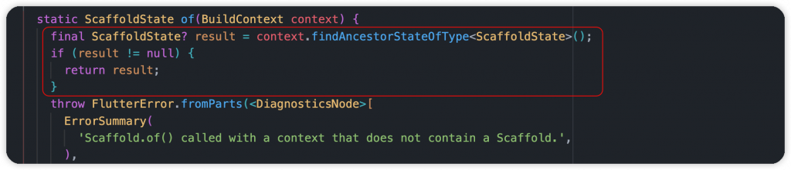

從範例來看，我們使用 `Scaffold.of(context)` 的 context 是來自於上層，而不是在 Scaffold 裡面的節點，所以往上找當然就找不到。如果 HomePage 第一頁，通常上層就會是根元件的 **MaterialApp**，那層還沒有使用任何的 **Scaffold** 元件，所以才會導致錯誤。

### 正確方式

#### 1. 包裹 Builder

在元件外層包裹 `Builder` 元件，對於該層次提供一個 `context`，創建一個樹上節點，讓我們可以存取到之前的祖先、父節點。

``` dart
@override
Widget build(BuildContext context) {
  return Scaffold(
    body: Builder(
      builder: (context) {
        return TextButton(
          onPressed: () {
            Scaffold.of(context).showBottomSheet(
              (context) => const SizedBox(
                height: 200,
                child: Text('Dash!'),
              ),
            );
          },
          child: const Text('Hi!'),
        );
      }
    ),
  );
}
```


#### 2. 自定義元件 HomePageButton

自定義新的 Widget，可能是 StatelessWidget 或 StatefulWidget，透過 `build(context)` 提供的 context 來使用。

``` dart
@override
Widget build(BuildContext context) {
  return const Scaffold(
    body: HomePageButton(),
  );
}
```


> 提醒：在開發 UI 時，需確保 `context` 的位置和來源，準確使用而不要越層級存取

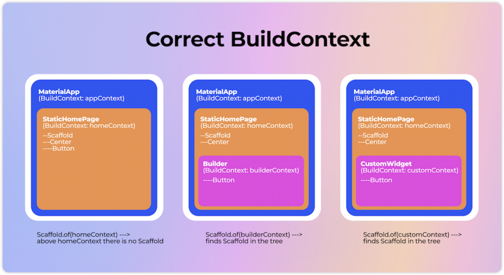  
by Daria Orlova

------------------------------------------------------------------------

個人建議 Flutter 開發者都能了解 `BuildContext` 和 `Element`，盡可能地熟悉它，知道相關運作原理以及生命週期。它們能在狀態管理的主題上給予非常大的幫助，當發生錯誤時，我們能在第一時間有個概念與想法，才不會發呆不知道如何是好，可以更快且有效地解決問題。

`Element` 是 Flutter 高效的原因，請盡可能與它保持友善互動。相信很多人跟我一樣，都是看了很多文章、學習每位開發者的理解，再搭配 source code 閱讀，才能越來越熟悉它。總之，投資在這上面是很值得的一件事，當我們能正確使用它的時候，實現高效且高品質的產品就不會很困難了。

------------------------------------------------------------------------

## 延伸閱讀

[Day 3: 最熟悉的朋友 Flutter Widget，你會用但真的了解它嗎？](https://ithelp.ithome.com.tw/articles/10321643)
