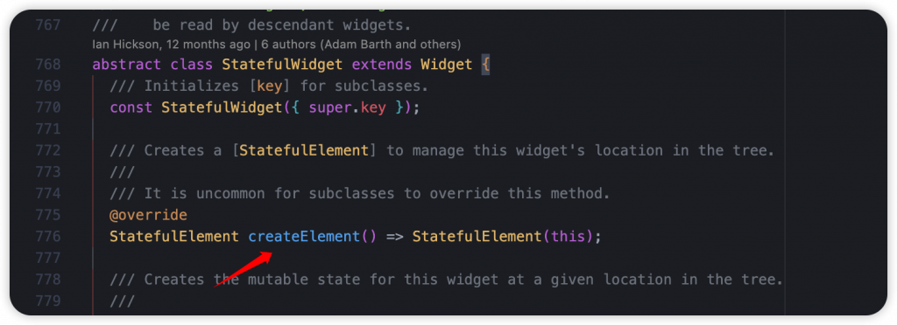
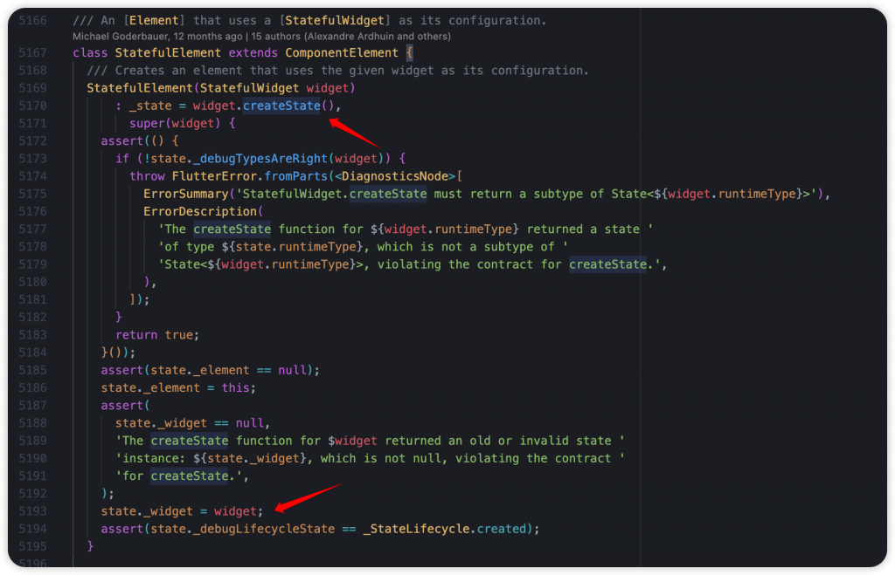
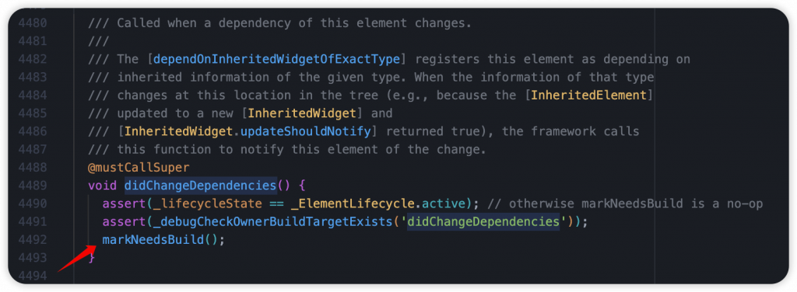
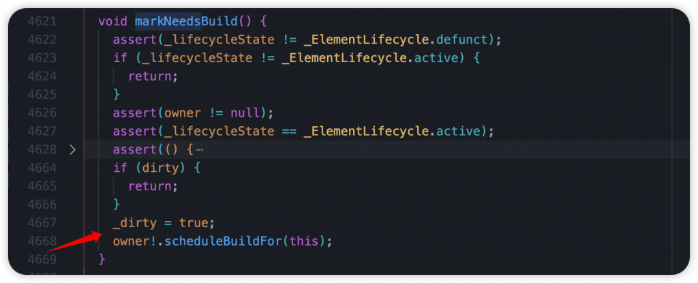
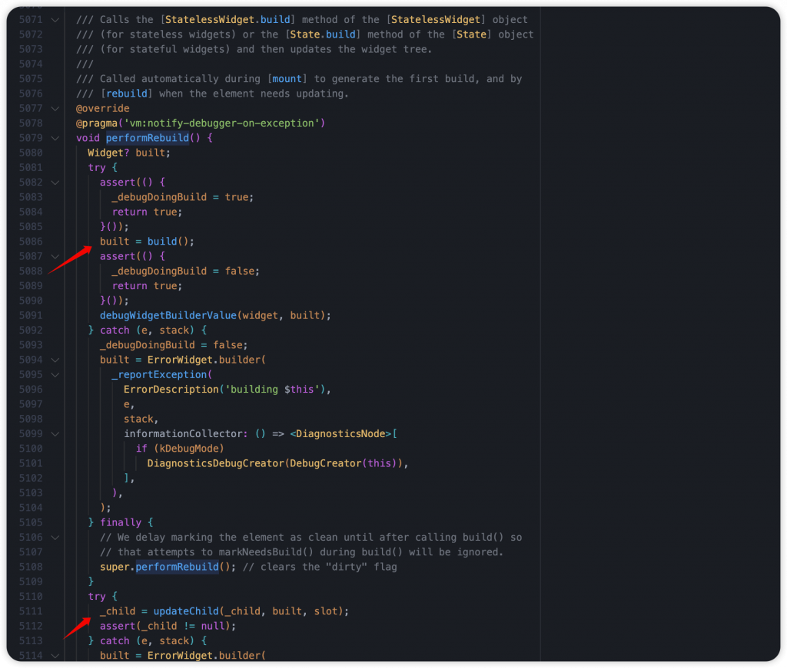
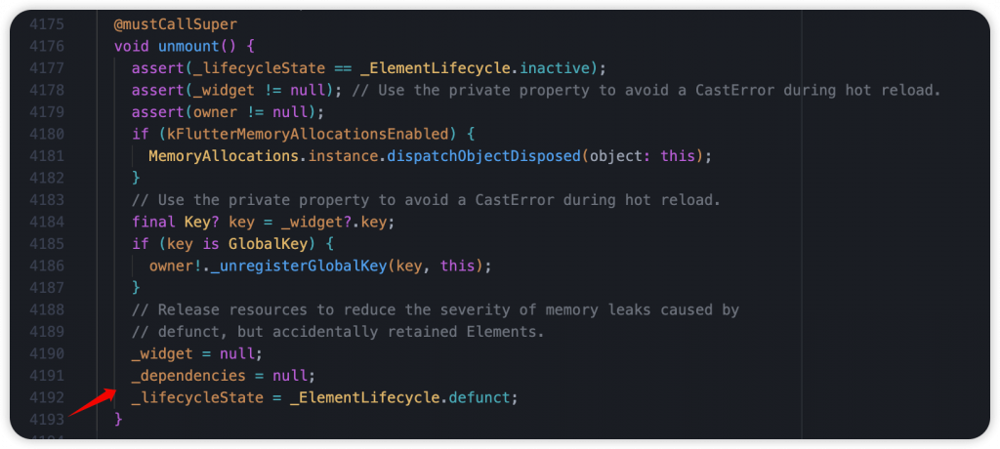

# Day 5: Flutter 的 StatefulWidget 和 State 生命週期，先熟悉它們再開發吧！

- 發布時間：2023-09-20 20:24:14
- 原文連結：<https://ithelp.ithome.com.tw/articles/10321406>
- 系列標記：探索 Flutter 由裡到外，三十天帶你前往進階系列 第 5 篇

生命週期在大部分的軟體開發中都會了解這個名詞，簡單來說就是某個東西從出現到消失，中間的每個階段都會有一個對應的狀態，那為什麼要有狀態？這些狀態都是為了讓開發者在特定情境下去針對應用程式、物件、UI 或是進行合適的操作，例如：在一開始的時候，我們需要將某些服務啟動或是給予屬性初始值，準備待會使用; 在初始化後的第二階段，可以開始進行資料的操作，可能是請求資料，也可能是數據處理; 最後在被銷毀，準備死亡的階段，可以進行資源的釋放，防止記憶體洩漏，讓整體效能提升。開發者在對的時間做對的事，告訴 APP 該怎麼運行和顯示，確保使用者擁有好的體驗，以及 APP 能流暢的呈現，這些都是我們的職責。所以生命週期對於 Mobile 開發來說非常重要，是不可忽視的一環。

大家都知道 Flutter 中有 StatelessWidget 和 StatefulWidget，而 StatefulWidget 因為需要長期保持狀態，會需要透過 State 去維護，它本身是託管在 Element 底下，也因為成本高的關係不適合重複創建。Flutter Framework 讓 Element 以及 State 可以在不同情境下觸發一些介面，讓我們能即時針對當前的 Widget 或是資源去進行處理，而在 State 中就有比較多環節我們需要注意，以下就跟著我來了解它們。

------------------------------------------------------------------------

## StatefulWidget Lifecycle Diagram

#### Combine State LifeCycle

## createState()

- Widget 初次創建時，同時會創建一個 **State**，負責在接下來記錄所有狀態
- 詳細過程
  1.  StatefulWidget 呼叫 `createElement()`，創建 StatefulElement 同時注入 Widget  
      
  2.  在建構子由 Widget 呼叫 `createState()` 創建新的 State，並由 Element 記錄下來
  3.  最後再將此 Widget 更新到 state 身上的 widget 屬性  
      

## initState()

- Widget 創建後的初始化(只會呼叫一次)，此時 State 狀態為 `created`
- 狀態轉變的過程，首先調用 `super.initState()`，接著 StateLifecycle 會轉變為 `initialized`，並呼叫 `didChangeDependencies()`
- 可在這裡進行其他服務的初始化，例如 Animation、Controller 等等
- 提醒：避免在函式裡使用 InheritedWidget 和 Provider 的 context 存取，因為有可能依賴物更新後不會被通知要更新，請確保 MediaQuery.of(context) 這類的操作放置在 `didChangeDependencies()` 、`build()` 等等其他位置

State 生命週期包含 4 個部分，包含 `created`、`initialized`、`ready`、`defunct`。  

## didChangeDependencies()

- State 狀態爲 `initialized`
- 觸發後裡面只有做了一件事，就是 `markNeedsBuild()`，也就是我們使用 `setState()` 做的事情，進行多層的生命週期與狀態檢查後，標記此元件對應的 element 為 **dirty**，並添加到 \_dirtyElements 這個清單，等候待會下一幀進行 rebuild
- 直接幫大家歸納幾個關鍵的觸發原因
  1.  元件初次執行 `createElement()` 的時候被 `mount` 綁定到樹上，這時候就會調用
  2.  依賴的 InheritedWidget 產生變化、有更新。例如：Theme.of(context)、Locale.of(context) 等發生變化時，依賴元件的 `didChangeDependencies()` 方法將會被調用
  3.  父元件的階層改變
  4.  元件本身的 Type 與 Key 改變  
        
      

## didUpdateWidget()

- 可以在此檢查新舊元件、屬性是否不同，根據不同條件進行服務的重置，或是調整某個狀態。例如：在 `didUpdateWidget()` 中取消 Old Widget 訂閱的 callback，並讓 New Widgets 訂閱 callback
- 透過 Widget.`canUpdate()` 來檢查 Widget Tree 中同一位置的新舊節點，決定是否要更新，如果返回 true，代表新舊元件的 `key` 和 `runtimeType` 都相同，就會觸發`didUpdateWidget()`。使用新 Widget 配置更新原本的 Element 配置; 反之如果返回 false 則創建新的 Element
- 幾個常見場景
  1.  本身進行 hot reload，在 `ressemble()` 後會觸發 `didUpdateWidget()`
  2.  父元件執行 `setState()` 或其他會執行 `build()` 的操作，父元件不會觸發 didUpdateWidget()，而子元件 `didUpdateWidget()` 會被觸發
- 提醒：`setState()` 在這使用會沒有作用，因為 didUpdateWidget() 執行完後就會執行 `rebuild()`，也就是 State 的 `build()`  
  

## reassemble()

- 為了 debug 開發使用，在執行 Hot Reload 後呼叫
- release 模式下會被忽略，不會使用
- 執行順序
  1.  `reassemble()`
  2.  `didUpdateWidget()`
  3.  `build()`

針對當前元件執行 `markNeedsBuild()`，觸發 `build()` 進行 rebuild，接著同時針對所有的 child 都執行 `reassemble()`。  

## build()

- State 狀態爲 `ready`
- 最熟悉的部分，也就是創建 Widget 內容、整個 Widget Tree，或是更新
- 大部分操作都會影響 build()，通常前面執行了 `didChangeDependencies()`、`didUpdateWidget()`，或是我們手動執行 `setState()`，都會觸發它

底層是 Element 會執行 `performRebuild()`，接著觸發 StatelessWidget-build() 或是 State.build() 創建 Widget Tree，並將 element 本身的 dirty 屬性設為 false，代表乾淨了、更新完成，最後在使用 `updateChild()` 進行 child 刷新。  

## deactivate()

- 當 Widget 從 `Widget Tree` 中被移出後呼叫，移出後會等待重新添加到 `Widget Tree`，可能會在當前幀更改完成之前重新插入樹中，如果未被插入到其他節點時，則會繼續執行 `dispose()`
- 重新插入其他樹中，可以通過 **GlobalKey** 來實現，Widget 從這顆樹移動到另一顆樹，或是移動到其他的階層位置，這個技巧稱為 **Tree Sugery**，其中還包含對應的兩個好夥伴 Element 以及 RenderObject

看 Code 部分，同時在這裡也會將此元件原本有依賴的 InheritedWidget 都拿出來，以迴圈的方式，將此 Widget 從他們的依賴者名單中移除，也就代表之後的更新不會再通知我了。最後將 Element 生命週期設為 **inactive**。  

## dispose()

- State 狀態爲 `defunct`
- 將 Widget 永久銷毀，包含 Element 和 Render Object，釋放資源
- `context.mounted` 屬性會被設置為false，也代表生命週期的結束，所以不能在此執行 `setState()`
- 其中 `super.dispose()` 應該作為 Widget-dispose 的最後一個執行函式，資源釋放需要在之前執行，如果在後面則不會處理
- 提醒，在元件使用到的資源記得要釋放掉，否則會造成記憶體洩漏。例如：**TextEditingController**、**AnimationController**、**Ticker**、**Stream** 等等

元件的 Element 會執行 unmount()，從樹上拔除，並將元件和相關依賴資源釋放，然後生命週期從 inactive 轉變為 defunct，這個時候 State 生命週期也會轉變為 defunct 狀態。  
  

## mounted & context.mounted

- 用來檢查 Element 是否存在，是否還在 Element Tree，還在的話代表我們可以繼續存取 context 物件以及它的屬性
- 這裡使用到的 context 本身是 `BuildContext` ，它也是 Element 的介面，實際上就是 Element，也代表這個 Widget 在樹中的位置
- 常見用法，通常我們進行在非同步操作後，需要透過它檢查是否綁定，接著才能進行 `setState()`，或是其他 context 操作

可以看到源碼，很簡單的就是檢查 element 是否為 null。可以由註解得知，同時也是在檢查 State 物件是否還存在。最後一行也提到，避免在 `mounted` 為 false 的時候執行 `setState()`，不然就會報錯。

如果專案有使用 **flutter_lints** 套件保護代碼品質的話，它本身也有提供相對的規則來幫我們檢查是否有在非同步操作後直接使用 context。也提醒大家 Linting Tool 代碼分析是很重要的哦。  

------------------------------------------------------------------------

在 Flutter 中關於生命週期這件事，Element 是核心角色，它掌管著 Widget 和 State、RenderObject 更新，建議開發者可以去了解他們，或是跟著我解析 Source Code，當我們越熟悉也代表越了解 Flutter 以及 APP 是如何運作，開發過程中會更有感覺喔！

------------------------------------------------------------------------

## 延伸閱讀

[Day 6: 完全掌握 Flutter APP 生命週期，跟著我從源碼認識它！](https://ithelp.ithome.com.tw/articles/10324112)
