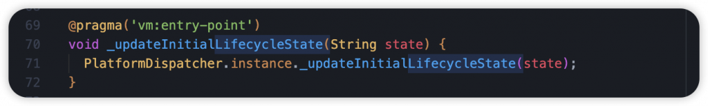
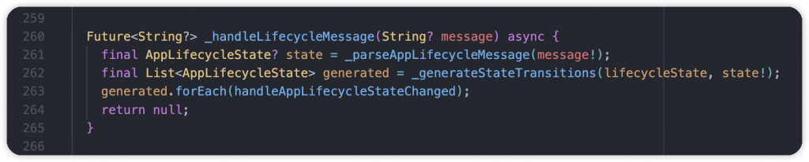
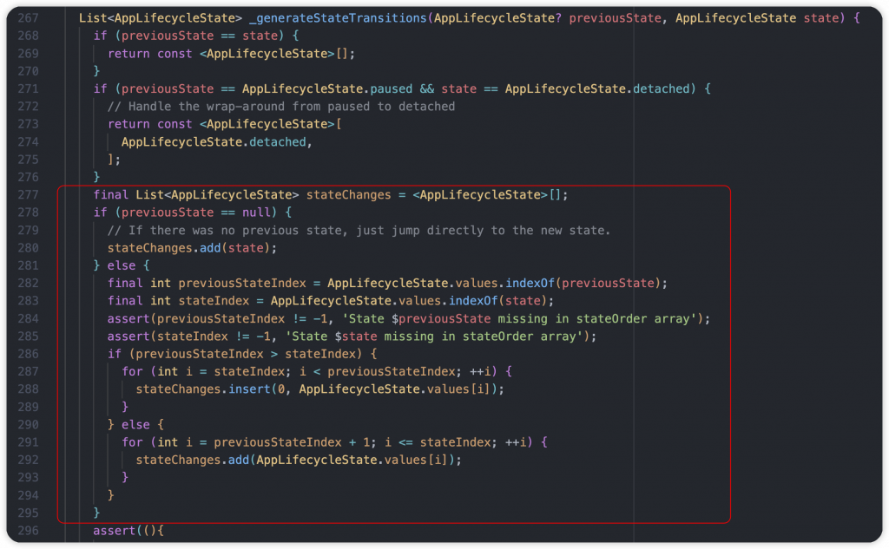
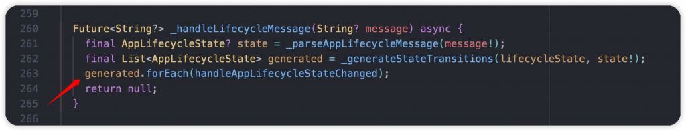
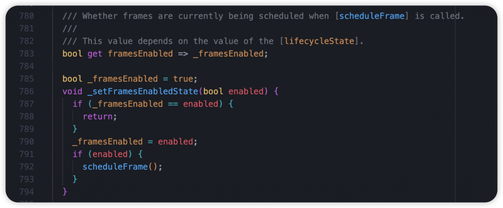
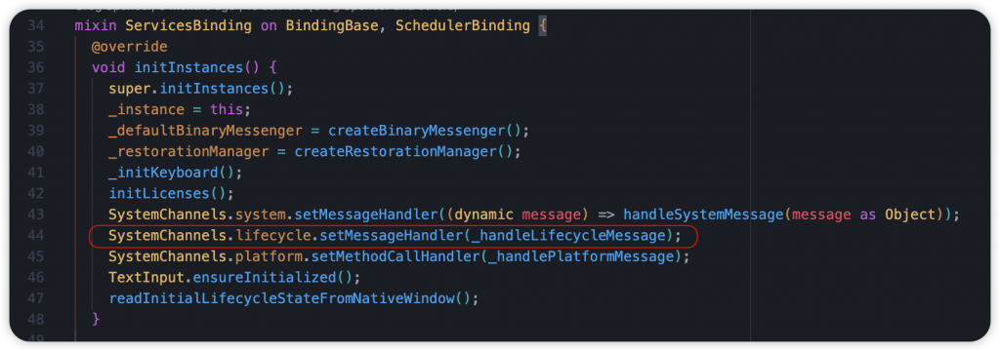
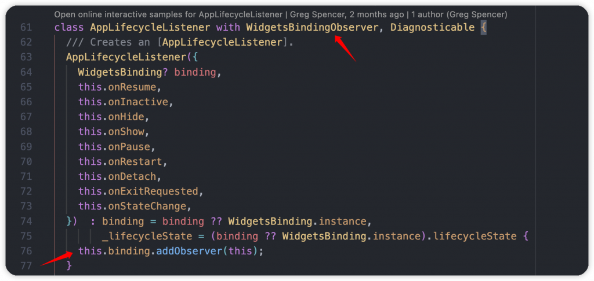
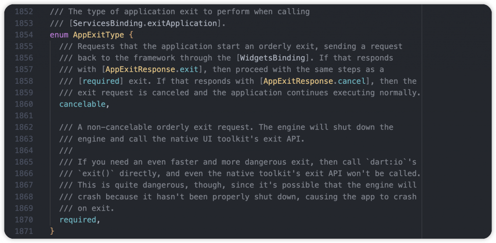
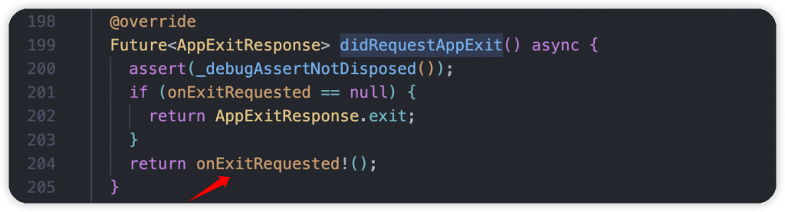

# Day 6: 完全掌握 Flutter APP 生命週期，跟著我從源碼認識它！

- 發布時間：2023-09-21 20:38:32
- 原文連結：<https://ithelp.ithome.com.tw/articles/10324112>
- 系列標記：探索 Flutter 由裡到外，三十天帶你前往進階系列 第 6 篇


到了生命週期第二篇，開發者不僅要了解 StatefulWidget 的生命週期，很常也會需要現在 APP 的週期狀態，而在 8/17 剛發布的 Flutter 3.13 改版，新增了 **AppLifecycleListener** api，讓我們更完整的掌控生命週期，而且多了幾種狀態，讓開發者能夠更精準的處理每個情境。常見的情境，包含我們在做一些 Socket 通訊的應用，即時在用戶到背景的時候失去連線，或是遊戲玩到一半返回桌面需要先暫停。在每個狀態下即時進行一些相對應的措施，讓使用者有一個良好的體驗。本文中會跟大家說明監聽生命週期的所有方式(新舊方法)，特別是 **AppLifecycleListener** 類別。

------------------------------------------------------------------------

## AppLifecycleListener

從字面上來看 AppLifecycleListener 就是負責監聽 APP 生命週期，而它跟我們常用的 `didChangeAppLifecycleState()` 不同地方就是能掌握的情境更多，先說明一下 APP 所有狀態

1.  `resumed` → 在裝置前景
2.  `inactive` → 剛退出螢幕前景
3.  `hidden` → 隱藏內容
4.  `paused` → 退到裝置背景
5.  `detached` → APP 被銷毀、釋放

#### resumed

- 在前景運行，通常手機正在顯示 APP 畫面
- 可以跟使用者互動

#### inactive

- 非活動狀態
- 在前景時插入其他應用，切到手機的APP選擇頁、子母畫面、電話、下滑的控制中心、系統視窗訊息等等，接著就是進入 `hidden` 狀態
- 此狀態等於 Android.onPause()

#### hidden

- 即將進入背景時的過渡階段

#### paused

- 在背景運行
- 無法跟使用者互動，也是非活動狀態
- 此狀態等於 Android.onStop()

#### detached

- 一開始與結束的停止狀態
- 一旦從 Platform 收到第一個生命週期更新，就會更新到當前狀態
- 實際情況：APP被關閉清除

------------------------------------------------------------------------

知道 APP 五大狀態後，接下來要了解狀態轉變過程中會觸發哪些情境也就是程式裡的 callback，總共有八種，我們需要了解從 APP 啟動到被銷毀的過程以及從背景回到前景過程。  


### APP開啟到停止運作

1.  state: detached
2.  `onStart()`
3.  state: resumed
4.  `onInactive()`
5.  state: inactive
6.  `onHide()`
7.  state: hidden
8.  `onPause()`
9.  state: paused
10. `onDetach()`
11. state: detached

### APP背景回到前景

1.  state: paused
2.  `onRestart()`
3.  state: hidden
4.  `onShow()`
5.  state: inactive
6.  `onResume()`
7.  state: resumed

提醒：onPause()、onDetach()、onRestart() 這三種狀況只會出現在 **iOS** 和 **Android** 裝置

有人看到這裡可能會問說，有沒有任何狀態改變都能捕捉的 callback？當然有呀！這時候我們可以使用 `onStateChange()`，除了個別狀態的 callback 會被觸發以外這個方法每次都會被觸發，讓我們在開發時可以進行不同處理。文章後面會有實際開發方式

------------------------------------------------------------------------

取得當前 APP 狀態可以使用幾個方式 ，可以通過創建新的 `AppLifecycleListener` 或通過覆寫 `WidgetsBindingObserver.didChangeAppLifecycleState` 也能經由`SchedulerBinding.instance.lifecycleState` 來查看當前的APP狀態，有幾種方式能存取我們要的資料。

### 取得當前狀態

可以使用 `SchedulerBinding.instance.lifecycleState`，本身是 nullable，所以存取前記得檢查是否為空值。

``` dart
@override
void initState() {
    super.initState();

    _state = SchedulerBinding.instance.lifecycleState;
    if (_state != null) {
        debugPrint(_state!.name);
    }
}
```

### 監聽全部狀態

這件事很簡單，只需幾個步驟即可，首先我們要在 StatefulWidget 的 State 上去 with `WidgetsBindingObserver` 這個 mixin class，透過它我們才能進行 APP 狀態監聽。

``` dart
class _MyHomePageState extends State<MyHomePage> with WidgetsBindingObserver {
    ...
}
```

那我們如何透過 WidgetsBindingObserver 去監聽呢，首先我們需要透過 `addObserver()` 去註冊這個 State 為監聽者，當有週期變化的時候才會通知我們。

WidgetsBinding 本身是一個 Flutter Framework 和 Flutter Engine 層溝通的橋樑，其中針對 SchedulerBinding(安排任務)、GestureBinding(手勢操作)、RendererBinding(渲染操作)等等都是它服務的對象。而在這過程中如何做到通知呢？核心都會使用到 InheritedWidget 去執行狀態更新。

1.  在 State 裡的 `initState()`，也就是一開始的時候進行觀察者註冊

``` dart
@override
void initState() {
    super.initState();
    
    WidgetsBinding.instance.addObserver(this);
}
```

2.  在 State 裡的 `dispose()`，在銷毀的時候進行觀察者釋放，讓記憶體有效使用

``` dart
@override
void dispose() {
    WidgetsBinding.instance.removeObserver(this);

    super.dispose();
}
```


3.  覆寫 `didChangeAppLifecycleState()`，監聽 APP 的五種狀態，在 Flutter 3.13 更新後多了 `hidden` 狀態

``` dart
@override
void didChangeAppLifecycleState(AppLifecycleState state) {
    super.didChangeAppLifecycleState(state);

    if (state == AppLifecycleState.resumed) {

    } else if (state == AppLifecycleState.inactive) {

    } else if (state == AppLifecycleState.hidden) {
  
    } else if (state == AppLifecycleState.paused) {

    } else if (state == AppLifecycleState.detached) {

    }
}
```

你以為這樣就結束了嗎？當然還沒，我們來了解一下底層做了哪些事。

在 APP 一開始 Flutter Engine 會透過 `_updateInitialLifecycleState()` 進行初始狀態的通知，接著 ServiceBinding 裡的 `readInitialLifecycleStateFromNativeWindow()` 會使用 `_handleLifecycleMessage()` 處理來自平台的初始狀態。  
  


一開始會解析狀態字串，將從 Flutter Engine 拿到的字串轉成我們熟悉的 **AppLifecycleState** enum (看到這裡就想到可以使用 Dart3 的 switch expression 來優化一下XD)。  
  


接著使用 `_generateStateTransitions()` 計算上一個狀態跟當前狀態的差異，返回一個 AppLifecycleState List，實際上有可能是 resume 到 paused，過程就會包含 inactive 跟 hidden。圖中紅線為重點部分，如果是 paused 到 detached 就不需要計算，直接回傳有 detached 狀態的 List。  


取得改變的狀態清單後，呼叫 SchedulerBinding 裡的 `handleAppLifecycleStateChanged()`，在背景針對狀態做一些處理，同時通知有訂閱的 Observer，也就是 State 裡我們使用的 `didChangeAppLifecycleState()`。  
  


同時可以看到針對 `inactive` 狀態，在 APP 不活躍不可互動的時候，會呼叫 `setFramesEnabledState()` 更新 framesEnabled 為 false，也就代表現在不用再執行渲染了，暫停工作，節省手機電量。反之當 App 為 `resume` 狀態的時候，回來前景了，這時候繼續執行 `scheduleFrame()` 開始後續的渲染工作。  


後續每當 APP 生命週期有變動的時候，在 ServicesBinding 裡都會透過 `_handleLifecycleMessage()` handler 進行接收，一樣會先將狀態字串轉換成 AppLifecycleState，最後傳遞給每個觀察者 observer，我們的 `didChangeAppLifecycleState()` 就會一直被通知，我們就能做一些對應的動作囉。  
  
  


以下方的例子，就是當 APP 到背景的時候印出訊息，而當回到前景的時候顯示 Snack message。很多的情境都會使用到，可以發通知提醒使用者，或是有使用藍牙服務的話，可以即時暫停掃描。

``` dart
@override
void didChangeAppLifecycleState(AppLifecycleState state) {
    super.didChangeAppLifecycleState(state);
    
    if (state == AppLifecycleState.resumed) {
        ScaffoldMessenger.of(context).showSnackBar(const SnackBar(content: Text('App resumed.')));
    } else if (state == AppLifecycleState.inactive) {
    } else if (state == AppLifecycleState.hidden) {
    } else if (state == AppLifecycleState.paused) {
        debugPrint('App paused.');
    } else if (state == AppLifecycleState.detached) {}
}
```

### AppLifecycleListener 監聽狀態更新過程的所有情境 (新方式)

創建 AppLifecycleListener 實例，不需要跟以前一樣在 State 裡 mixin WidgetsBindingObserver 在元件創建的 `initState()` 進行監聽，最後再銷毀 `dispose()` 的時候釋放資源。這個動作很重要，記得不要忘記，否則會造成記憶體洩漏哦。

``` dart
@override
void initState() {
    super.initState();

    _listener = AppLifecycleListener(
        onShow: () => _handleTransition('show'),
        onResume: () => _handleTransition('resume'),
        onHide: () => _handleTransition('hide'),
        onInactive: () => _handleTransition('inactive'),
        onPause: () => _handleTransition('pause'),
        onDetach: () => _handleTransition('detach'),
        onRestart: () => _handleTransition('restart'),
        onStateChange: _handleStateChange,
    );
}

void _handleTransition(String name) {
    debugPrint(name)
}

void _handleStateChange(AppLifecycleState state) {
    // do something
}

@override
void dispose() {
    _listener.dispose();

    super.dispose();
}
```

一樣源碼環節，直接深入 **AppLifecycleListener** 這個類別，可以看到跟 State 一樣 with **WidgetsBindingObserver**，進行 observer 監聽，它包了一層，並暴露一些實用的 API。  


主要在 `didChangeAppLifecycleState()` 監聽到狀態的時候，做了很多檢查還有觸發 callback，判斷上一個狀態跟當前狀態的差異，得知現在的場景，而不管怎麼樣都會觸發 `onStateChange.call()`。  


### 監聽 APP 退出時的請求

使用 `onExitRequested()` 可監聽 APP 退出時的請求，決定是否要讓 APP 關閉退出。

我們使用以下的官方範例來理解，可以創建一個 callback 接收事件，再被觸發的時候回傳 AppExitResponse，當有退出請求的時候我們可以告訴它是否允許退出，或是取消這請求。

``` dart
@override
void initState() {
    super.initState();

    _listener = AppLifecycleListener(
        onExitRequested: _handleExitRequest,
    );
}

Future<AppExitResponse> _handleExitRequest() async {
    final AppExitResponse response =
        _shouldExit ? AppExitResponse.exit : AppExitResponse.cancel;
     
    debugPrint(response.name);

    return response;
}

Future<void> _quit() async {
    final AppExitType exitType =
        _shouldExit ? AppExitType.required : AppExitType.cancelable;

    await ServicesBinding.instance.exitApplication(exitType);
}
```

**AppExitResponse** 擁有兩個類型

1.  `exit` → 允許 APP 退出
2.  `cancel` → 禁止退出 APP  
    

quit() 用來關閉運行中的 APP，執行 `ServicesBinding.instance.exitApplication(exitType)` 方法，其中參數是 AppExitType，一樣擁有兩個 type

1.  `required` → 允許 APP 退出
2.  `cancelable` → 禁止退出 APP  
    

當我們使用 ServicesBinding 的 `exitApplication()` 時會檢查是否有覆寫 `onExitRequested()`，沒有的話會直接回傳 `AppExitResponse.exit`，有的話會確認自定義的回應，接下來會檢查 AppExitResponse type 和 AppExitType type，總共有三種情況：

1.  如果在預設沒有覆寫的情況下，就會自然關閉 APP
2.  如果 AppExitResponse \*\*\*\*和 \*\*\*\*AppExitType \*\*\*\*其中有一個是允許退出的話，APP 就會執行關閉
3.  只有在兩個都是 cancel 語義的情況下 APP 才不會退出

透過 ServicesBinding 的 `exitApplication()` 使用 `SystemChannels` 將 Flutter Engine 關閉並呼叫 Platform 的 exit API。

> `exitApplication()` 與 `exit()` 方法不同的是，它讓 Engine 有機會清理資源，以便在退出時不會崩潰，建議使用此方式退出 APP。


這時侯會從原生 Platform 取得 `System.requestAppExit` 事件，同時使用 `handleRequestAppExit()` 取得 AppExitResponse，它本身預設為 exit type，但我們有覆寫 `didRequestAppExit()` 也就是在 Widget-State 裡的 onExitRequested callback，看我們給予什麼 AppExitResponse  


`handleRequestAppExit()` 裡面的邏輯是只要有一個 observer 是設置 **AppExitResponse.cancel**，也就是取消關閉，APP 就不會被關閉。  
  


最後檢查 result Map 裡的 `response` 欄位，如果是 cancel 就繼續運行，exit 或沒有東西就會將 APP 關閉。  


官方提醒：不要在 `onExitRequested()` 儲存重要數據，可能會錯誤和失敗。APP 本身可以通過很多種方式退出，而且不會提前告知，例如：拔掉電源、取出電池、任務管理器或使用 command line 終止。

------------------------------------------------------------------------

本文篇幅稍微有點長，主要想告知大家生命週期的重要性，熟悉它是每個開發者都需要做的事，能有效理解 APP 如何運作，在對的時間做對的處理。而新推出的 `AppLifecycleListener`，讓我們可以監聽到狀態的轉換過程，相信對實際開發上一定會有所幫助。花一些時間了解它是很值得的哦！

------------------------------------------------------------------------

## 延伸閱讀

[Day 5: Flutter 的 StatefulWidget 和 State 生命週期，先熟悉它們再開發吧！](https://ithelp.ithome.com.tw/articles/10321406)
