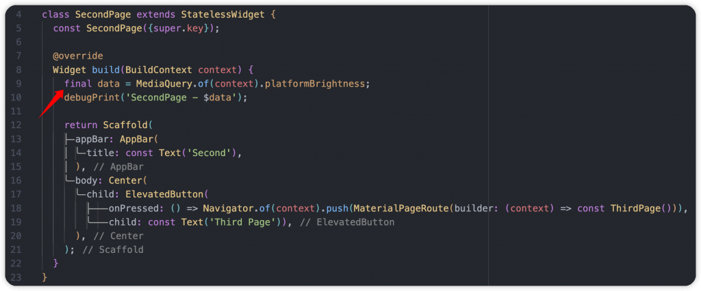
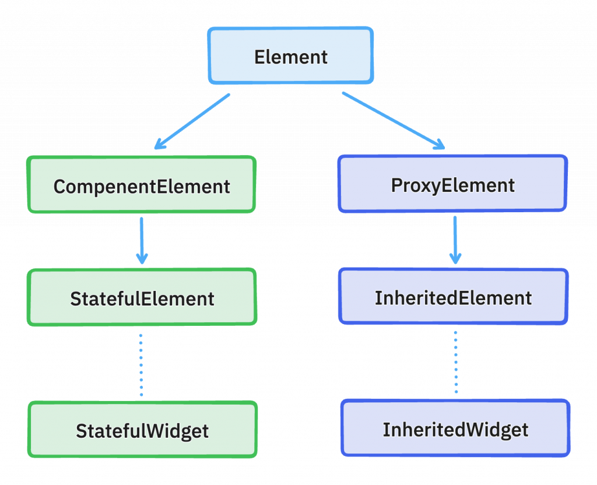
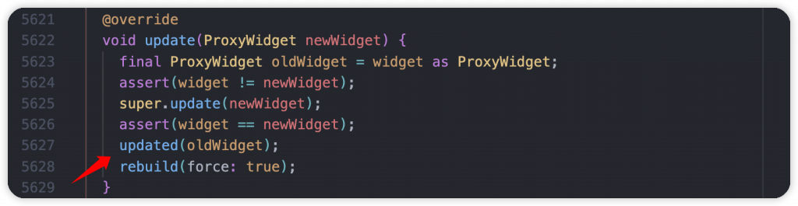
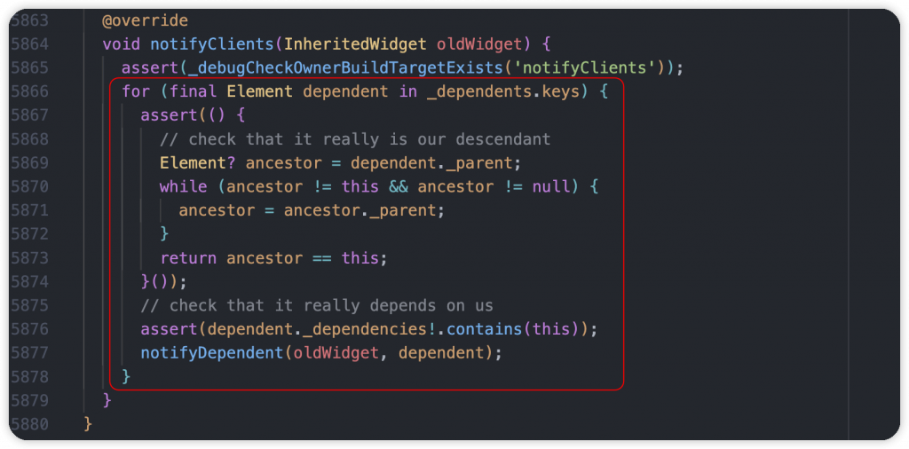
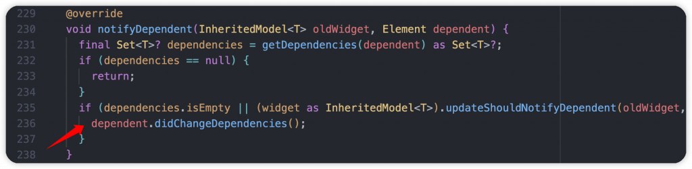
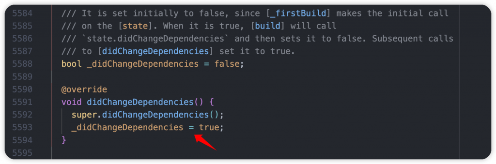
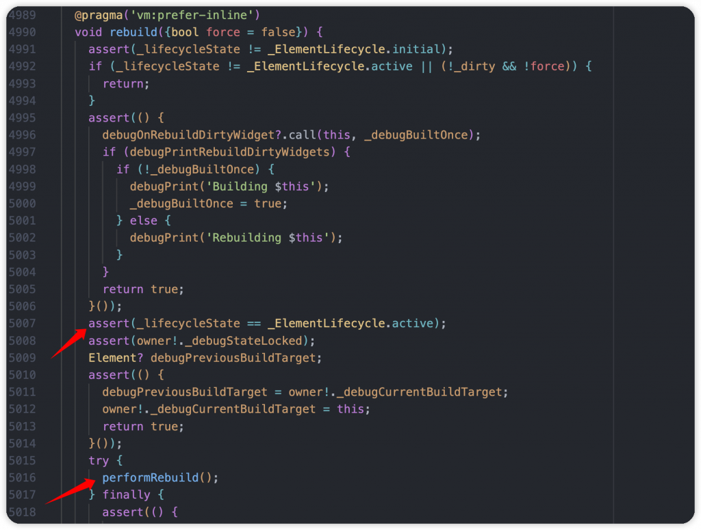
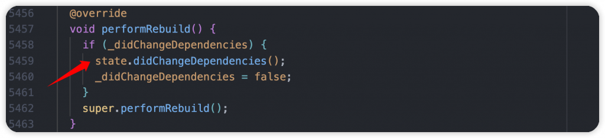
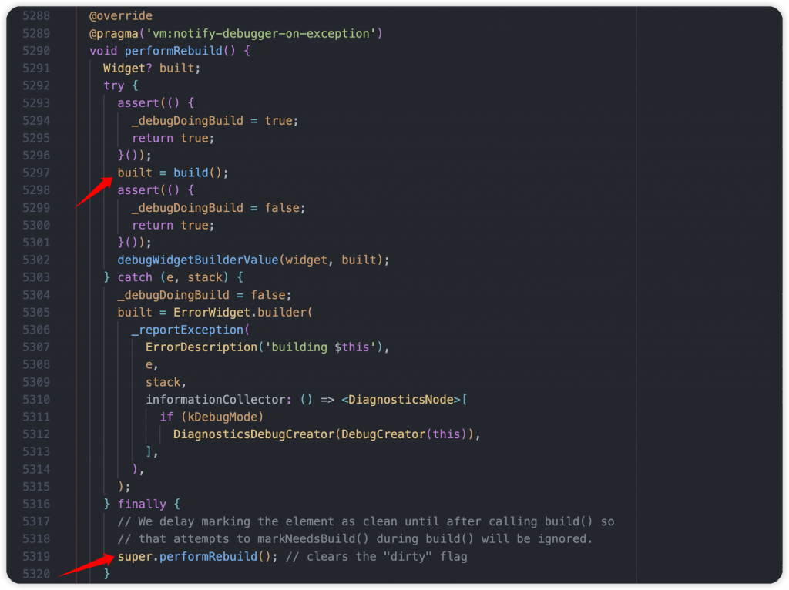
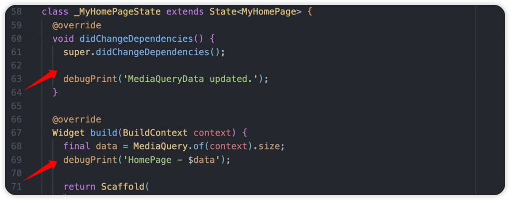

# Day 7: MediaQuery 是什麼？很方便但如何正確在 Flutter 使用，順便跟你說它的缺點

- 發布時間：2023-09-22 20:08:41
- 原文連結：<https://ithelp.ithome.com.tw/articles/10325095>
- 系列標記：探索 Flutter 由裡到外，三十天帶你前往進階系列 第 7 篇

所有的 Flutter 開發者應該多多少少都有碰過 **MediaQuery**，它給予的支援很廣，是個很重要的數據來源，以至於非常多場景都會需要存取它。而在 Flutter 3.10 改版後，**MediaQuery** 有進行優化，算是一個重要的更新，但就我了解很多開發者不清楚，可能因為官方沒有在發布上進行說明。它多了新的撰寫方式和存取資料的方式，本文會帶大家了解新舊用法的差異，以及深入內部了解細部程式碼，讓我們更熟悉它。

------------------------------------------------------------------------

那我們在進入主題之前可能需要先幫 `InheritedWidget` 做個簡單的說明，讓大家複習一下。因為 MediaQuery 本身繼承 `InheritedWidget` 類別。它的主要職責是**共享數據**，而其他元件存取數據的限制是必須在相同 Widget Tree 底下，也是相同 Element Tree，透過 Element 訂閱並接收資料，所以不同樹狀結構下就會拿不到東西。上面有講到訂閱這個關鍵字，實際上 `InheritedWidget` 內部互動長什麼樣子呢，我們稍微講解一下。

以下面範例來說，我們通常在自定義一個 InheritedWidget 的時候大概會是這個樣子，其中有一個 data 屬性，對應的 AppData 是我在這個 APP 要共享的資料，接下來元件在使用時會透過 `of(context)` 靜態方法來訂閱並存取這包資料，訂閱的意思就是在 AppData 有任何更新的時候要通知元件，這時候可以進行一些 UI 變化。主要透過 `dependOnInheritedWidgetOfExactType()` 方法進行監聽，以字面來說就是要依賴這個資料。底下再覆寫 `updateShouldNotify()`，撰寫需要通知的條件，正常就是判斷兩個新舊的 AppData 是否一樣，不同的話就通知訂閱者也就是元件，讓他們可以做後續處理。  

回到主題 MediaQuery，它本身也是繼承 `InheritedWidget`，數據來源為 `MediaQueryData`，在內部一樣是 data 屬性，而 MediaQueryData 擁有 18 個屬性資料，都是跟 APP 和裝置相關的資料，包含 **size** 長寬大小、**orientation** 裝置方向、**textScaleFactor** 文字大小、**platformBrightness** 裝置顯示模式等等，都是很多情境上會影響畫面的數據。  
  

## 存取 MediaQuery 的方式

接下來看一下最常存取 MediaQuery 的方式，它雖然很方便但也是個性能炸彈，我們逐步來了解。此範例擁有三個頁面，HomePage、SecondPage 以及 ThirdPage。

1.  首先我在 HomePage 使用 `MediaQuery.of(context)` 靜態方法取得整包資料，然後拿 size 長寬出來使用，可能是有元件需要根據長寬來做一些佈局調整或是單純想了解。
2.  SecondPage 我一樣使用 `MediaQuery.of(context)` 取得 **platformBrightness** 屬性，可以得知目前裝置是 Light mode 還是 Dark mode，接著把它印出來
3.  第三個頁面 ThirdPage 沒有使用 MediaQuery，不同的是使用了一個 TextField 輸入框，可以讓用戶輸入一些資料，屬於很正常的場景  
      
      
    

我們實際來看看運行後 APP 會出現什麼狀況，左邊是 Console，右邊是運行的模擬器，整個流程就是開啟到第三頁，模擬使用者打開鍵盤要輸入一些資料。從 GIF 展示可以發現，在執行鍵盤操作的時候會其他兩個頁面都會受到影響，不停的進行 rebuild，但是它們實際上沒有顯示在螢幕上，造成不必要的性能消耗。

主要原因是打開和關閉鍵盤的時候，裝置的 padding 屬性會持續改變，它也是 MediaQueryData 的一員，當更新後就會經由 `updateShouldNotify()` 檢查資料，最終通知所有的依賴者進行 rebuild。  

> 實際上配置沒有更新的元件都不會進行繪製 repaint，節省消耗成本，不過還是要盡量保持 Widget 的拆分，讓受影響的部分減少

## 源碼分析

接下來看一下源碼，讓我們更了解它。以下是流程，首先提供 Element 繼承關係圖，讓大家更容易了解 Code 的運作：  

1.  在收到資料更新後，InheritedWidget 對應的 InheritedElement 的 `updated()` 會被觸發，檢查我們覆寫的 `updateShouldNotify()` 是否條件符合，true 的話就執行父類(ProxyElement)的 `super.updated()` 方法  
    

2.  檢查新舊元件後，執行 `updated()` 和 `rebuild()`，兩個主角。`updated()` 是要通知所有元件的 Element 有更新了請注意。過程中會呼叫 `notifyClients()`，使用迴圈取得每個 dependant 物件(這邊的命名方式個人覺得還可以更好，實際上它是 Element)，個別使用 `notifyDependent()` 方法通知  
      
      
    

前面會先確定每個 Element 是否有依賴數據，有的話會呼叫 Element 的 `didChangeDependencies()` 方法，以 StatefulWidget 的 StatefulElement 來說，裡面就是更新 `_didChangeDependencies` 屬性為 true，代表接下來允許觸發 State 的 `didChangeDependencies()` 方法。  
  

3.  `rebuild()` 環節裡面會先驗證 Element 狀態是否為 **active**，代表還在樹上，可以進行後續處理，這時候在呼叫 `performRebuild()`，讓元件開始進行 rebuild 工作。  
    

一樣以 HomePage(StatefuleWidget) 來說就是跟 StatefulElement 互動，檢查 `_didChangeDependencies` 屬性是否為 true，是否有依賴的資料更新了，有的話就觸發 State 裡我們在使用的 `didChangeDependencies()`，接著在尾巴呼叫呼叫父類 ComponentElement 的 `performRebuild()`。  

到了 ComponentElement 的 `performRebuild()`，主要進行 State 的 `build()` 重建 WidgetTree，最後再將 dirty 屬性從 true 改成 false，代表 Element 和 Widget 都已經刷新了，完成工作。  

最後會先觸發 `didChangeDependencies()` 在觸發 `build()`，是不是跟我們熟知的生命週期一樣呢！  

## 正確用法

StatefulWidget 需要更改存取 MediaQueryData 的地方，在 `didChangeDependencies()` 存取，我們只需要在數據有更新的時候拿到最新資料，更新後交給後面的 `build()` 去使用。避免直接在 `build()` 使用 `MediaQuery.of(context)` 方法，才不會所有的 rebuild 都一直重新呼叫 ，造成不必要的運行成本。  

------------------------------------------------------------------------

本文舉鍵盤操作的案例只是為了示範，很多操作都會更新 MediaQueryData，所以需要謹慎使用 `MediaQuery.of(context)` 方法，想看看今天疊了5個頁面以上，造成的影響會更多，甚至有可能使用者體驗會下降，而且以上只是因為 padding 屬性的變動，如果有其他沒有使用到的屬性更新了，每個訂閱者都會慘遭波及，這場景應該不太好對吧？

那現在我們怎麼優化這部分呢？要感謝 Flutter 3.10 發布的改版優化，讓我們可以做到指定依賴，詳細我們下一篇討論吧！

------------------------------------------------------------------------

## 延伸閱讀

[Day 8: MediaQuery 優化後與 InheritedModel 如何進行指定更新](https://ithelp.ithome.com.tw/articles/10325740)
