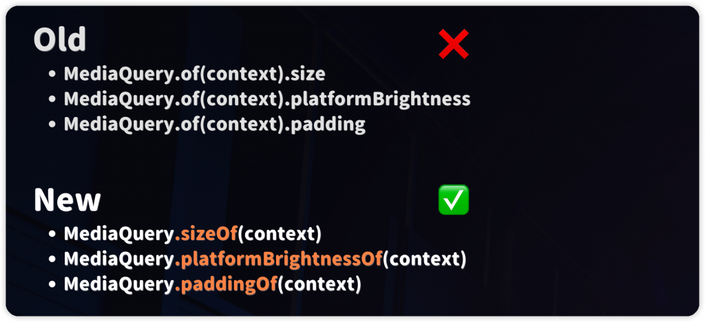
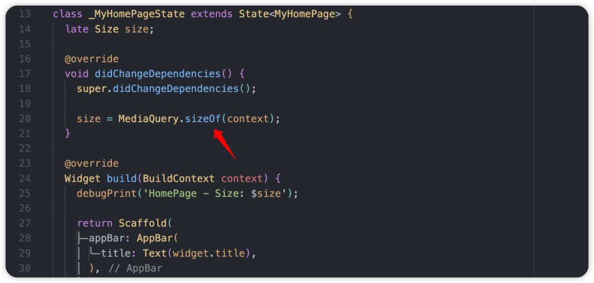
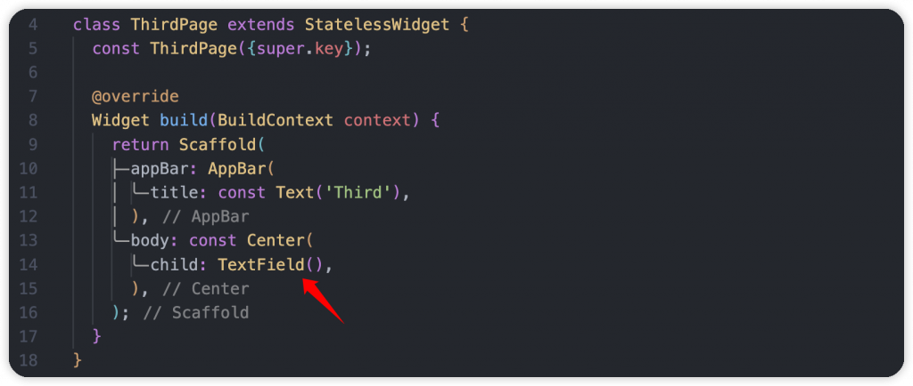
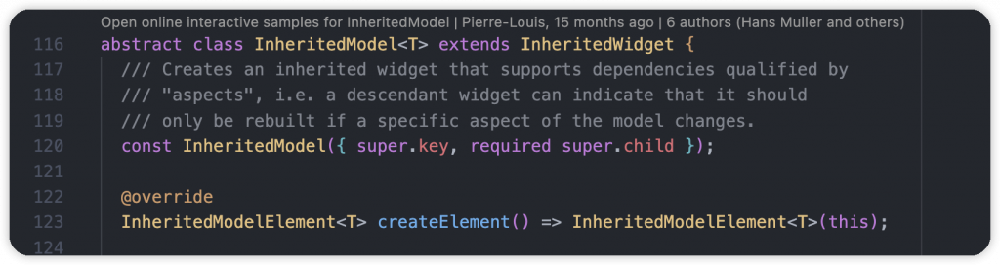
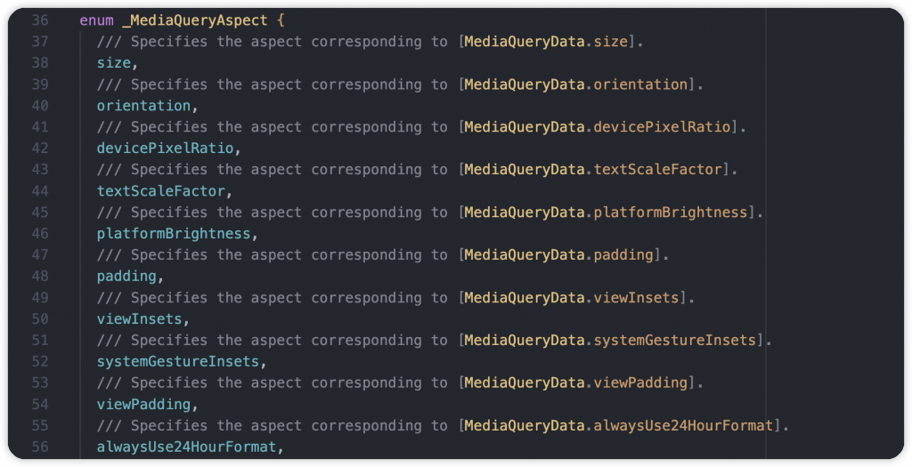
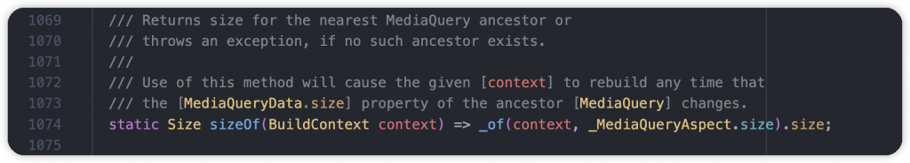
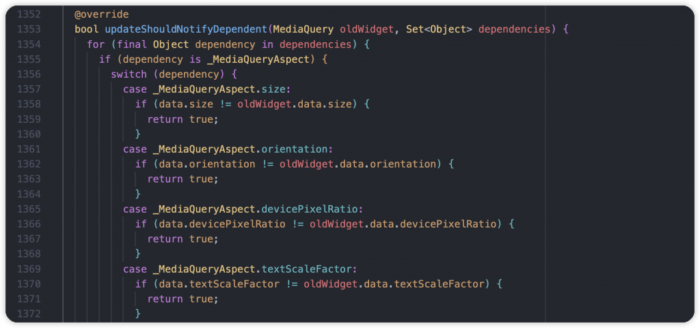

# Day 8: MediaQuery 優化後與 InheritedModel 如何進行指定更新

- 發布時間：2023-09-23 19:12:32
- 原文連結：<https://ithelp.ithome.com.tw/articles/10325740>
- 系列標記：探索 Flutter 由裡到外，三十天帶你前往進階系列 第 8 篇


上一篇我們討論了 MediaQuery 是什麼、它的正常使用方式，並稍微帶大家分析背後源碼的運作流程。本文要了解在 Flutter 3.10 改版後，**InheritedWidget** 做了哪些改動，以及我們如何更高效的去存取 **MediaQueryData**，提升 APP 整體品質。

------------------------------------------------------------------------

我們在存取 MediaQueryData 時很常會使用 `MediaQuery.of(context)` 方法，進行整包資料的訂閱，並在有任意資料變動的時候收到通知，很容易造成不必要的 rebuild，影響 APP 性能與運行。

## Specific dependency 指定依賴

原本的 `MediaQuery.of(context)` 屬於依賴整包資料，有任更新都會收到通知。指定依賴就是我們可以只依賴我們需要的屬性就好，只有它更新的時候通知我就好，其他的我不需要理會，這個方式也比較符合我們大部分的開發場景。一開始先展示實際範例，讓大家能快速了解新的用法  


``` dart
// 18種靜態方法，針對18個屬性
MediaQuery.sizeOf(context)
MediaQuery.orientationOf(context)
MediaQuery.devicePixelRatioOf(context)
MediaQuery.textScaleFactorOf(context)
MediaQuery.platformBrightnessOf(context)
MediaQuery.paddingOf(context)
MediaQuery.viewInsetsOf(context)
MediaQuery.systemGestureInsetsOf(context)
MediaQuery.viewPaddingOf(context)
MediaQuery.alwaysUse24HourFormatOf(context)
MediaQuery.accessibleNavigationOf(context)
MediaQuery.invertColorsOf(context)
MediaQuery.highContrastOf(context)
MediaQuery.disableAnimationsOf(context)
MediaQuery.boldTextOf(context)
MediaQuery.navigationModeOf(context)
MediaQuery.gestureSettingsOf(context)
MediaQuery.displayFeaturesOf(context)
```

此範例中 HomePage 在 `didChangeDependencies()` 裡使用 `MediaQuery.sizeOf(context)`，只有訂閱 size 屬性，需要再它有變化時通知我。  


ScondPage 一樣將寫法更改為 `MediaQuery.platformBrightnessOf(context)`，監聽 platformBrightness 屬性的變化，可以了解 APP 是否使用深色模式。  


最後跟上一篇文章一樣，我們在 ThirdPage 使用了 TextField 輸入框，讓使用者可以輸入文字。當鍵盤彈出和關閉時，會頻繁更新 MediaQueryData 裡的 **padding** 屬性，光打開就會更新 20 幾次。  


可以看到實際運行的狀況，前面的 HomePage 和 SecondPage 絲毫沒有受影響，因為它們本身是依賴 **size** 和 **platformBrightness** 屬性，不會因爲其他數值的更新而收到通知，也不會因此 rebuild。  


在現在的 Flutter 版本，讓我們可以精準的去存取 MediaQueryData，進行指定依賴，原有專案也只需要簡單做個修改，整體性能就能有所提升，這個 MediaQuery 優化真的很重要。

------------------------------------------------------------------------

當然，不免俗的我們還是要進入源碼分析環節，了解實際上背後做了什麼改動，以及它的更新流程。以下稍微列出了幾個重點：

- `_MediaQueryAspect` → enum，需依賴的資料類型
- `inheritFrom({aspect})` → 幫 Widget 產生依賴，決定依賴全部屬性還是指定屬性
- `updateShouldNotifyDependent()` → 檢查資料是否異動，並通知依賴者

首先看到 MediaQuery 本身，會發現繼承的對象換了，是 `InheritedModel`，泛型待著一個 `_MediaQueryAspect`，InheritedModel 實際上繼承 InheritedWidget，也就是多封裝了一層，它存在的目的就是讓我們可以只依賴 Model 的一小部分。

另外我們也可以自定義 InheritedModel 跟 aspect enum，讓 InheritedModel 可以根據我們的依賴，僅通知跟 aspect 相關的元件進行更新  
  


我們來看看 MediaQuery 使用到的 `_MediaQueryAspect`，單純是一個 enum，裡面的 type 對應 MediaQueryData 的18個屬性，讓我們可以區別實際上依賴哪個資料  


先隨邊挑選一個靜態方法，來看它做了哪些事情，`sizeOf(context)` 實際上 call 了內部方法 `of(context, MediaQueryAspect.size)`，跟以前不同的是多了第二個參數，給予 size 這個 MediaQueryAspect enum。  


原有的 MediaQuery 使用方式 `of(context)`，裡面都是使用 `_of(context)` 內部方法，但就沒有給予 aspect type，因為它是監聽整個 MediaQueryData。

接下來可以看到重點部分 `InheritedModel.inheritFrom(context, aspect)`

1.  一開始先檢查 aspect 是否為 null，是的話就跟直接回傳 `dependOnInheritedWidgetOfExactType()`，依賴整包資料
2.  檢查 Element Tree 上的所有 InheritedElement，取得泛型為 MediaQuery 且有提供這個 aspect 資料的 InheritedElement list。使用 `_findModels()` 方法查找，接著會透過 `isSupportedAspect()` 檢查 Element 是否有提供
3.  取出最後一個拿到的 InheritedElement，接著透過 `dependOnInheritedElement()` 取得對應的 InheritedWidget，也就是 MediaQuery  
      
    

到這裡我們已經了解大概的依賴流程，那資料更新時如何通知呢？就需要看另一個重要環節 `updateShouldNotifyDependent(oldWidget, dependencies)`，當 MediaQueryData 其中有一個屬性有變動後就會檢查每個有依賴這些資料的 Element，看他們跟現在變動的數據是否有依賴關係，這時候會呼叫 `updateShouldNotifyDependent()` 進行檢查。它本身有兩個參數，第一個是舊的 MediaQuery，第二個是那些有變動的 aspect type 資料。  


一開始針對這些變動資料執行迴圈，根據每個 `_MediaQueryAspect` type 檢查原本的屬性值跟新的屬性值是否不一樣，不一樣代表有變化，所以返回 true，通知依賴者、元件的 Element 要執行更新任務，呼叫 `didChangeDependencies()`。  
  
最後 State 的 `.didChangeDependencies()` 和 `build()` 就會陸續被觸發，進行 rebuild。

------------------------------------------------------------------------

MediaQueryData 整個的依賴、更新流程就是這樣，是不是慢慢的看過後會更熟悉它，實際上也沒有非常複雜的邏輯去處理。當懂原理後，在往後的開發會知道如何去思考作法，讓一切都在自己的掌控範圍，整個過程也會更有意思。

------------------------------------------------------------------------

## 延伸閱讀

[Day 7: MediaQuery 是什麼？很方便但如何正確在 Flutter 使用，順便跟你說它的缺點](https://ithelp.ithome.com.tw/articles/10325095)
