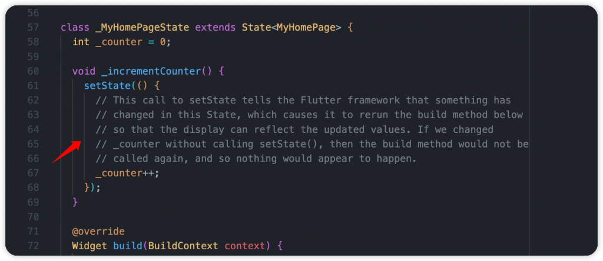
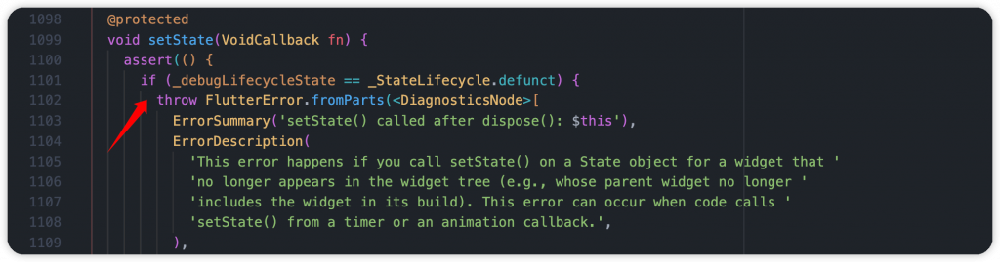
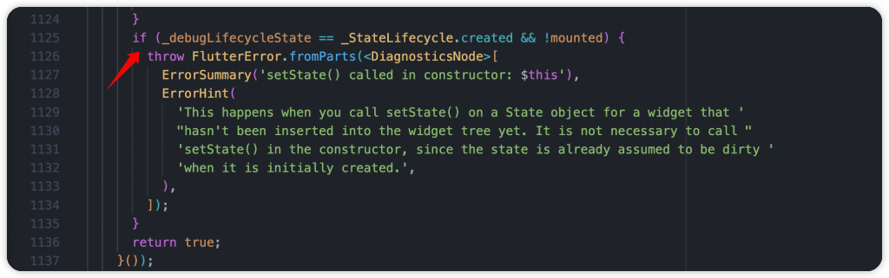
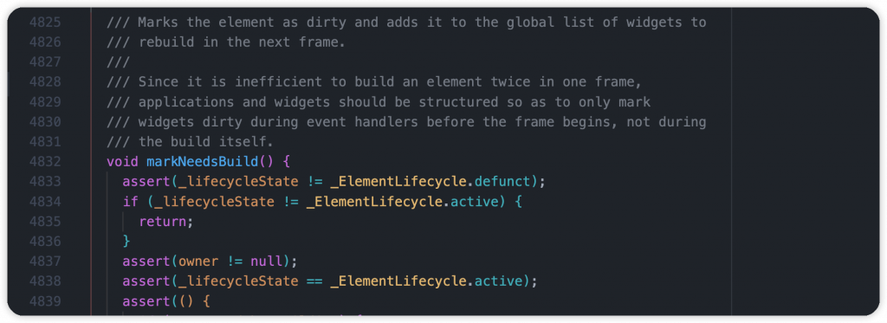
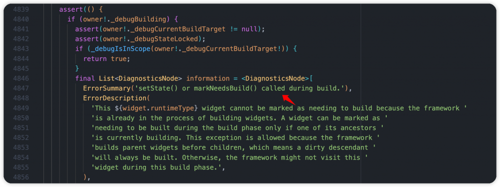
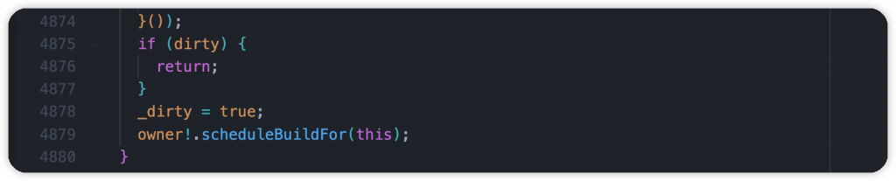
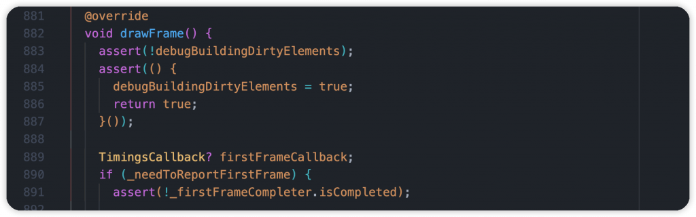
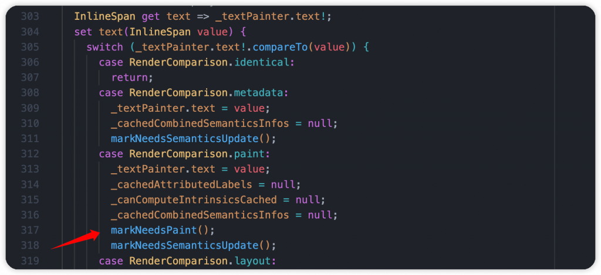

# Day 9: 深入 setState()，觀察它如何進行 UI 刷新！

- 發布時間：2023-09-24 18:29:15
- 原文連結：<https://ithelp.ithome.com.tw/articles/10326495>
- 系列標記：探索 Flutter 由裡到外，三十天帶你前往進階系列 第 9 篇


每次執行 `flutter create <name>` 創建新的專案後，預設都會在主頁面看到很熟悉的計數器功能，在點擊 FloatingActionButton 後會執行 \_incrementCounter() 方法，裡面使用了 `setState()` 方法，並在第一個參數使用匿名 callback，讓開發者將一些狀態放在區塊內更新，接著頁面、元件就會在下一幀刷新並進行 rebuild，顯示新的畫面跟效果給使用者。  


當 `setState()` 呼叫後，根據 StatefulWidget 的生命週期，就會在執行一次 `build()`，讓整個 Widget Tree 可以根據新的狀態、配置去顯示。

> 有關 LifeCycle 的部分可以去閱讀另一篇文章  
> [Day 5: Flutter 的 StatefulWidget 和 State 生命週期，先熟悉它們再開發吧！](https://ithelp.ithome.com.tw/articles/10321406)


- 主要透過 Element 呼叫了 `markNeedsBuild()`，進行重新 rebuild
- 神奇的魔法，實際上不管變動的狀態是否有放在 callback 裡面，整棵樹都會被重置。如果將狀態或一些操作寫在 callback 裡面，就要確保不能有非同步操作，也就是 Future 回傳值

> 建議：將需要更新的狀態操作放在 callback，其他則在方法外面，提高整體可讀性

``` jsx
setState(() {
    _counter = _counter + 1;
});

// or

_counter = _counter + 1;
setState(() {});
```

提醒一下，在 `setState()` 或是 `context` 操作之前如果有進行非同步操作，記得呼叫時要先檢查 `mounted` 屬性，確認 Widget 與 Element 都有在樹上，才能確保後續的 rebuild 刷新，否則如果剛好 Widget 銷毀了或是進行樹上的移動，這時就會報錯，記得保持好習慣哦。有使用 **flutter_lint** 通常會出現 `use_build_context_synchronously` 提醒，以下是範例：

``` dart
Future<void> _incrementCounter() async {
  await Future.delayed(const Duration(seconds: 1));

  if (!mounted) {
    return;
  }

  setState(() {
    _counter++;
  });
}
```

#### 其實

當初為 Flutter 開發人員做了 UX 的研究，原本只有一個 `markNeedsBuild()` 的時候，發現大家把它當成保命符，在不確定的情況下都會呼叫它，導致濫用的情況。後來改成同步的 `setState()` 後，大家開始謹慎使用了，發生問題的機率也變小了。 本身 `setState()` 是一個跟心理層面影響的 API。

以下是相關資訊：

- <https://github.com/flutter/flutter/issues/12296>
- <https://stackoverflow.com/questions/44379366/why-does-setstate-take-a-closure/44379367#44379367>

------------------------------------------------------------------------

那實際上到底 `setState()` 做了什麼事？如何告訴 Flutter 有東西改變了你要處理一下，我們來挖掘它，看看實際的過程。

### State 的 setState

`setState()` 是 State 的方法，State 由 \_MyHomePageState 繼承 所以我們能使用它。可以看到參數就是一個 VoidCallback，沒有回傳值的方法，很常在開發中看到或用到，例如：元件要暴露點擊事件的話就可以使用 VoidCallback 撰寫。

1.  一開始使用 `asset()` 進行狀態檢查，必須確保 State 的狀態不是 **defunct**，這時候代表本身已使用 `dispose()` 要被銷毀了  
      
    

2.  第二層檢查，確認 State 的狀態不是剛創建而且還沒綁定到 Element Tree 上，使用 `mounted` 屬性檢查，這時候去刷新頁面是沒有作用的  
    

3.  第三層檢查，確認外部給予的 Callback 不是非同步方法，檢查是不是 Future，裡面也不會 await，因為實際上整個 Flutter 的繪製、渲染流程是同步的，不允許有非同步操作的影響，需要確保整體是順暢的運行  
    

4.  最後都沒有問題後，透過 element 呼叫 `markNeedsBuild()`，標記這個元件為 dirty 髒的，代表需要 rebuild，下一幀更新

### Element 的 markNeedsBuild()

到這裡對 `setState()` 應該有一點了解了吧，接下來繼續看 Element 做了哪些事情，繼續往深處挖掘。我們看到 `markNeedsBuild()` 執行大部分工作之前都必須檢查生命週期，在正確的時候做正確的事情才能確保高效、順暢。

1.  一樣進行幾個檢查，確認對應的 Element 本身不是 **defunct** 銷毀狀態，需要是 **active** 狀態

2.  檢查 `owner` 存在不為空值，它是 Element 的 Lifecycle Manager  
    

3.  如果正在 building 的情況不允許再呼叫 `setState()` 和 `markNeedsBuild()` 刷新，因為刷新工作已經在執行了。這也是為什麼不要 State 的 `build()` 方法裡使用 `setState()`，可是會出錯的哦  
    

4.  檢查 `dirty` 屬性，一樣如果標記過後就忽略，因為已經在處理了。最後透過 `owner` 安排任務去處理  
    

### BuildOwner 的 scheduleBuildFor()

負責將要更新的 Element 儲存到髒的 Element 清單，等待之後執行 `WidgetsBinding.drawFrame` 的時候可以被處理。

1.  首先確認是否已經在髒清單裡面，檢查 `_inDirtyList` 布林值，是的話就 return 不繼續下去
2.  接著呼叫 `onBuildScheduled()` 安排任務，並將此 Element 新增到髒清單，然後將 `_inDirtyList` 設為 true  
    

### 後面流程

1.  觸發 WidgetBinging 的 `_handleBuildScheduled()`

2.  觸發 SchedulerBinding 的 `ensureVisualUpdate()` → `scheduleFrame()`

3.  …

4.  觸發 WidgetBinding 的 `drawFrame()`，設置 `debugBuildingDirtyElements` 為 true，開始處理髒 Element 清單。裡面最重要的是呼叫 `buildScope()` ，真正進行 Element 處理的地方  
      
    

5.  首先對髒清單進行樹的深度排序，while 迴圈執行，淺的 Element 優先處理

6.  接著到中間會看到呼叫 Element 的 `rebuild()`，然後執行 `performRebuild()`

7.  這時候對應的 Element 就是 `RenderObjectToWidgetElement`(每個元件後面對應的都是 RenderObject，負責幫我們處理佈局、繪製，這邊就不深談這個部分)  
      
    

### RenderObjectWidget 的 updateRenderObject()

到了這裡已經快完成更新的工作了！如果以範例來說，畫面上的 Text 元件因為倒數文字改變，等同是它的配置有異動，這時候就會呼叫 `updateRenderObject()` 來處理。這時候要看源碼的話需要到 RichText，也就是 Text 的基座，它本身是 `MultiChildRenderObjectWidget`，尋找它的 `updateRenderObject()` 方法。  


更新 RenderParagraph 物件，因為是改變文字，這時 text 屬性就會就會被更新，並觸發寫好的 `setter`，因為是文字內容的改變會進行重繪，執行 `markNeedsPaint()`，後面的事情就交給渲染引擎去處理了。  
  


------------------------------------------------------------------------

其實後續還有能繼續挖掘的源碼，但到這裡大家應該可以了解一個畫面、元件刷新的部分流程。細節很多，一步一步去探索，會發現很有趣，你會更熟悉實際上做哪些事情。當然其中牽扯了許多 Flutter 核心觀念，例如：Widget、Element、RenderObject 的三者關係、生命週期等等，大家不需要一次就懂，可以從中去學習，慢慢會影響我們開發時的想法，你也會更有 Sense，知道該做什麼樣的操作對 APP 有幫助。

------------------------------------------------------------------------

## 延伸閱讀

[Day 5: Flutter 的 StatefulWidget 和 State 生命週期，先熟悉它們再開發吧！](https://ithelp.ithome.com.tw/articles/10321406)
