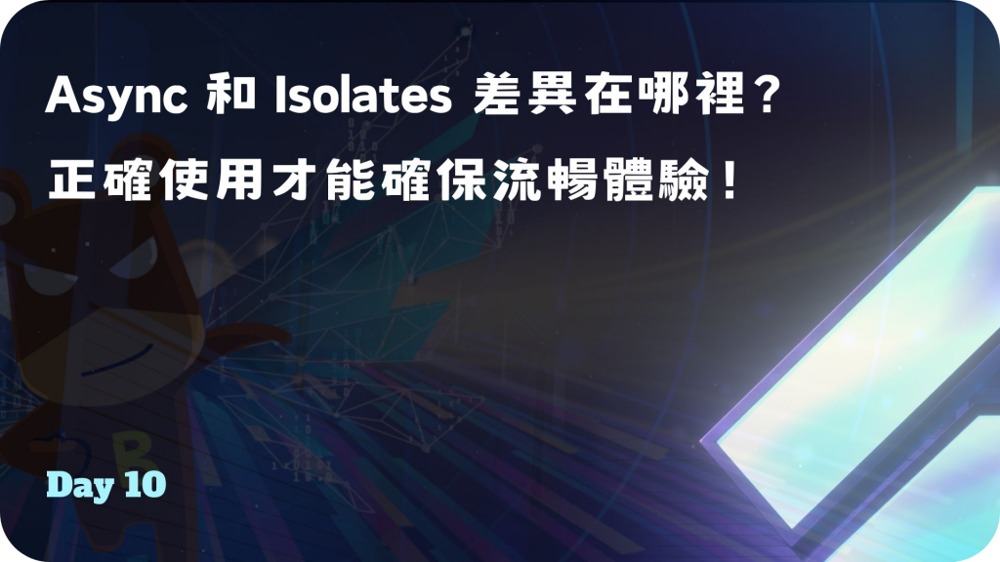
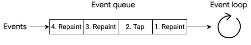
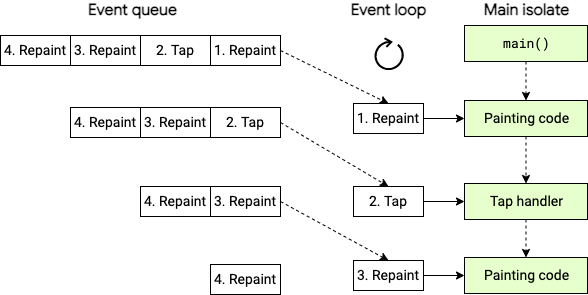
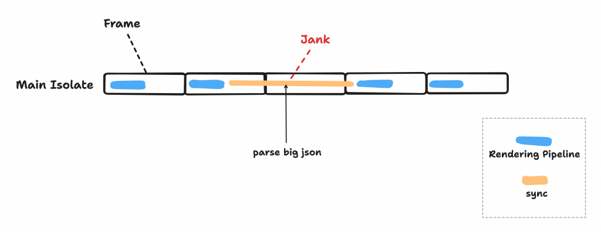
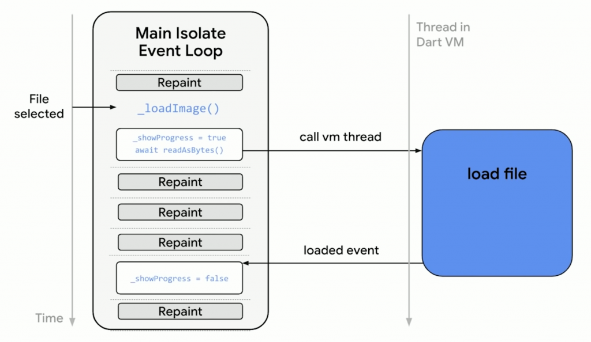
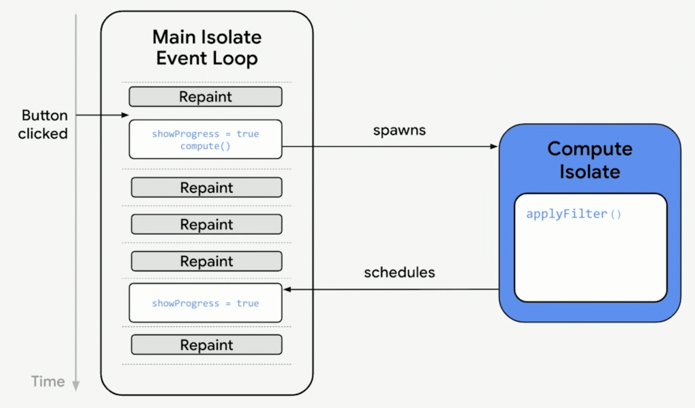
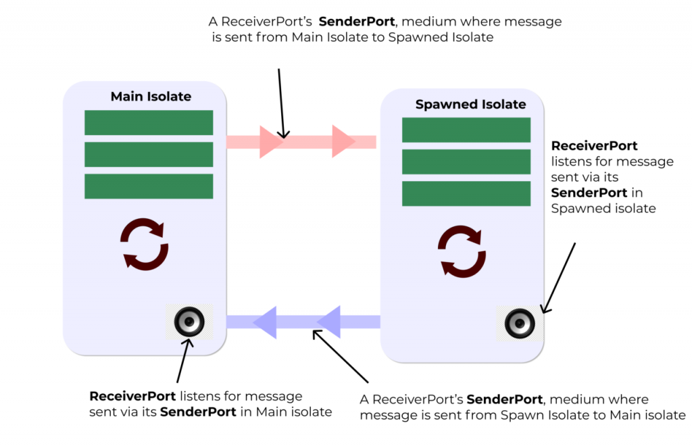
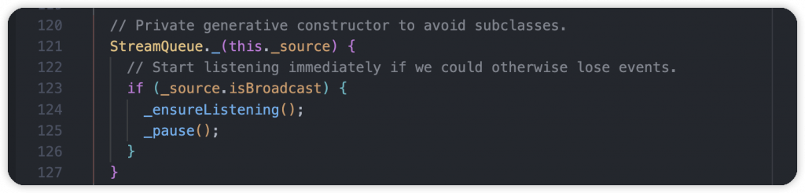

# Day 10: Async 和 Isolates 差異在哪裡？正確使用才能確保流暢體驗！

- 發布時間：2023-09-25 20:41:55
- 原文連結：<https://ithelp.ithome.com.tw/articles/10327324>
- 系列標記：探索 Flutter 由裡到外，三十天帶你前往進階系列 第 10 篇



為什麼在 Flutter 開發中很常會需要 **Async** 非同步操作？因為畫面的互動、繪製刷新都是在同步的狀況下運行，為了順暢運行，需要一秒快速進行多次的渲染處理，而當我們要執行無法預期時間的相關操作或是繁重任務時，就會需要非同步來幫忙。但非同步本身的工作如果消耗的時間更久更麻煩的話，這時候就會需要 **Isolate** 隔離的協助。這兩個角色對於開發來說很重要，我們需要了解他們是什麼，以及在某些情境下該用誰來處裡任務，才能讓 APP 保持高效運行，讓使用者操作的很舒適。

在進入正題之前，需要先了解 Flutter 本身的運行狀況，它是在什麼環境下運行，由哪些重要角色支撐著，才能提供良好的性能表現以及使用者體驗。往下滑囉！

------------------------------------------------------------------------

## Flutter 運行狀況

- 1 Thread、1 Processor
- Flutter 在主隔離(Main Isolate)上運行，而隔離在運行時會有自己的 **Event Loop** 和兩個 Queue，就像一個無限循環，裡面經由 **Event Queue** 和 **Microtask Queue** 處理著所有請求和任務
- `Event Queue` → 處理大部分任務和來自用戶的操作，例如：手勢、點擊螢幕、I/O操作、佈局、繪製、繪圖、Timer、Steam等等，它們都會被加入 Queue 中，接著按照順序在 Event Loop 處理。舉例來說：為了順暢的用戶體驗，Flutter 每秒60次向 Event Queue 添加 repaint 事件  
  



- `Microtask Queue` → 負責由內部系統操作生成的任務，比用戶啟動的任務有更高的優先級。意思是只要 Microtask Queue 有任務要處理，就會先暫停 Event Queue 的工作，以 Microtask 為優先，頻繁地在兩邊進行轉換


------------------------------------------------------------------------

## Async

`"Async is the ability to wait for other things without blocking."` 這句話來自某位開發者，很適合用來表示 Async，也就是我們熟知的非同步。

- 本身屬於**並發**運行(Concurrency)，有處理多個任務的能力，但不一定會同時處理。
- 使用 Async 的同時也會使用到 Future，代表未來的某個時候完成，我們無法知道準確時間點，也是在告訴 Dart：「這段程式碼不急，你有空再幫我處理就好了。」，會根據情況、需求自動在不同的程式區塊裡跳轉
- 雖然它是非同步操作，但使用時不會自動生成其他線程來幫忙，其實都是在相同線程，在進行 Flutter 開發時都是在相同線程、相同 isolate 進行，非同步任務會等待 UI 渲染完成後才進去動作
- 在 `Dart VM Thread` 上運行，當 await 任務完成後會向主隔離的 Event Queue 添加新的事件並標示任務完成，有點類似 Callback
- `await` 區塊結束後，才會接著處理後方的程式碼，而在 Flutter APP 裡其他程式碼一樣同時運行，其他工作區不需要停止或等待
- 符合大多數的開發情境，但不適合有複雜處理的同步任務，例如：解析大量資料、IO長時間操作，如果使用非同步處理太久，APP 得其他部分有可能會造成卡頓，因為只要是 OS 操作而非 Dart 程式碼都會暫停執行

#### Flutter 是單線程卻能夠運作順暢

整個 **Rendering Pipeline** 都是在同步中進行，所以當 `Event loop` 知道要進行佈局、繪製等操作的時候，就會讓非同步任務先暫停並等待 Pipeline 執行結束後再繼續，這樣就不會因為進行耗時操作卡住 UI。這也是為什麼使用 `setState()` 刷新只能是同步操作的原因。  


不會單線程畢竟有它的侷限，當有一些比較重的同步任務，例如：解析大量 json、處理圖片、長時間IO，處理過程可能會超過一個 vsync 時間，這樣 Flutter 就不能即時將 layer 送到 GPU 線程，會導致 APP janking 卡頓，這時候我們就會需要 Isolate 來幫忙解決這個問題。

> 說明：vsync 代表每一幀的渲染信號，通常在開發動畫、使用 AnimationController 時就會遇到，而如果以 60 幀順暢運行來說，一幀的時間就是 16 毫秒。



舉例：

1.  在跟人聊天的時候，快速檢查手機訊息，短短0.5秒停頓，對方感受不出來
2.  在跟人聊天的時候，這時剛好有重要訊息需要確認，可能盯著訊息5秒以上，接著再回來這段對話，對方應該會覺得尷尬或不舒服，而這個情況就會需要 Isolate 幫忙處理



## Isolates 隔離

`"Isolates is the ability to run things in parallel. It can offload heavy computations in the app to a background worker."`

- 每個 Isolate 實際上是**並行**運行(Parallelism)，又稱為 worker isolate、background isolate、background worker
- 一個隔離使用一個線程，假設你是用 VS Code 開發，可以從 Call Stack 區塊觀察每個創建出來的隔離
- 本身不是 Thread，不同的是每個 Isolate 擁有自己的記憶體空間，不共享數據，透過 Event Loop 管理任務、處理工作。不會遇到執行緒會有的 Critical Sections, Dead Locks, Mutexes 和 Racing Condition 情境
- 只要是一幀無法完成的任務都需使用 Isolate 解決， 將長時間的同步任務、複雜運算、工作分配到多個內核(Core)去進行處理，不同程式碼在不同隔離全速運作，互不影響。可以確保 Main isolate 每秒產生60幀以上，減輕負擔，以獲得舒適的使用者體驗
- 當有多個 Isolate 同時產生時，無法確保每次都以相同的順序運行
- Isolates 之間的訊息傳輸通常執行深度的資料複製，因此記憶體使用會因此增加，隨著訊息的大小線性增加，O(n) 表示

舉例：當我在跟你講話的時候，我在抓癢，同時做兩件事卻不干擾

適合情境：

- 解析大量 JSON 字串
- 資料庫存取
- 大型檔案存取
- 圖像處理、解碼

### 使用方式 compute()

負責 **short-lived** background tasks 短時間的複雜運算，我們可以使用 Flutter 提供的 `compute()` 全局方法，迅速建立一個 Isolate 幫忙處理任務，結束後返回結果，就跟我們使用 await 非同步方法一樣，簡單有效。

``` dart
await compute(_printName, 'Yii');
```

- 第一個參數 → 運行的 function 名稱，可提供一個參數
- 第二個參數 → function 的參數，如果需要多個參數的話可以使用 Map、List 等等包裝  
  

### 使用方式 spawn()

負責 **long-lived** background tasks 長時間的複雜運算與處理，我們可以自定義隔離，使用 `spawn()` 創建，並透過 Port API 讓 main isolate 與 worker isolate 溝通。  
  


#### Isolate.spawn() - 建立隔離

``` dart
Isolate.spawn(_entryPoint, _receivePort.sendPort)
```

1.  第一個參數 → Isolate 要執行的函式
2.  第二個參數 → ReceivePort 的 SendPort，給 worker isolate 跟 main isolate 的通訊管道，溝通使用。當有多個函式參數需要使用時，可以透過 `List<dynamic> args` ，裡面再透過 args\[0\]、args\[1\] 取得資料

> 補充：第二個參數，也可以自定義一個協議 Model 類別，裡面包含主要的 SendPort 跟其他的資料欄位，就不用擔心只能傳一個參數的問題。

#### ReceivePort - 接收訊息

ReceivePort 顧名思義就是接收訊息的通道，本身透過 `Stream` 實作，可以持續監聽。第一個訊息通常會是其他 Isolate 的 `SendPort` ，當前 Isolate 可以使用它發送訊息跟其他隔離溝通。

``` dart
final receivePort = ReceivePort();
```

- `first` 屬性 → 取得發送過來的訊息，為 Future。一般使用 first 後 stream 就會被關閉，所以如果需要持續接收訊息，需要將 ReceivePort 轉成廣播流，使用 `asBroadcastStream()`
- `sendPort` 屬性→ Isolate 的通訊管道，提供給其他 Isolate 發送訊息用，我們也才能收到訊息

#### SendPort - 發送訊息

使用 SendPort 發送訊息給創建它的 ReceivePort，也有可能多個 SendPort 對應一個 ReceivePort。

``` dart
sendPort.send('message');
```

#### StreamQueue - 接收訊息的佇列

實際上可以不需要 StreamQueue，但它使用上可以跟 ReceivePort 很好的進行協作，類似 ReceivePort 的 broadcastStream，將 ReceivePort 設為參數傳入，在建構的時候就開始監聽 Stream，是對於後續接收訊息還蠻方便的 API。

``` dart
StreamQueue _streamQueue = StreamQueue(_receivePort);

// Get new message from another isolate
await streamQueue.next;

// Stop receiving messages
await streamQueue.cancel();
```



1.  `next()` → 負責取得其他 Isolates 透過 `SendPort` 傳送的訊息
2.  `cancel()` → 停止 Stream，也就是停止訊息資料的監聽

> 缺點：不管是透過 `spawn()` 或是 `compute()` 都會經過 Isolate 的創建與銷毀，如果頻繁創建或濫用就會有很大的記憶體消耗，這是唯一代價，所以請謹慎使用。

## 注意

- Isolate 創建、銷毀與傳遞資料，可能會耗費約 50-150ms 的時間
- 使用 multi isolates 整體計算時間會比 single isolate 多
- 本身 Isolate 是佔空間的，每當創建出來至少需要 2MB 記憶體左右甚至更多，取決於工作內容
- 通常實作上可能會使用 message 參數傳遞資料或檔案，每次都會經歷一次 copy ，這其實就存在著 **OOM** 風險。想看看，如果要返回 1 GB 大小的資料，在記憶體不多的手機上就會出現問題

## 改善

1.  減少 Isolate 創建，降低消耗
2.  減少 message 傳遞次數，以及資料大小

------------------------------------------------------------------------

## 範例解說

此範例使用 `jsonFileNameList` 紀錄準備好的3個 Json 檔案，放在本地的 `assets/` 目錄，待會要透過 Isolate 進行解析、處理。

``` dart
const List<String> jsonFileNameList = [
  'assets/a.json',
  'assets/b.json',
  'assets/c.json',
];
```

主隔離的 `getJsonDataFromFiles()` 方法，負責創建 Isolate ，並請它在背景幫忙處理檔案，按照順序取得 Json 資料後將內容返回主隔離，再讓 `main()` 印出來。下面跟大家一行一行解說，更好地去了解：

1.  首先一開始都會先創建 ReceivePort 物件，而在這個情境使用到了 StreamQueue，協助 ReceivePort 更好地處理訊息
2.  使用最重要的方法 `Isolate.spawn()` 創建隔離，`isolateParsingFile` 為 Background-Isolate 要執行的方法名稱，第二個為通訊管道
3.  兩個 Isolate 在使用時，通常一開始的互動都是互相給予自己的 SendPort，這樣對方才能跟我傳訊息。所以這裡先透過 `streamQueue.next` 取得 Isolate 的 SendPort
4.  透過迴圈請 Isolate 按照順序幫我處理檔案，一樣再使用 `[streamQueue.next](http://streamQueue.next)` 取得最新訊息，接著透過 Generator functions 傳值到外部
5.  最後傳遞 null 給 Isolate，這是我們訂的約定，只要是 null 就代表任務結束，需要釋放資源

``` dart
Stream<Map<String, dynamic>> getJsonDataFromFiles() async* {
  print('getJsonFilesContent() - Start');

  final ReceivePort receivePort = ReceivePort();
  final StreamQueue streamQueue = StreamQueue(receivePort);
  await Isolate.spawn(isolateParsingFile, receivePort.sendPort);

  final SendPort workerIsolateSendPort = await streamQueue.next;

  for (String fileName in jsonFileNameList) {
    workerIsolateSendPort.send(fileName);

    final Map<String, dynamic> jsonData = await streamQueue.next;
    yield jsonData;
  }
  print('getJsonFilesContent() - Json file parsing finished');

  workerIsolateSendPort.send(null);
  print('getJsonFilesContent() - Request worker isolate to exit()');

  await streamQueue.cancel();
  print('getJsonFilesContent() - Dispose the StreamQueue');
}
```

接下來看 Isolate 要執行的 `isolateParsingFile()` ，來仔細了解它的工作內容：

1.  起手式都是創建 ReceivePort，接著傳遞自己的 SendPort 出去，完成前置作業
2.  使用 `await for` ，代表只要收到訊息就會執行這個區塊
3.  一開始先檢查型別，而我們確定這個是檔案名稱，所以必須是字串
4.  讀取本地 JSON 檔案，使用 `jsonDecode()` 轉換成 Map，這一步是最耗時的工作，接著將結果回傳給 Main Isolate
5.  跟外部約定好了，只要收到訊息為 null 就代表工作完成，直接關閉迴圈，並在最後 `Isolate.current.kill()` 將自己清除，釋放記憶體

``` dart
void isolateParsingFile(SendPort sendPort) async {
  print('isolateParsingFile() - Worker isolate - Start');

  final ReceivePort receivePort = ReceivePort();
  sendPort.send(receivePort.sendPort);

  await for (dynamic message in receivePort) {
    if (message is String) {
      final String fileContent = await File(message).readAsString();
      final Map<String, dynamic> jsonData = jsonDecode(fileContent);

      print('isolateParsingFile() - Worker isolate - Send data to main isolate');
      sendPort.send(jsonData);
    } else if (message == null) {
      break;
    }
  }

  Isolate.current.kill();
  print('isolateParsingFile() - Worker isolate - Finished');
}
```

主程式 `main()` 呼叫 `getJsonDataFromFiles()`，本身是回傳 Stream，在這裡將每次解析到的 Json 資料印出來，印出三筆資料就完成我們的工作。以下提供 Console log ，協助驗證運行的流程。

``` dart
void main(List<String> arguments) async {
  await for (Map<String, dynamic> jsonData in getJsonDataFromFiles()) {
    print("Get json data - $jsonData");
  }
}
```


> Source: [dart_isolate](https://github.com/chyiiiiiiiiiiii/dart_isolate)

------------------------------------------------------------------------

對於 Async 和 Isolate 有沒有再更了解了，Async 在日常的開發中每天都會遇到，而 Isolate 相對來說就沒這麼頻繁出現，但大家都需要知道他們，並在對的時間選用。建議大家搭配 Isolate 範例，邊閱讀邊練習，讓自己更理解它的運作方式。更進一步，如果你需要頻繁的操作 Isolate，持續創建和銷毀，那你可以考慮建置一個 Isolate Pool 或是研究相關套件。最後，Isolate 還有很多好玩的部分，有興趣有想法都歡迎在底下跟我討論哦！

------------------------------------------------------------------------

## Reference

- <https://dart.dev/language/concurrency#how-isolates-work>
- <https://www.youtube.com/watch?v=5AxWC49ZMzs&ab_channel=Flutter>
- <https://www.youtube.com/watch?v=yUMjt0AxVHU&ab_channel=Flutter>
- <https://www.youtube.com/watch?v=vl_AaCgudcY&ab_channel=Flutter>
- <https://www.youtube.com/watch?v=OLAXR0TCrcc&ab_channel=EVERESTACADEMY>
