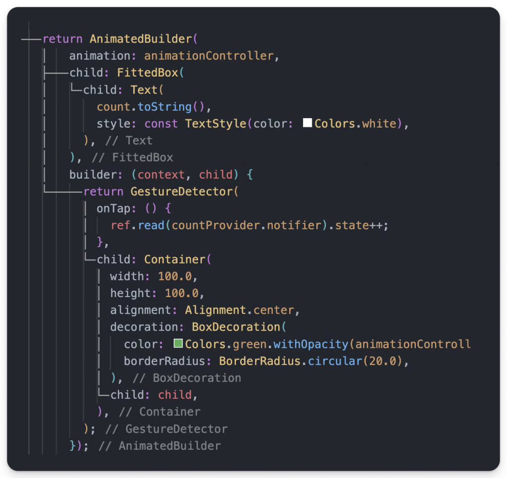
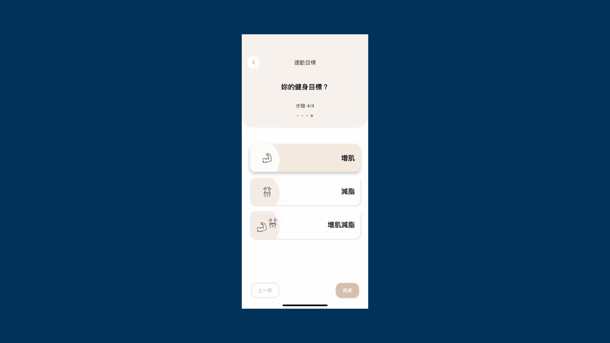
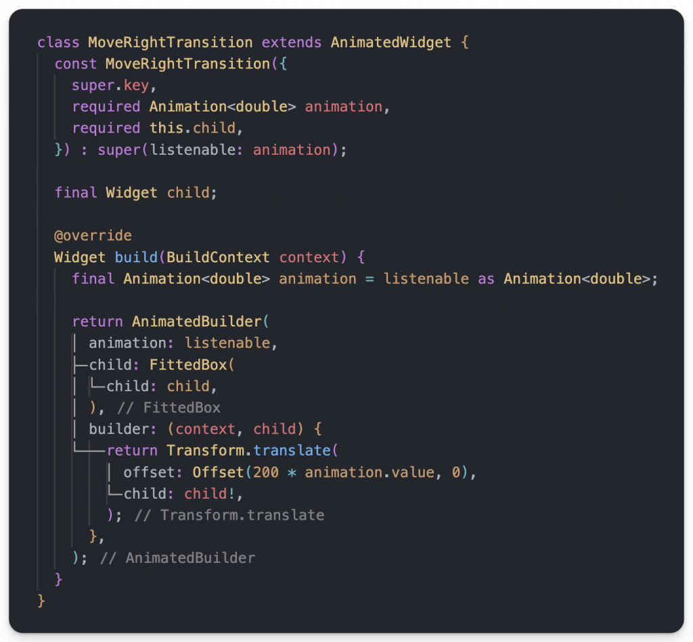

# Day 11: Flutter 動畫大補帖，觀念與使用時機都告訴你！

- 發布時間：2023-09-26 15:56:24
- 原文連結：<https://ithelp.ithome.com.tw/articles/10328634>
- 系列標記：探索 Flutter 由裡到外，三十天帶你前往進階系列 第 11 篇


在 Flutter 中，動畫在大部分開發情境下不太常使用到，很多產品都以功能為導向，有時候有趣的體驗或是酷炫的效果都會被忽略甚至是排在後面，視為往後優化的部分，所以大部分實際遇到需要動畫的情況也不多，就我了解，大部分開發者除了自身興趣外應該都對它沒有很熟悉。所以藉這個機會跟大家分享一些撰寫動畫的重點，也包含一些實作經驗與範例，希望能讓你更熟悉它。

主要動畫的分類可以分成兩種來識別，一種是 **Explicit Animation** 顯式動畫和 **Implicit Animation** 隱式動畫，在不一樣的情境下有不一樣的選擇，實現的方式有很多種，如何高效的去使用才是重點。這時侯我想大家看這兩個分類應該還是很難懂我在說什麼，沒關係，跟著我繼續往下吧！

------------------------------------------------------------------------

## 顯示動畫 (Explicit Animation)

- 製作顯示動畫的第一要素，就是需要一個 `AnimationController`，透過它我們才能完全的控制動畫，包括設置運行時間長度，會用到 Duration、開始動畫能設置初始點、反轉動畫、停止動畫等等，搭配 Tween 補間差值，能做到任何的效果呈現
- 在每一幀刷新，`AnimationController` 都會產生一個對應的數值，讓元件根據數值進行顯示上的變化。而當不使用 Tween 時(後面會提到)，就是線性的依次產生一個 0-1 的數值
- 使用時需要搭配 `AnimatedBuilder` 來進行元件的更新，務必使用它包裹 Widget Tree，才能無縫的在每幀進行刷新。切記不要用 `setState()`，雖然一樣能完成動畫效果，但實際上它無法渲染訊號同步，一旦有多個動畫要執行，或是牽扯到的範圍很大，很可能會造成卡頓
- 如果基本的動畫元件無法滿足需求時，可以透過  `AnimatedWidget` 或 `AnimatedBuilder` 實作動畫效果。我們可以自定義某個複用的效果元件，並以 XxxTransition 此規則來命名，必備參數為 `AnimationController`，通常只要看到 Transition 為後綴的元件都是顯示動畫，算是大家的共識
- 動畫的運動類型分成兩種
  - **Tween Animation** → 屬性值的變化區間，Tween 就是 Between 的簡寫，所以它的參數會有 `begin` 和 `end` 可以設置
  - **Physics Animation** → 類似Tween，只不過它的變化區間是根據物理引擎計算出來的，更加模擬真實的效果。在開發中會使用到 Simulation 相關類別去實作

#### 使用時機與情境

可以根據特性來判斷是否使用它來實作

1.  動畫會重複
2.  動畫不連貫、不順暢
3.  多個相關元件一起執行動畫

> 補充：實作時可以透過 child 參數設置不被動畫影響的元件，避免重複創建、提高效能，而最好的方式還是用 `const` Widget，節省記憶體使用

#### 相關動畫元件

| 元件                   | 說明         |
|------------------------|--------------|
| AlignTransition        | 對齊動畫     |
| DecoratedBox           | 裝飾動畫     |
| DefaultTextStyle       | 文字風格動畫 |
| Fade                   | 淡入淡出動畫 |
| Positioned             | 位置動畫     |
| RelativePositioned     | 相對位置動畫 |
| Rotation               | 旋轉動畫     |
| Scale                  | 大小倍率動畫 |
| Size                   | 尺寸動畫     |
| Slide                  | 滑動動畫     |
| StatusTransitionWidget | 狀態改變元件 |

## 隱式動畫 (**Implicit Animation)**

- 隱式就是顯示動畫的相反，使用上不需要使用 `AnimationController`，相對簡單許多，使用起來很快速、便利，只需要運行的時間長度 Duration，然後設定改變的目標值，它就能幫你做完所有事情。不過就無法控制動畫
- 有一貫的命名方式，通常一般以 **AnimatedXxx** 為規則來命名，這點一樣需要記下來。不過 AnimatedIcon 為例外，它其實是 Explicit Animation
- Flutter 本身提供很多樣的隱式動畫 Widget，例如：AnimatedContainer、AnimatedIcon、AnimatedAlign 等等，下方我會列出來

#### 使用時機與情境

1.  沒有符合顯示動畫的條件時

#### 相關動畫元件

| 元件                          | 說明                                       |
|-------------------------------|--------------------------------------------|
| AnimatedAlign                 | 對齊動畫                                   |
| AnimatedContainer             | 綜合動畫，更改支援的所有屬性都會有動畫效果 |
| AnimatedCrossFade             | 針對兩個元件執行交換的 Fade 動畫效果       |
| AnimatedDefaultTextStyle      | 文字動畫                                   |
| AnimatedOpacity               | 透明度動畫                                 |
| AnimatedPhysicalModel         | 陰影動畫                                   |
| AnimatedTheme                 | 主題風格動畫                               |
| AnimatedSize                  | 大小尺寸動畫                               |
| AnimatedPadding               | Padding動畫                                |
| AnimatedRotation              | 旋轉動畫                                   |
| AnimatedSwitcher              | 元件漸變動畫，跟 AnimatedCrossFade 類似    |
| AnimatedScale                 | 動畫版本的 Transform.scale，影響大小       |
| AnimatedSlide                 | 滑動動畫                                   |
| AnimatedPositioned            | 位置動畫                                   |
| AnimatedPositionedDirectional | 位置方向動畫                               |


## 動畫控制器 (AnimationController)

- 製作顯式動畫時，都會需要 **AnimationController** 來管理和控制動畫，可以根據 APP、頁面狀態去操作動畫，給予不一樣的效果。而我們在使用時，通常會在元件的 State with `SingleTickerProviderStateMixin` 並在創建 AnimationController 的時候設置 `vsync` 參數為 this，緊接著就能開始製作動畫了
- 大部分時候我們只需一個 AnimationController，搭配 `SingleTickerProviderStateMixin`，顧名思義它就是適合一個 AnimationController 的情境。如果需要多個 AnimationController 來管理多個動畫，可以選用 `TickerProviderStateMixin`，同時管理多個 Ticker 實體與每幀更新同步

> 詳細動畫的刷新過程跟源碼分析可以閱讀下一篇文章，分享了細節，這邊就不深入探討了。  
> [Day 12: 研究 Flutter 動畫，背後的 vsync 跟 Ticker 有多重要？](https://ithelp.ithome.com.tw/articles/10329250)

### SingleTickerProviderMixin

- 適合 State 裡面只有一個 **AnimationController**，使用 `vsync` 創建一個 TickerProvider

### TickerProviderMixin

- 適合 State 裡面需要多個 **AnimationController** 同時使用，使用到多個 TickerProvider

## 補間 (Tween)

- **Between** 代名詞，擁有開始(begin)和結束(end)兩個參數，動畫的數值變化只會在這個區間更動，內容可以是任何類型，例如：int、double、Offset、String、Color、Matrix4 等等
- 普遍的使用方式 `Tween<T>`，使用泛型放置你期望的型別，當然也可以使用特定類型的 Tween 類去替代，下方有幫大家條列了
- 與 AnimationController 搭配，它負責管理 Tween，使用 `animate()` 生成 `Animation` 物件

#### 可使用種類

| 類型                  | 說明                                           |
|-----------------------|------------------------------------------------|
| IntTween              | 數值變化                                       |
| StepTween             | 使用 double 刪除小數值返回整數部分             |
| ColorTween            | 顏色變化                                       |
| SizeTween             | 大小變化                                       |
| BoxConstraintsTween   | 約束變化                                       |
| DecorationTween       | 裝飾變化，例如：BoxDecoration、ShapeDecoration |
| EdgeInsetsTween       | EdgeInsets變化，可搭配 Padding 使用            |
| Matrix4Tween          | 矩陣變化                                       |
| TextStyleTween        | 文字風格變化                                   |
| FractionalOffsetTween | 小數變化                                       |
| MaterialPointArcTween | 圓弧變化                                       |
| RectTween             | 矩形變化，使用 null 代表 Rect.zero             |
| AlignmentTween        | 對齊變化                                       |
| ConstantTween         | 常數變化                                       |

#### 產生核心 Animation

實現動畫的核心類，根據 Tween 生成更新的區間數值，而元件根據數值的更新來重繪，產生動畫效果

``` dart
// 1.
Animation animation = _animationController.drive(
  Tween<Offset>(
    begin: const Offset(0, 0),
    end: const Offset(100, 200),
  ),
);

// 2.
Animation animation = Tween<Offset>(
  begin: const Offset(0, 0),
  end: const Offset(100, 200),
).animate(_animationController);
```

#### 串連 Chain the Tweens

- 可以將多個 Tween 進行組合，簡單的連結它們，例如：給 Tween 添加 **Curve** 曲線。有時候Tween 很難描述一個複雜動畫，這個時候就需要進行疊加了

``` dart
Animation animation = Tween(
      begin: 0,
      end: 50,
    )
        .chain(
          CurveTween(curve: Curves.easeIn),
        )
        .animate(animation);
```

#### 自定義 Tween

- 繼承 `Tween` 自定義特殊情境的差值，任何類型的改變，都可以作為 `Tween`
- 根據動畫的時間進度參數 `t` 進行處理和計算，讓結果不同

以下範例，實作出文字陸續出現的效果，就像打字機一樣：

``` dart
class TypingTween extends Tween<String> {
  TypingTween({
    String begin = '',
    String? end,
  }) : super(
          begin: begin,
          end: end,
        );

  @override
  String lerp(double t) {
    final endStringLength = end?.length ?? 0;
    final cutPosition = (endStringLength * t).round();
    final displayedText = end?.substring(0, cutPosition) ?? '';

    return displayedText;
  }
}
```


## Curve

- 曲線本身是一個數學函數 **f(x)**，控制動畫在時間上變化的速度，行進的曲線。預設動畫以線性方式動作，而它能讓動畫變的更加自然、真實，避免生硬的動畫過程，例如讓行進從慢速開始然後加速
- 在動畫中，過程被稱為**插值器**(interpolator)，`Curves` 提供了很多不同類型的選擇，覆蓋了大部分的使用場景，例如：`Curves.easeIn`、`Curves.bounceInOut`、`Curves.fastOutSlowIn`，總共 38 種，詳細可以到官方文件上了解

#### 可使用種類(38種)

`Curves.easeIn` → 動畫從慢速開始然後加速  
`Curves.easeInOut` → 動畫從慢速開始，加速，然後減速  
… 詳細可查看官方文件，有呈現所有的運動效果

[Link: Curves class](https://api.flutter.dev/flutter/animation/Curves-class.html?gclid=Cj0KCQjw_5unBhCMARIsACZyzS0wOARvsZRleDe6PZydfngJva2sTYsJcb7xifZtCfNW686TaHhE0-kaAmLoEALw_wcB&gclsrc=aw.ds)

### CurvedAnimation

- 根據曲線(Curve)來生成**非線性**的區間值，可以讓動畫更自然，根據幾種運動方式去運行，比較不會讓人感覺古板
- 很多情況下，動畫的發生速率是變化的，例如：加速、減速
- 甚至能設定這個 Animation 在整體動畫的兩個指定時間點出現，使用 `Interval` 實作。第一個參數為開始，第二個參數為結束，設定 0-1，例如：可以設定時間長度在 0.25 開始執行動畫

``` dart
Animation animation = Tween<Offset>(begin: const Offset(0, 0), end: const Offset(100, 200)).animate(_animationController);
// 1.
animation = CurvedAnimation(parent: _animationController, curve: Cureves.easeInOut)

// 2.
Animation animation2 = CurvedAnimation(
  parent: _animationController,
  curve: const Interval(0, .6, curve: Curves.fastOutSlowIn),
);
```

## AnimatedBuilder

- 只要是顯示動畫都會需要用到 AnimatedBuilder，跟 `AnimationController` 搭配使用，精準的進行畫面重繪
- 參數
  - `child` → 設置不需要更新、變化的元件，不會因為動畫執行而重複創建和浪費資源，更好的是幫元件加上 **const**，確保編譯時就創建確定
  - `builder(context, child)` → 可以直接拿 `child` 來用，它就是我們賦予不會被影響的部分，外面包裹需要動畫更新的元件

> 再提醒一次，切記盡量不要使用 `addListener()` 和 `setState()` 進行動畫刷新，尤其是擁有一個 Long widget tree，會降低 APP 性能

  


## AnimatedWidget(Custom Animation Widget)

- 如果 `build()` 的 Widget Tree 變得腫大且難閱讀時，可以將動畫部分獨立出來一個新的 Widget。這時候很適合使用自定義的 AnimatedWidget，將 AnimatedBuilder 包成 Widget，除了可讀性高之外，以後也可以複用，不需要重寫相同效果，可以實作一個自己的動畫元件集合
- 屬於顯示動畫，需要 `Listenable` 作為參數，AnimationController、Animation 都是它的子類，根據命名規則，通常會以 **xxxTransition** 的命名方式
- 建議暴露一個 `child` 參數作為性能優化，可以提前創建不被影響  
  

## TweenAnimationBuilder

- 實際上也是 **Implicit Animation** 隱式動畫，類似 AnimatedBuilder 但是不需要 AnimationController 的幫助
- 一樣設置 **Tween**，固定的 Tween 可以使用 `static final` 聲明，節省記憶體消耗
- 適合情境
  1.  動畫不符合 Explicit Animation 條件
  2.  不需要 AnimationController 掌控動畫
  3.  需要 Curve 來呈現跳耀、非線性過程

``` dart
TweenAnimationBuilder(
  tween: ColorTween(begin: Colors.blue, end: Colors.green),
  duration: const Duration(milliseconds: 1500),
  curve: Curves.bounceInOut,
  builder: (context, tween, child) {
    return Container(
      width: 100.0,
      height: 100.0,
      alignment: Alignment.center,
      decoration: BoxDecoration(
        color: tween,
        borderRadius: BorderRadius.circular(20.0),
      ),
      child: child,
    );
  },
)
```


------------------------------------------------------------------------

## 動畫的選擇

以下是在實際開發場景中，我們如何針對動畫的需求條件來決定要使用哪種方式來實現。(此圖參考 Emily Fortura 製作中文版本)  


## 補充

### 注意

- 列表元件在實作時需考慮到緩存範圍，因為會優先繪製可視區域外的一些元件，可能在還沒滾動到它們時，動畫就已經結束了，使用者會看不到效果

### 技巧

- 實作動畫經常搭配的元素
  1.  Stack
  2.  Positioned
  3.  Transform
- 觀察動畫，歸納出我們看到的效果，例如：重疊、變小、位移、更換元件，分解之後再接著一步一步實作它們
- 了解三角函數對畫東西、做動畫有幫助。例如：當數值一下負一下正，數值來回移動，可以判斷為三角函數的 `sin(value)`，數值越長頻率越高，越小波形越平緩  
  

### 撰寫有關時間的測試

- 使用 `clock` 套件，透過模擬的時間，在測試環節可快速跳過並驗證。不需要使用 Future 和 Datetime 耗費真實時間

> [Package: clock](https://pub.dev/packages/clock)

------------------------------------------------------------------------

本文說明了動畫的核心幾部分，希望有讓大家了解在什麼情境下要選擇什麼實作方式，通常一種動畫效果可以有很多種方式來完成它，但我們可以挑相對快速且方便的作法，根據動畫的作動、行為、可操作性來判斷。如果都不夠你用的話，那我們就使用 Canvas 自己畫吧，有興趣的朋友跟我說，會在出其他文章來討論。

動畫除了是一個效果、一個產品需求之外，它同時也是提升使用者體驗的重要元素，當市面上產品的呈現方式都差不多時，可以想想是否能讓自家產品脫穎而出，但凡事過多都會造成反效果，所以規劃、嘗試很重要，適當才能夠畫龍點睛。思考一下，讓 APP 擁有自己的特點吧！

------------------------------------------------------------------------

## 延伸閱讀

[Day 12: 研究 Flutter 動畫，背後的 vsync 跟 Ticker 有多重要？](https://ithelp.ithome.com.tw/articles/10329250)
