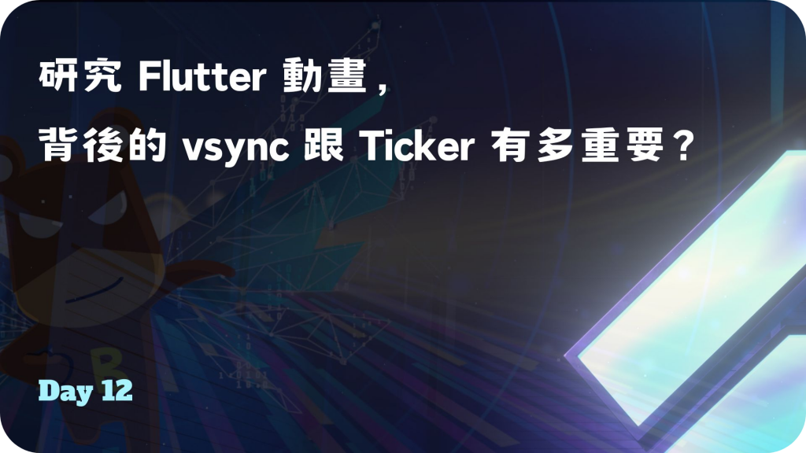
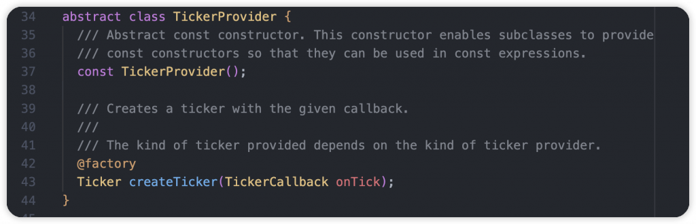
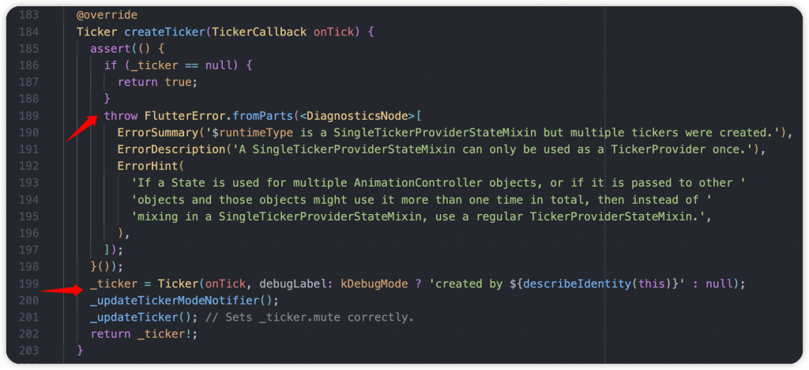
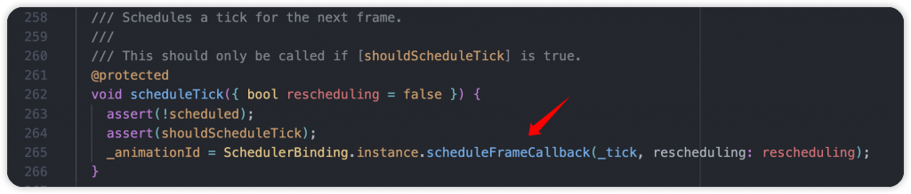
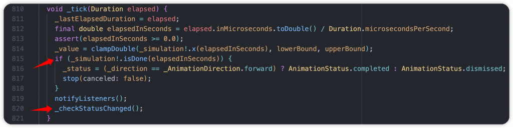
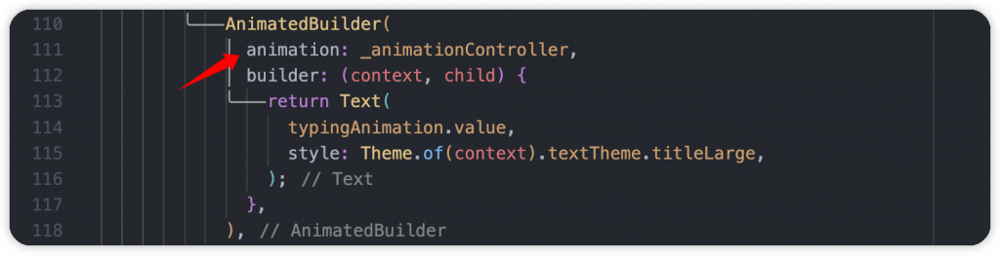
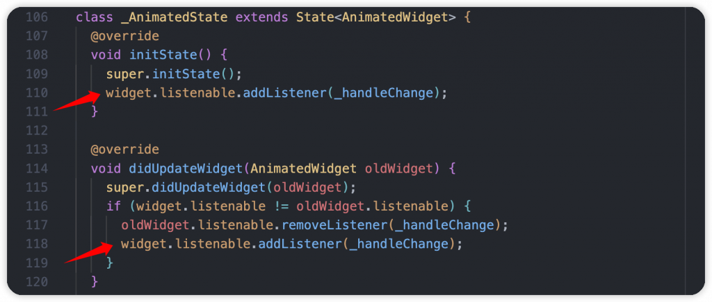
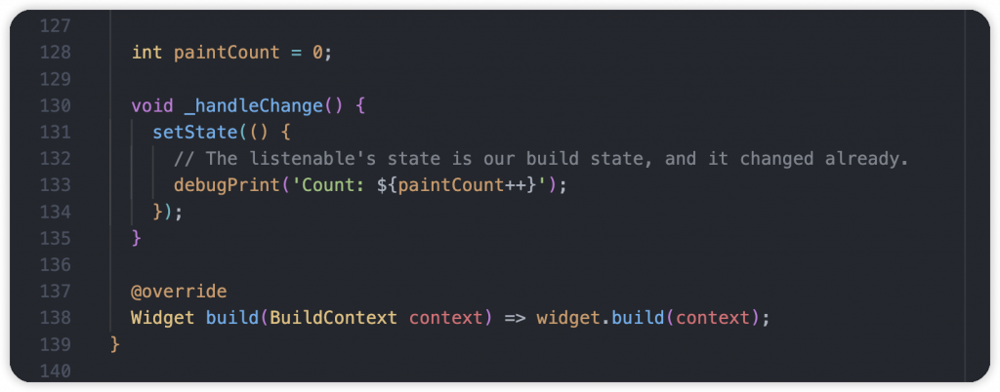

# Day 12: 研究 Flutter 動畫，背後的 vsync 跟 Ticker 有多重要？

- 發布時間：2023-09-27 12:03:07
- 原文連結：<https://ithelp.ithome.com.tw/articles/10329250>
- 系列標記：探索 Flutter 由裡到外，三十天帶你前往進階系列 第 12 篇



上一篇介紹了動畫的兩大分類，**Explicit Animation** 和 **Implicit Animation**，以及實作時會用到的幾個重要元素，包含 **AnimationController**、**Tween**、**Curve**、**AnimatedBuilder** 和 **TweenAnimationBuilder**，有了他們就可以實作出九成的動畫效果，大部分場景都能實現。最後也分享了動畫路線圖，幫助你在看到需求與設計時，可以根據幾個條件去判斷要選擇哪種實作方式。

本文要帶你深入 `vsync`、`Ticker`、`TickerProvider`，他們實際上在背後做了哪些事情，我們從源碼來了解。相信你看懂後，對實作上會更有想法，避免一些效能低效的選擇，讓動畫保持高幀運行。

------------------------------------------------------------------------

在實作 Explicit Animation 的時候都會使用到 `vsync`，但很多人都設置 this 後就去製作後面的動畫了，但實際上你知道 `vsync` 關鍵字是什麼意思嗎? 實作時幫 State with `SingleTickerProviderStateMixin` 就完成前置作業了? Flutter Framework 讓我們輕鬆的實作動畫，應該也會很好奇它們的真面目吧，帶你了解一下  


1.  vsync 本身是 `TickerProvider`，訊號提供者，必須要有才能提供給 Rendering Pipeline 信號，維持與畫面渲染的每一幀同步，精準在每一幀進行處理。才能讓 AnimatedBuilder 刷新，實現順暢的運行效果
2.  實際上背後是透過 `SchedulerBinding.instance.scheduleFrameCallback()` 在每幀觸發刷新
3.  在 AnimationController 創建的時候同時透過 `createTicker()` 創建一個新的 `TickerProvider`，負責處理當前 AnimationController 的訊號通知，當訊號來的時候進行畫面刷新  
    

看到 `_internalSetValue()` 方法，在一開始會根據初始值設置做一些初始的狀態設定，確認`AnimationStatus`  


接著重要的 `vsync.createTicker(_tick)` 做了什麼？它本身是一個抽象類，給子類繼承實作方法，也只有一個 `createTicker()`，參數 onTick 就是收到每幀的信號時的 callback。如果以範例來說是 with `SingleTickerProviderStateMixin`，這邊就看它是如何 override  


1.  首先檢查 `_ticker` 屬性也就是 TickerProvider，是否為空值，理論上這邊要是空值才正常，會幫忙創建一個新的 Ticker。如果不為空，代表你的 State 可能使用多個 AnimationController 導致有多個計時器，這時候你應該選擇使用 `TickerProviderStateMixin` 代替，否則會報錯

2.  創建 Ticker 的同時，一樣設置 onTick callback，讓幀數更動時可以觸發  
    

3.  在 Ticker 內部追蹤 onTick callback 的觸發來源，找到了根源 `scheduleTick()` 方法，主要幫下一幀做準備，到的時候通知我

4.  使用 `SchedulerBinding.instance.scheduleFrameCallback()` 給予 `_tick()` callback，參數為當前時間的 `timeStamp`  
    

5.  在第一次 tick 的時候，透過初始時間更新 `_startTime` 屬性，提供之後的每幀計算使用，算出時間間隔，也可以從這裡統計一秒有幾幀，進而看出是否掉幀的情況。

6.  接著呼叫外部傳入的 `_onTick()` ，參數為每次觸發時間跟初始時間計算出來的時間間隔

7.  最後根據狀態安排下一幀的處理，執行 `scheduleTick()`，如果動畫結束的話就不會繼續安排也不會在觸發 `_onTick()`  
    

實際在動畫運行中將間隔印出來，確實為1幀16毫秒，保持高效運作。  


1.  最後到 AnimationController 處理 `_tick()` callback，這裡的 `elapsed` 參數為此幀跟動畫初始時機的間隔時間長度，以 Duration 表示
2.  透過 `_simulation!.isDone(elapsedInSeconds)` 檢查動畫是否完成，使用當前時間跟完整運行動畫的 Duration 進行比較，超過的話就代表完成。AnimationController 使用 **InterpolationSimulation**，可以看 `isDone()` 覆寫內容
3.  動畫完成的話就更新 `_status` 狀態為 **completed** 或是 **dismiss**，並使用 `stop()` 停止動畫
4.  最後經由 `notifyStatusListeners(status)` 觸發 **AnimationStatusListener**，通知有監聽狀態的 AnimationController  
      
    

## AnimatedBuilder

到這邊你以為結束了嗎，其實還沒。上面只是了解每幀訊號的通知，跟動畫有關係的元件怎麼知道要刷新了呢，這時候就會轉移到另一個重點 **AnimatedBuilder**，我有設置相同的 `_animationController` 物件，而 AnimationController 本身也是 **Listenable**  


1.  實際上 **AnimatedBuilder** 的根源是基於 **AnimatedWidget** 來實作，一樣都有 `listenable` 物件
2.  **AnimatedWidget** 是一個 StatefulWidget，在一開始 `listenable` 進行變化監聽，`_handleChange` callback  
      
    

我在 callback 觸發的時候順便印出重繪次數，也確認設置的1秒動畫總共消耗了60幀完成。以下提供實際的範例驗證，動畫運行順暢。  
  


------------------------------------------------------------------------

## 補充

### Ticker & createTicker()

- 類似刷新率
- 設置一個 callback，參數 **Duration**，持續通知每一幀跟初始時間比較後經過多久，可以在這裡處理某些事情，例如：計算每幀間隔多久(毫秒)、計算位置後刷新
- 返回 **Ticker** 物件，記得在 State 銷毀、觸發 `dispose()` 的時候進行釋放
- 實際場景也可搭配 `ChangeNotifier` 觸發更新

``` dart
@override
void initState() {
  super.initState();

  _ticker = createTicker((Duration elapsed) {
    debugPrint('$lastTime, $elapsed, ${elapsed - lastTime}');
    lastTime = elapsed;

    setState(() {});
  });
  _ticker.start();
}

@override
void dispose() {
  _ticker.dispose();
  
  super.dispose();
}
```

------------------------------------------------------------------------

經過本文大家已經知道動畫背後的核心 vsync、Ticker 和 TickerProvider 是什麼，它們做了哪些事情來確保動畫更新。而當我們了解後，以後在開發時遇到問題也會更有想法，知道可能有哪些原因而導致，提高開發效率。建議大家多玩玩每種動畫，實作屬於自己的效果，搭配一些頁面操作，也會更了解差異性。

有什麼想法都歡迎交流，覺得不錯的話跟我說，我們在一起研究第三篇！
