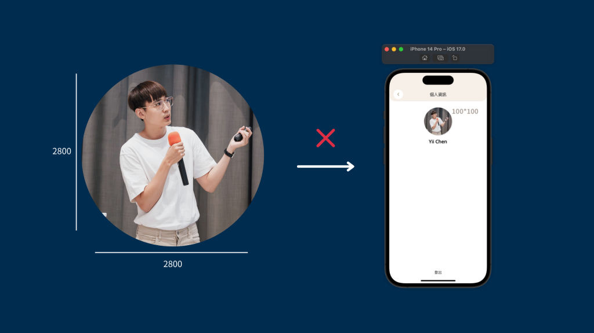
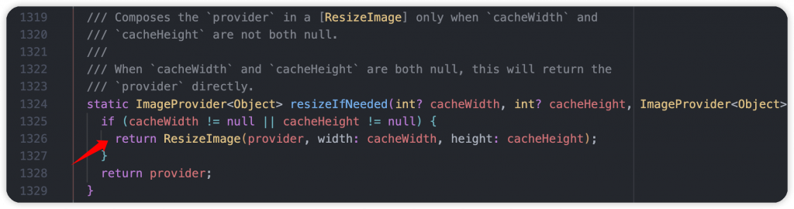
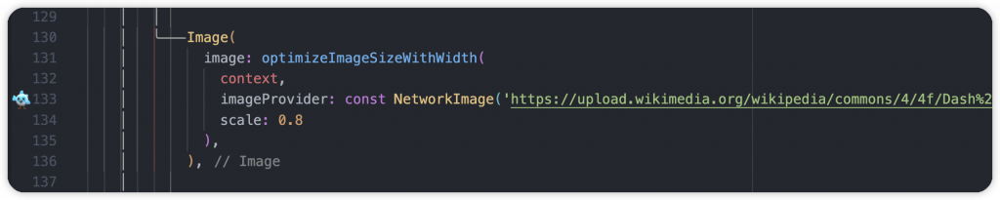
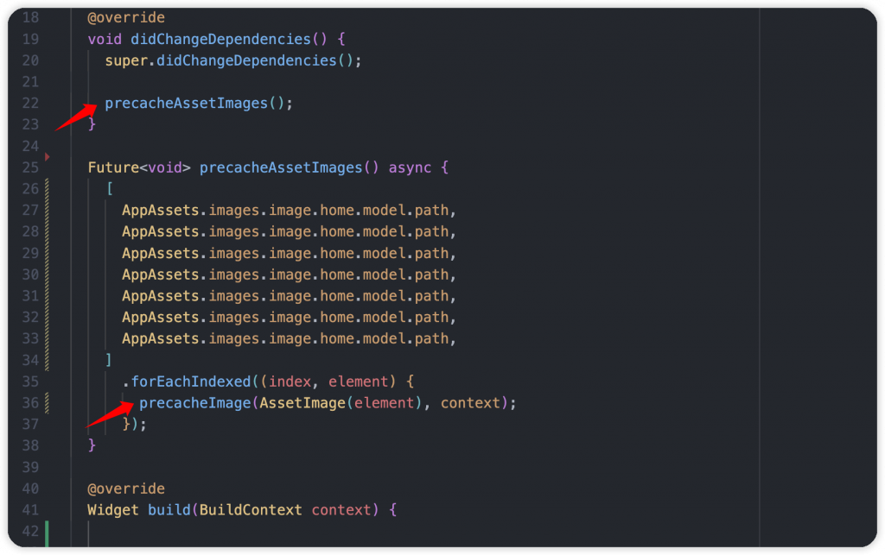
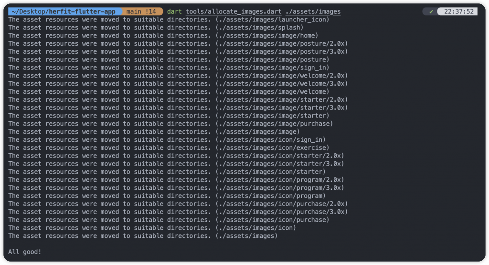
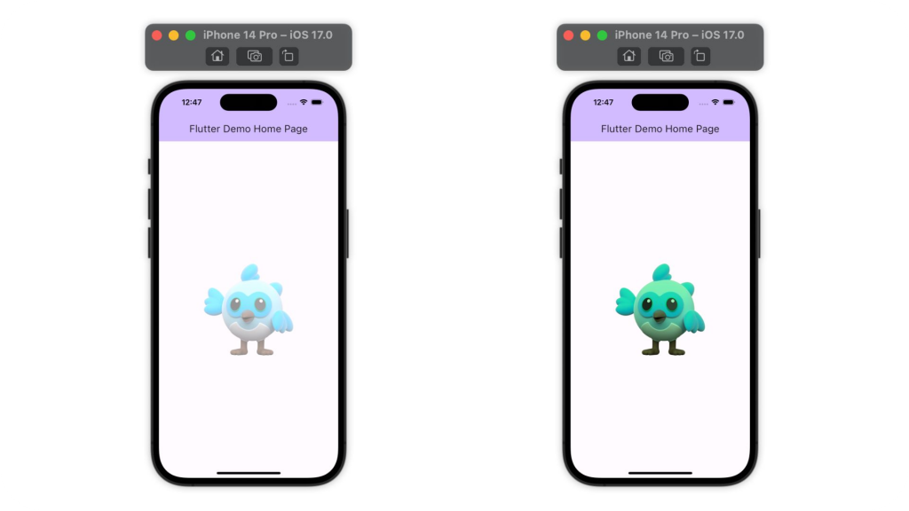
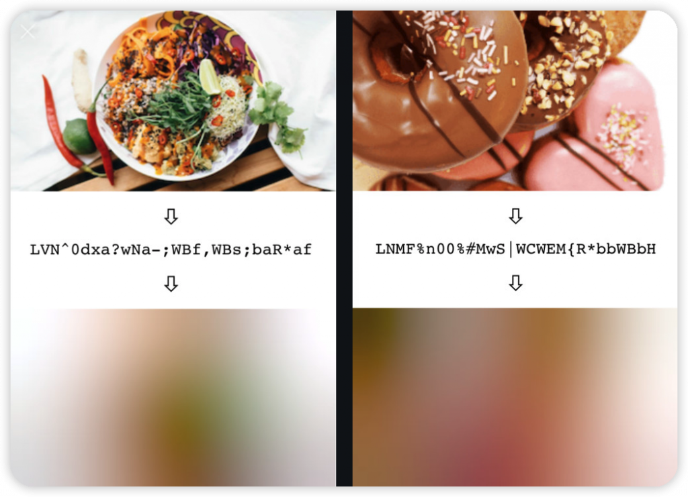

# Day 16: 聊聊 Flutter 圖像使用的良好習慣，記憶體掌握與優化！

- 發布時間：2023-10-01 19:12:49
- 原文連結：<https://ithelp.ithome.com.tw/articles/10332083>
- 系列標記：探索 Flutter 由裡到外，三十天帶你前往進階系列 第 16 篇


相信大部分 APP 都會使用到圖片，可能場景有貼文牆、大頭照、上傳圖片等等，在實作時大家是否有關心過記憶體的使用情況呢？或許在開發時、在自己的裝置上都運行的順暢，沒有什麼問題，但有確定在使用者的裝置上表現會相同嗎？本文就這部分，有關圖片、圖像的使用，要跟大家分享一些開發觀念、使用技巧與工具，如何讓我們有效率的存取它們，並確保 APP 的記憶體有正常使用，避免不當消耗。

深呼吸一口，我們開始吧！

------------------------------------------------------------------------

## 圖檔格式的選用

- `png`
  - 圖像是光柵圖形，由像素網格組成
  - 檔案大小通常較大
  - 適用於高細節、高復雜性、高解析，或者需要透明度具有透明背景的圖像，例如：照片
- `jpg` → 適合一般圖片，大小適中
- `webp` → 新型格式，可代替 `png`、`jpg`、`gif`，容量相對小很多，支援有損和無損壓縮、透明背景
- `avif` → 新型格式，跟 `webp` 支援度差不多，但是多了 HDR 顏色
- `svg`
  - 圖像是矢量圖形，由數學演算定義的形狀、曲線和直線組成
  - 檔案非常小
  - 適用於簡單的線條、隨意調整大小的圖形，可以任意縮放並保持相同品質
  - 例如：圖標

補充：在 Flutter 中，使用過多的 SVG 圖像可能會對應用的渲染性能產生一定影響。 需要更多的處理和解析，因為它們包含了矢量數據和復雜的路徑資訊。因此，使用大量的 SVG 圖像可能會導致變慢，特別是在較舊的設備上。不過以後不需要太擔心，此現象在新的 Impeller 引擎上有很大的優化，能有效降低計算成本，複雜的場景也能保持順暢，但是也要等到 Android 釋出 Impeller 後才算完全支援，請大家再等待一下了。

## 存取本地圖檔

大家在使用圖檔的時候請避免使用 **hard-coding** 的方式將字串寫死，雖然剛開始學習 Flutter 到一段時間後，還是覺得這樣當下很方便，已經產生習慣了，但還是請改掉這個行為。

它的缺點有幾個：

1.  打錯字就出問題了
2.  10個地方使用同一張圖片，需要輸入完整的字串10次
3.  難以管理和維護

請使用一個自定義的本地圖檔類別去紀錄所有的路徑，使用 static const 去宣告每個字串，除了好管理之外、效能也會更好。以後圖像改了、路徑變了，就到類別裡去做修正，即可完整需求。

以下方範例來看，創建了 **AppAssetsPath** 類別，再裡面提供了 iconHome 這個 `static const` 字串，代表對應的圖檔路徑。讓整體的可維護性提高，以統一入口去存取圖檔，實際上在元件上的存取方式也很直覺、簡單，不用再浪費時間打字了。

``` dart
@immutable
final class AppAssetsPath {
  const AppAssetsPath._();

  static const String iconHome = 'assets/images/home.jpg';
}

// UI code
Image.asset(AppAssetsPath.iconHome),
```

相信有些開發者還是覺得自己要寫類別，再新增每個圖檔常數很麻煩，所以還有一種大家常用的方式，代碼生成 Codegen。透過 **flutter_gen** 套件幫我們自動生成所有內容，我們只需要做一點設定，最後再 Terminal 執行 `dart run build_runner build -d` 指令，即可實現我們的使用需求。詳細請看 pub.dev。

> [Package: flutter_gen](https://pub.dev/packages/flutter_gen)

## 圖檔壓縮

#### 壓縮後再上傳到雲端

適當地壓縮圖像對於上傳大量圖片，或是請求圖檔資料時都很有幫助，當然壓縮後的品質需要確認是否達到標準，才不會為了壓縮導致呈現出來很粗糙。

- 減少遠端下載的頻寬
- 減少使用時所需要的記憶體
- 降低本地資源的大小
- 加快載入速度

🐦 使用 **flutter_image_compress** 套件壓縮圖檔

``` dart
final file = await FlutterImageCompress.compressAndGetFile(
  file.absolute.path, 
    targetPath,
  quality: 90,
  rotate: 180,
);
```

> [Package: flutter_image_compress](https://pub.dev/packages/flutter_image_compress)

#### 壓縮後再放入本地目錄

以下提供相關的網站和工具：

1.  **Squoosh** → GoogleChromeLab 推出的開源專案，處理速度快，在壓縮後可瀏覽前後的圖像對比照，輸出高品質的壓縮圖像。[網站](https://squoosh.app/)  
    

2.  **tinypng** → 知名熊貓，進行有損壓縮，減少圖像中的顏色數量，降低 WEBP、JPEG 和 PNG 的檔案大小。[網站](https://tinypng.com/)  
    

3.  **ImageOptim** → macOS App，可以直接到官網下載，使用起來直覺簡單，只需要將圖檔拉進去、匯入，圖片就會自動開始處理，壓縮後直接覆蓋原檔。[網站](https://imageoptim.com/mac)

> [Github](https://github.com/ImageOptim/ImageOptim)  
> 

## 限制寬高，不儲存過大的圖像

當專案需要載入高解析度的圖像時，特別是無限滾動的貼文列表、動態牆等等，很可能會導致卡頓，因為將原始圖像壓縮到螢幕的顯示尺寸，這個任務很繁重且耗時。如果 APP 特別只在手機端上運行，需要考量到是否還需要將大圖像提供給 client 端，是否可以在後端進行壓縮和調整。

#### 優點

1.  減少圖像的體積、大小
2.  減少記憶體的使用
3.  載入的時間更短、更快
4.  保持順暢，體驗避免卡頓
5.  提升渲染圖像的性能  
    

#### 設置緩存大小

在小區域顯示一個大尺寸圖像，Image 本身可以設置指定的緩存長寬，使用 `cacheWidth` 和 `cacheHeight`，進行圖像解碼並以指定大小存儲在記憶體，這將避免在解碼過程中產生不必要的成本消耗和硬碟空間的使用，最後保存調整過後的小圖像。

``` dart
Image.asset(
    'assets/images/flutter.png',
    cacheWidth: 100,
    cacheHeight: 100,
),

Image.network(
    'images/70760bf1e88b184bb1bc.png',
    cacheWidth: 100,
    cacheHeight: 100,
),
```

假設有設置 `cacheWidth` 或是 `cacheHeight` 兩個參數，內部會使用 ResizeImage 進行處理，將圖像 decode 成指定尺寸的 ImageProvider。在處理過後可能會失去一些細節，不過使用上的記憶體可以有效減少。  


自行處理圖像的範例：  
透過 MediaQueryData 取得螢幕尺寸和像素比，根據 `scale` 計算出新的尺寸，最後返回新的 ImageProvider 讓元件使用。

``` dart
ImageProvider optimizeImageSizeWithScale(
  BuildContext context, {
  required ImageProvider imageProvider,
  double scale = 1,
}) {
  final Size size = MediaQuery.sizeOf(context);
  final double devicePixelRatio = MediaQuery.devicePixelRatioOf(context);
  final Size newSize = size * devicePixelRatio * scale;

  return ResizeImage(
    imageProvider,
    width: newSize.width.round(),
  );
}

// Usage
Image(
  image: optimizeImageSizeWithScale(
    context,
    imageProvider: const NetworkImage('images/Dash%2C_the_mascot_of_the_Dart_programming_language.png'),
    scale: 0.8,
  ),
),
```



#### 從設備抓取圖像

如果今天是要上傳照片、圖片到後端，以大家熟悉的 **image_picker** 套件來看，它有提供 `maxWidth`、`maxHeight`、`imaqeQuality` 三個參數可以設置，除了能有效避免圖像過大以外，還可以輕鬆地壓縮品質。這些都可以根據實際的使用場景去決定，也許 APP 不需要最好的品質和尺寸去顯示，即可有好的效果。

``` dart
_picker.pickImage(
    source: source,
    maxWidth: maxWidth,
    maxHeight: maxHeight,
    imageQuality: imageQuality, // 0 ~ 100
)
```

> [Package: image_picker](https://pub.dev/packages/image_picker)

## 預先載入圖像

很常我們會在專案裡的 `assets` 目錄放置一些本地圖檔，屬於不會更改且頻繁出現的圖片，如果剛好在頁面創建的時候要顯示大量的圖片，例如：100、200張，這時候一定會看到圖片陸續被載入或是沒有顯示上非常的絲滑。

你可能想說本地檔案不是應該會很順嗎，為什麼一樣會延遲？因為即便圖像是從本地載入不是雲端，它們都需要先被緩存到記憶體，接著在呈現到畫面上，而不是直接就能顯示。

這時候就需要在 Splash Page 或是在頁面一開始的時候進行預先載入，讓大部分圖片都可以在 `build()` 方法觸發之前先準備好，能夠有效避免遲緩的情況。

- Flutter Framework

``` dart
// Precache local
precacheImage(AssetImage(imgPath), context);

// Precache remote
precacheImage(NetworkImage(imgUrl), context);
```



- 使用 **cached_network_image** 套件時，很常會搭配 **flutter_cache_manager** 套件，有自己的 CacheManager 去進行緩存管理，可以在 APP 一開始或是過渡時間進行遠端的圖片緩存

``` dart
// Precache remote if not cache before
await getSingleFile(imgUrl);
```

> [Package: flutter_cache_manager](https://pub.dev/packages/flutter_cache_manager)

## SVG 圖檔預編譯

通常使用到 svg 圖檔大家對 **flutter_svg** 應該都很熟悉，搭配 **vector_graphics_compiler** 套件，允許 svg 生成二進制格式，使用時的解析速度更快，並且可以減少 clipping、masking 和過度繪製的情況。生成以 `.vec` 後綴的 svg 圖檔

在 Terminal 透過指令生成 `svg.vec` 檔案。

``` bash
dart run vector_graphics_compiler -i assets/home.svg -o assets/home.svg.vec
```

在 UI code，使用 `AssetBytesLoader` 載入圖檔。

``` dart
import 'package:flutter_svg/flutter_svg.dart';
import 'package:vector_graphics/vector_graphics.dart';

final Widget homeImage = SvgPicture(
    const AssetBytesLoader('assets/images/icon/home.svg.vec')
);
```

> [Package: flutter_svg](https://pub.dev/packages/flutter_svg)  
> [Package: vector_graphics_compiler](https://pub.dev/packages/vector_graphics_compiler)

## 資源圖檔支援解析度適配

Flutter 支援解析度感知(resolution awareness)，根據設備像素比載入解析度合適的圖像，例如：在像素比 1.8 的設備會使用 `2.0x/` 目錄的圖像; 像素比 2.7 會用 `3.0/` 圖像。

假設我們有一個 `cat.png` 圖檔，在 asset 目錄裡需要提供多倍率的對應檔案，為了適配設備的解析度，避免小尺寸手機載入大尺寸、容量的圖像，這是不必要的需求，而且還會讓載入速度也會變慢，嚴重的話可能很快就會有設備 OOM 情況，導致 APP 崩潰。

如果大家有使用和熟悉 figma 這類的設計軟體，通常在圖檔匯出時都會有倍率可以選擇，操作上很方便。取得檔案後接著在分配到專案的指定路徑，而下方我有提供使用 Dart 撰寫的 script，簡單、快速地幫你自動分配好檔案，大家也不需要浪費時間了。

``` dart
.../cat.png       (mdpi baseline)
.../1.5x/cat.png  (hdpi)
.../2.0x/cat.png  (xhdpi)
.../3.0x/cat.png  (xxhdpi)
.../4.0x/cat.png  (xxxhdpi)
```

撰寫自己的 dart script 幫忙分配圖檔，先將圖檔放到 assets 指定路徑，接著再根目錄使用指令。當然也可以使用 Makefile 執行

``` bash
dart tools/allocate_images.dart ./assets/images
```

  


> [Github: flutter-tips-and-tricks](https://github.com/chyiiiiiiiiiiii/flutter-tips-and-tricks/tree/main/tips/0001-use-dart-program-to-allocate-resolution-images)

## 圖像搭配 AspectRatio

AspectRatio 元件本身可以讓 child 根據寬長比例去顯示，必須設置 `aspectRatio` 參數，可以在使用時想說寬比長，然後以寬/長來填入。如果是正方形，就是設 1; 如果是寬長 16:9 就是設 1.77，使用上很簡單。它的用處是可以讓我們在開發時不需要設置固定的長寬數值(不同裝置較容易跑版)，可以根據裝置的大小長寬去自動適配，所以這也是在做 APP 多端開發的時候，很常用的一個技巧。有效確保在所有設備上保持圖像的一致性，即使設備的解析度、尺寸不同，它也會自動放大或縮小圖像以符合 UI。

``` dart
// 16:9
const AspectRatio(
    aspectRatio: 1.77,
    child: Image(
        image: NetworkImage(
      'images/Dash%2C_the_mascot_of_the_Dart_programming_language.png',
    ),
  ),
),
```

## 實作透明圖像

盡量避免在 Image 外層包裹 **Opacity**，雖然能實現效果，但是在背後渲染時的工作成本比較昂貴，濫用會影響運行幀數。詳細可以閱讀另一篇文章，有更多對於 Opacity 的說明。

針對圖像的操作可以使用 Image 本身的 `color` 以及 `colorBlendMode` 參數去做調整，顏色本身可以使用 `fromRGBO()` 建構方法，第四個參數設置指定的不透明度。最後設置 BlendMode 為 `BlendMode.modulate`，讓它可以透過顏色調整圖片，完成我們要的效果

``` dart
// Add white with opacity 0.5
Image(
    image: NetworkImage(
    'images/Dash%2C_the_mascot_of_the_Dart_programming_language.png',
    ),
    color: Color.fromRGBO(255, 255, 255, 0.5),
    colorBlendMode: BlendMode.modulate,
)

// Add green color
Image(
    image: NetworkImage(
    'images/Dash%2C_the_mascot_of_the_Dart_programming_language.png',
    ),
    color: Color.fromRGBO(160, 239, 180, 1),
    colorBlendMode: BlendMode.modulate,
)
```



## 添加 Blurhash 載入效果

為什麼需要載入效果，可以讓使用者的明確知道現在每張圖片都有在載入，載入完成的先顯示，還沒完成的繼續有效果去提醒，盡量不讓使用者看到空白處或是靜止圖片的呈現。根據過去的開發經驗與研究，當看到空白處三秒後使用者會開始不耐煩，對於 APP 的觀感會開始降低，10~15 秒後就會將 APP 關閉、停止。

常見的載入效果，很常會看到旋轉的 indicator 指示器，很方便使用但相對比較普遍。有些 APP 提供品牌的載入動畫，這也是一個選擇，提醒之餘增加趣味性，當然風格也更為強烈。

這裡要跟大家分享 Blurhash 效果，將圖片編碼成30個字元以下的 hash 字串，它代表一個模糊圖像，讓我們在載入圖片時，可以當作 placeholder 呈現，模糊的效果跟原始圖片色塊類似，讓每張圖片也能看出差異。很棒的事，當圖片載入完成時它會以漸變的方式做圖像轉換，從模糊無縫到實際圖片。

實作方式，可以將生成與編碼 hash 的工作內容讓後端負責，可能在 client 上傳圖片後去處理，然後將圖檔 url 跟 hash 存儲起來。 當 client 請求資料時，可以同時收到這兩個東西。 然後接下來就簡單了，載入期間顯示 blurhash 模糊效果，最後將雲端的完整圖像顯示出來。

可以到官網 BlutHash 了解，另外 Github Repo 也有提供每個語言的處理方式，主流語言一定都有支援，當然 Dart 也有，可以在自己的 APP 或是後端進行處理。

> [Wolt - BlurHash](https://blurha.sh/)  
> [Github](https://github.com/woltapp/blurhash)

### 效果範例

  


### 開發方式

- 第一種：使用 **blurhash_dart** 套件

``` dart
// blurhash 轉成 Widget
Widget build(BuildContext context) {
    final image = BlurHash.decode('LEHV6nWB2yk8pyo0adR*.7kCMdnj').toImage(35, 20);

    return Image.memory(Uint8List.fromList(encodeJpg(image)));
}

// 圖片生成 blurhash
final data = File('assets/image/test.png').readAsBytesSync();
final image = img.decodeImage(data.toList());
final blurHash = BlurHash.encode(image!, numCompX: 4, numCompY: 3);
```

> 提醒：如果要在 APP 端處理，因為 `encode`、`decode` 都是同步操作，不彷透過 Background Isolate 來處理，確保效能  
> [Package: blurhash_dart](https://pub.dev/packages/blurhash_dart)

- 第二種：使用 **flutter_blurhash** 套件，提供許多 API 可以操作

``` dart
BlurHash(
    hash: r'LBS?GdOG-;$zxua}jtj?~VxCITSi',
    image: 'images/70760bf1e88b184bb1bc.png',
    duration: const Duration(seconds: 2),
    onStarted: onStarted,
    onDecoded: onDecoded,
    onDisplayed: onDisplayed,
),
```

> [Package: flutter_blurhash](https://pub.dev/packages/flutter_blurhash)

- 第三種：使用 **octo_image** 套件，結合 `cached_network_image` 緩存以及 blurhash

``` dart
OctoImage(
    image: CachedNetworkImageProvider(imgUrl),
    placeholderBuilder: OctoPlaceholder.blurHash(blurhash),
    errorBuilder: (context, error, stackTrace) => const Icon(
        Icons.warning_rounded,
        color: Colors.black54,
    ),
    fit: BoxFit.cover,
    width: 300,
    height: 300,
),
```

> [Package: octo_image](https://pub.dev/packages/octo_image)

- 第四種：使用 **blurhash_ffi** 套件，編碼和解碼在背後一次處理完成，不需要取得 hash 才能使用，當然基本的個別操作也有提供

``` dart
import 'package:blurhash_ffi/blurhash_ffi.dart';

class MyImage extends StatelessWidget {
    const MyImage({
        required this.imageUrl,
        super.key,
    });

    final String imageUrl;

    @override
    Widget build(BuildContext context) {
        return Image(
            image: BlurhashTheImage(
                NetworkImage(imageUrl),
                    decodingHeight: 1920,
                    decodingWidth: 1080,
            ),
            alignment: Alignment.center,
            fit: BoxFit.cover,
        );
    }
}
```

> [Package: blurhash_ffi](https://pub.dev/packages/blurhash_ffi)

## 標示大型圖像

使用 debugInvertOversizedImages 通過顏色反轉和顛倒來標示體積過大、使用大量記憶體的圖像。  


如果不想開啟 DevTools 也可以在主函式 `main()` 設置。

``` dart
debugInvertOversizedImages = true
```

> 更多且更詳細 Debugging 內容，請看另一篇文章，等待發布。

------------------------------------------------------------------------

## 總結

本文分享了有關圖像的觀念與操作，希望大家可以審視專案是否有正常運用記憶體，尤其是大圖像緩存與載入小空間的部分，沒有注意的話，除了記憶體暴漲之外，也很容易就會造成卡頓。如果有其他圖像的優化方式與內容也非常歡迎提出，我們可以做個討論，一起互相學習。以使用者體驗為第一優先，沒錯吧！
