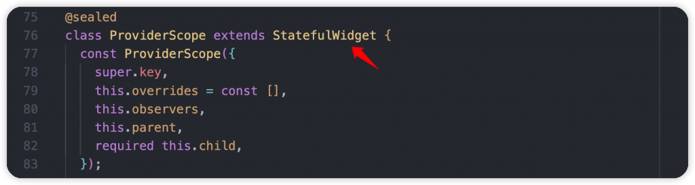
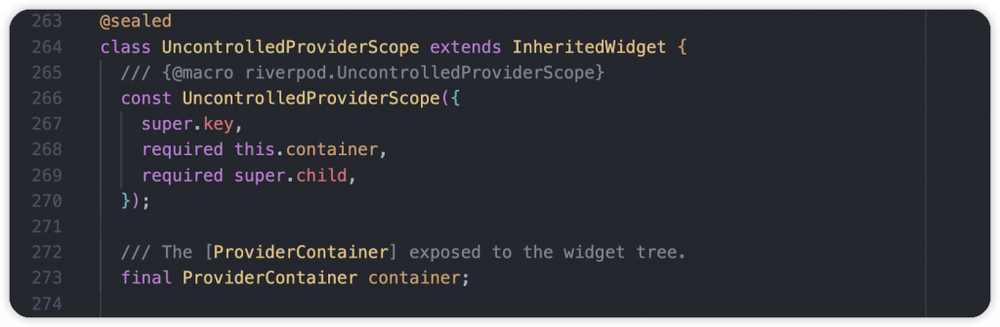
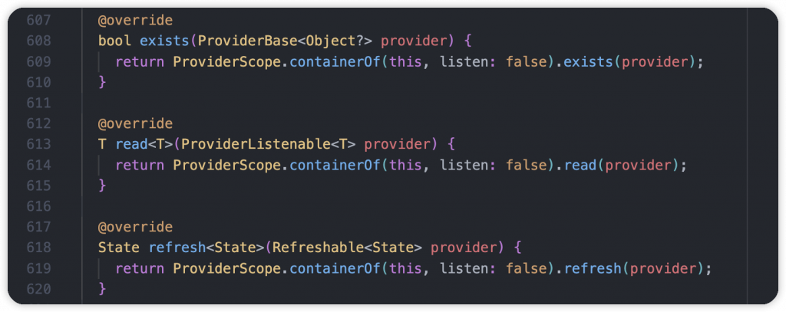
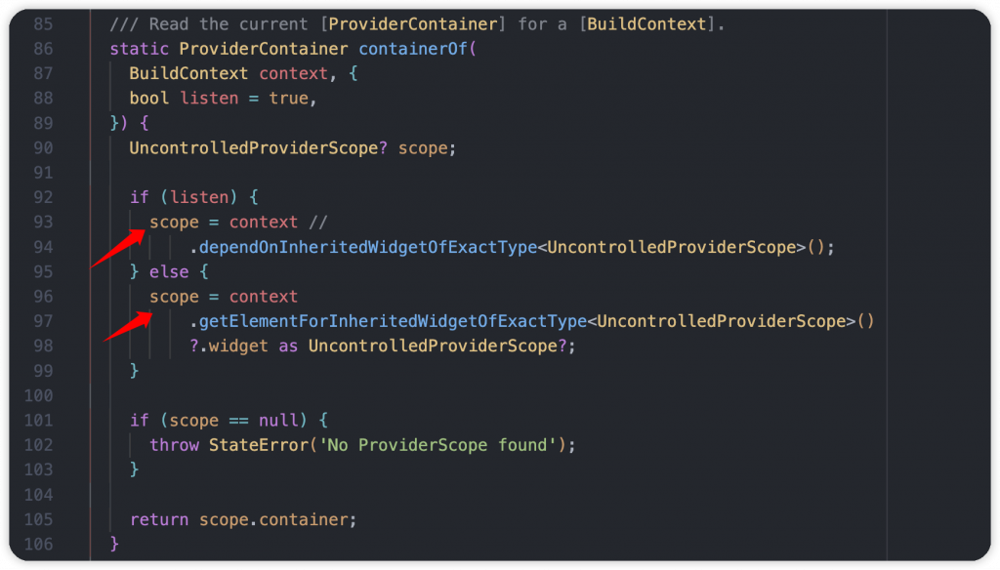
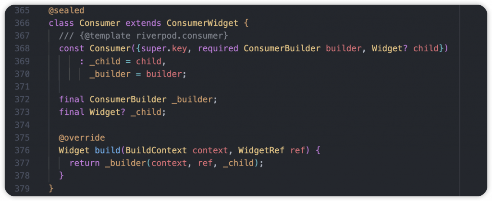
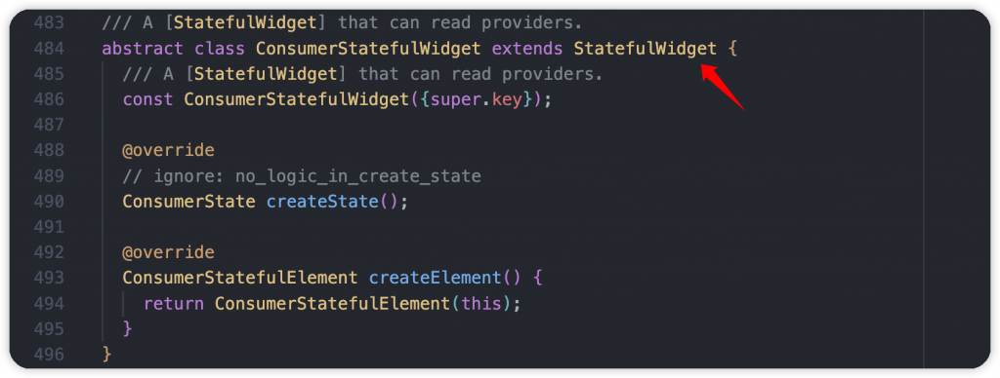

# Day 17: Riverpod 是什麼？它負責狀態管理嗎？跟著我了解幾個重要角色

- 發布時間：2023-10-02 13:01:00
- 原文連結：<https://ithelp.ithome.com.tw/articles/10332717>
- 系列標記：探索 Flutter 由裡到外，三十天帶你前往進階系列 第 17 篇


在 Flutter，狀態管理對於專案來說很重要，不是說一定要用，只是當開發者還不熟悉 Flutter 原理以及刷新觀念，很容易會造成不當開發的效能問題。狀態管理的職責就是讓開發者很輕鬆、容易地去管理狀態，並完成精準更新，省時省力且提升效能。Flutter 本身有提供一些開箱即用的功能**InheritedWidget**、**ChangeNotifier**、**ValueListenableBuilder** 等等，已經可以透過它們實現一個 APP，但是這些 API 總有可改進可加強的部分。

目前在 [pub.dev](http://pub.dev) 上的狀態管理套件、框架非常多，大概20種以上，比較普遍大家知道幾個，Bloc、Riverpod、StateNotifier、Redux、Stacked、MobX、GetX 和 Provider，其實 Riverpod 主要職責不太屬於狀態管理，只是它有這個能力，詳細我們可以另開文章來聊。

對於開發者來說，尤其是剛入門的朋友，都會不知道要從哪個開始學習，當然基本的可以從知名度、like 數量去判斷。而在幾年的 Flutter 經驗裡，可以跟大家分享幾個主流選擇。目前最多產品、企業使用的是 Bloc，以固定流程、嚴謹規範搭配簡單的實作方式，我想是團隊的第一選擇，靈活性沒這麼高但是很穩固。接著第二個選擇是 **Riverpod** 也是本文的主題。

Riverpod 為 **Provider**、**freezed** 原作者 **Remi Rousselet** 所製作，在 Flutter 領域貢獻良多的一位開發者，為了改善 Provider 許多缺點所以有了 Riverpod，而它也是目前主推的狀態管理選項。加上作者本身非常活躍，頻繁與社群互動、表達自己的開發想法，常在各大研討會出現。對於一個開源維護者來說，這點讓使用者很安心，所以近幾年 Riverpod 聲量很高，使用人數持續成長，各種教學資源與範例也持續出現。

到這裡，前面講了這麼多，到底 Riverpod 特別在哪裡，應該很好奇吧？以及如何在專案裡使用它？我為什麼喜歡使用它來開發？趕快往下了解吧！

> [Riverpod](https://docs-v2.riverpod.dev/)

------------------------------------------------------------------------


Riverpod **is a reactive caching and data-binding framework**。在官網第一眼看到的說明，有發現沒有 State Management 嗎，其實它本身不是狀態管理框架，而是進行響應式緩存以及數據綁定，不是以管理狀態為主軸，但是它有這個能力。這是 “鳥” 與 “鴿” 的問題，當大家說 “狀態管理”（鳥）時，有些人想到的是 “雞”，而 Riverpod 其實是 “鴿子”。Riverpod 可以作為狀態管理者，但很明顯地，它可以做的事更多。大家很常將它認定為狀態管理其實作者也無奈呀。

Riverpod 能夠幫忙處理大部分邏輯，也可以輕鬆執行執行網絡請求或非同步操作，支援錯誤處理和緩存，同時可以執行主動和被動的資源釋放。

## **說明**

如果 Provider 是 **InheritedWidget** 的簡化，那麼 **Riverpod** 就是從頭開始對 **InheritedWidget** 的重新實現。

> 如果 Provider 是蠟燭，那麼 Riverpod 就是燈泡。它們的用途非常相似，但我們不能通過改進蠟燭來製造燈泡。

### Riverpod 保有 Provider 特色，與自身優點

- Riverpod 提供的 Provider 不是 Widget，在 Widget Tree 之外管理 Provider 生命週期，從頭實現了所有的狀態處理機制，沒有依賴 Flutter。它是一個 Dart 物件，所以允許在純 Dart 環境下運行
- 能夠安全地創建、觀察和結束狀態，不必擔心在 Widget 重建時狀態消失
- 組合狀態，在其中一個狀態更新時作出反應
- 當有多個 InheritedWidget 時提高可讀性
- 通過單向數據流使應用更具擴展性
- 所有 Provider 狀態都存儲在 ProviderContainer，由 ProviderScope 創建
- 幫 Widget 區塊綁定狀態裡的某個數值，當此數值更新時 UI 才會刷新，實現 Data Binding

### 比 Provider 更好的部分

- 讀取的物件實體是**編譯安全的**，編譯時就能找出問題，不需要擔心有運行異常，例如：沒有 Provider 創建，進行存取時會有的 **ProviderNotFoundException**
- Riverpod 使用 InheritedWidget 實現，但獨立於 Flutter 之外，使 Provider 模式更加靈活。其實內部有使用 `context`
- 能夠擁有多個相同型別的 Provider
- Provider 可以依賴或監聽其他 Provider
- 可以讓每個狀態都是一個 Provider，或是由 Notifier Provider 去管理多個狀態
- 沒有使用 Provider 的時候，主動銷毀，實現記憶體釋放。甚至可以自行清除狀態
- 可以將 Provider 設置成 private，只屬於某個檔案或 library
- 測試流程很好進行模擬、資料偽造與驗證
- 輕鬆管理異步狀態，使用方式類似 RxDart 的 Subject

## API 重點

### ProviderScope

- 本身為一個 StatefulWidget，負責儲存所有 Provider 提供的狀態，透過自身創建的 **ProviderContainer** 進行儲存
- 使用時會在 Widget Tree 根部包裹一個 **ProviderScope** 或是 **UncontrolledProviderScope**，相當於啟動 Riverpod，是個必須的前置作業
- ProviderScope 除了在根部以外，可以再多個地方重複使用，讓一些 Provider 狀態只限於某個 Widget Tree，不會共享於整個 APP
- 屬性
  - `parent` → ProviderContainer，當我們有其他 ProviderScope 要使用時，可以透過 parent 給予原有的 ProviderContainer，能夠讓 Sub-ProviderContainer 繼續使用原本的所有 Provider 以及狀態
  - `observers` → 自定義 ProviderObserver，在這個 ProviderScope 裡進行一些 Provider 更新的監聽
  - `overrides` → 在當前 ProviderScope 裡複寫原有的 Provider，替代原有的數據
  - `child` → 包裹元件、Widget Tree



### UncontrolledProviderScope

- 通常一樣在 Widget Tree 根部使用，替代 ProviderScope，將 ProviderContainer 暴露給 Widget Tree，讓我們可以自行創建和直接操作它，做一些處理之後再設置給 ProviderScope
- 本身是 InheritedWidget，大部分 API 操作都會經過它，例如：`ref.watch()`、`ref.read()`、`Consumer`，透過 context 在 Element Tree 上取得 ProviderContainer 內容



### ProviderContainer

- 負責儲存所有 Provider 的狀態，大部分的 Provider 操作都會透過 context 存取 ProviderContainer
- 正常開發中不會去直接面對它，在 ProviderScope 裡會自然被創建，當然也可以在 UncontrolledProviderScope 使用自己的 ProviderContainer

一般可以使用 `ProviderScope.containerOf(context, listen = xx)` 靜態方法拿到 **ProviderContainer**，不同的是 listen 的值。如果沒有監聽需求，`listen` 參數為 false，接著使用 `getElementForInheritedWidgetOfExactType()` 方法，這樣在數據發生變化時元件就不會觸發 `didChangeDependencies()`，避免Widget執行不必要的重建。過程跟我們熟悉的 InheritedWidget 操作相同，需要監聽的話就會依賴 UncontrolledProviderScope，等待通知。  
  


### Consumer

- 負責監聽 Provider 變化，一旦狀態更新會立即被通知，在 UI Code 使用
- 繼承 **ConsumerWidget**，需要透過它取得 WidgetRef
- `builder` → 一個 **ConsumerBuilder** typedef，提供 BuildContext、WidgetRef、Widget 三個參數，可以透過 WidgetRef 執行 `ref.read()`、`ref.watch()` 等 API，執行對 Provider 的操作



### ConsumerWidget

- 類似 Flutter 擁有的 StatelessWidget，沒有狀態也無法執行 `setState()`，都是透過 WidgetRef 進行 Provider 與 狀態的操作，在 `build()` 方法會提供
- 繼承 **ConsumerStatefulWidget** 的抽象類別，將一些 API 方法隱藏起來，只暴露了 `build()` 給外部使用

  


### ConsumerStatefulWidget

實際上就是 Flutter 擁有的 StatefulWidget，只是一個繼承它的抽象類別，跟正常的用法都一樣。搭配 **ConsumerState**，只是 State 多了 WidgetRef 物件可以使用，一樣所有的操作都需要透過它進行

  


### WidgetRef

- 一個允許元件跟 Provider 互動的物件，透過它存取資料、執行任務處理，所有的狀態管理操作都需要經過 WidgetRef
- 抽象類別，提供許多常用的互動 API，例如：`exists()`、`read()`、`watch()`、`listen()`、`listenManual()`、`refresh()`、`invalidate()`，有經驗的朋友們應該對他們很熟悉吧。實際在使用他們的時候，內部還是使用了 `context`，因為前面提到 Tree Root 使用 **InheritedWidget**，便於在實作時從 **Element Tree** 取得指定 Provider，讓我們高效存取 **ProviderContainer**。


- WidgetRef 本身其實也是 **BuildContext**，內部都是透過 context 轉型，讓開發者可以直接使用操作 API。對於 ConsumerWidget 和 ConsumerStatefulWidget 來說 BuildContext 就是 **ConsumerStatefulElement**，API 細節都在這裡面


以下為 API 簡易說明：

#### exists()

檢查 Provider 是否已經初始化、是否有狀態了

#### read()

取得 Provider 當前狀態，如果是第一次存取就會執行初始化，並緩存狀態

#### watch()

監聽 Provider 狀態變化，一旦有更新，Widget 就會執行 rebuild，或是其他 Provider 進行狀態重整

#### listen()

監聽 Provider 狀態變化，有更新的話，可以經由 callback 取得新舊資料，可以自行處理接下來的任務。例如：顯示 SnackBar、Dialog

#### listenManual()

一樣是監聽 Provider 狀態變化，但跟 `listen()` 不同的是，不適用於 `build()` 方法裡使用，而是在 State 的 `initState()` 或是其他生命週期的位置。另外可以使用 `close()` 停止 Provider 監聽，在某些時候可以自行操控。

#### invalidate()

讓 Provider 狀態消失、無效，確保下次 Provider 被存取時可以重新初始化

#### refresh()

讓 Provider 重新獲取狀態，並返回最新資料。過程中使用了 `invalidate()`，先釋放並立即初始化取得狀態， 例子：重新請求 API

### AutoDispose & autoDispose

資源自動釋放，是 Riverpod 的一大重點。我們可以幫 Provider 加上 `autoDispose` 修飾符，或是使用 Codegen 寫法(keepAlive 屬性預設為 false)，讓 Provider 發現沒有被使用的情況下進行釋放。有關此 `ProviderElement` 的狀態就會自動處理掉，因為不再需要了。

從源碼來看，通常有使用到 autoDispose 操作，背後都會 mixin **AutoDisposeProviderElementMixin**，其中的 `mayNeedDispose()` 就是關鍵，最終執行 `scheduleProviderDispose()`，安排釋放

1.  首先檢查 `maintainState` 屬性，這部分屬於舊版寫法，false 代表不保存狀態
2.  檢查有沒有監聽者，可能是元件或是其他 Provider
3.  現在都是使用 keepAlive 來判斷是否持續存活，如果沒有使用的話代表不保存狀態  
    

> 之後可以在開一篇文章，我們來探討細部 API 背後所做的一舉一動，應該蠻有趣的

------------------------------------------------------------------------

## 範例

### 自定義 ProviderContainer

- 創建一個給 APP 和 Riverpod 使用的 **ProviderContainer**，可以優先使用它取得初始化 Provider 和服務，提早獲得狀態
- 呼叫 `container.read()` 創建類的實體並初始化，甚至可以更新狀態。很常見的情境是，有些服務的初始化需要非同步操作，可以將這類行為先完成後，再賦予完整狀態，這時候就可以使用 Provider，而不是 FutureProvider。例如：SharedPreference
- 將包裹APP的 `ProviderScope` 更換成 `UncontrolledProviderScope`，並設置 container 屬性，給予自定義的 ProviderContainer 物件

``` dart
class AuthService {
    AuthService();

    Future<void> init() async {
        // Do something...
    }
}

final authServiceProvider = Provider<AuthService>((ref) {
    return AuthService()..init();
});

Future<void> main() async {
    final providerContainer = ProviderContainer();
    providerContainer.read(authServiceProvider);

    runApp(
        UncontrolledProviderScope(
            container: providerContainer,
            child: const MyApp(),
        ),
    );
}
```

### 使用 overrides 覆蓋 Provider 狀態

ProviderContainer 提供了 **overrides** 參數，可以覆寫特定的 Provider，可以提早做一些操作和資料處理。或是進行非同步操作，接著覆蓋一個基本的 Provider，即可省略使用 FutureProvider。在測試時也很方便使用，用來偽造數據、偽照狀態。

``` dart
Future<void> main() async {
    final authService = AuthService();
    await authService.init();

    final providerContainer = ProviderContainer(
        overrides: [
            authServiceProvider.overrideWithValue(authService),
        ],
    );

    runApp(
        UncontrolledProviderScope(
            container: providerContainer,
            child: const MyApp(),
        ),
    );
}
```

------------------------------------------------------------------------

## 總結

開發 APP 過程中一定會有很多狀態，它們牽扯到了記憶體、運算、效能，如何正確管理和處理是個重要課題。在對的時機點使用，再不需要的時候進行釋放。Riverpod 對於複雜且龐大的 APP 來說是一個不錯的選擇，它擁有其他狀態管理套件的能力，加上自己獨有的一些特色，包含強大的靈活性(但同時也是個雙面刃)，能夠讓開發者很輕鬆地進行開發。只要你熟悉了，Riverpod 絕對能有效地給予幫助。

## 延伸閱讀

- [Day 18: Flutter 狀態管理？Riverpod 的 watch() 實際上如何通知更新？](https://ithelp.ithome.com.tw/articles/10333398)
- [Day 19: 如何撰寫 Riverpod 測試，使用 Mocktail 來幫助我們吧！](https://ithelp.ithome.com.tw/articles/10333935)
- [Day 20: Riverpod 的開發多元性以及日常使用技巧！Provider 該如何選擇？](https://ithelp.ithome.com.tw/articles/10334626)
