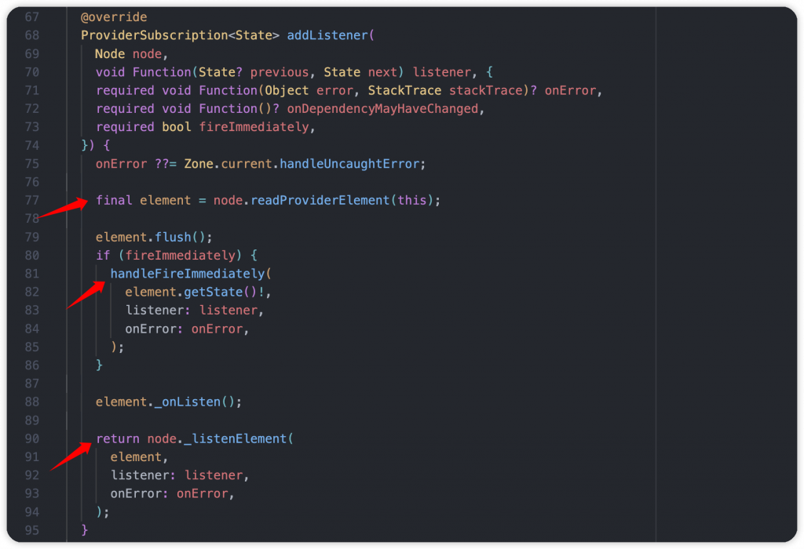
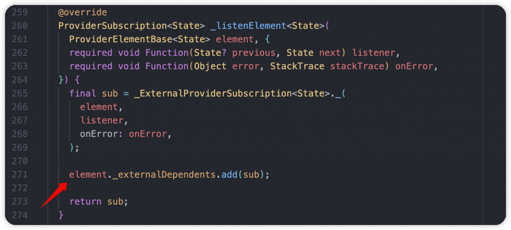
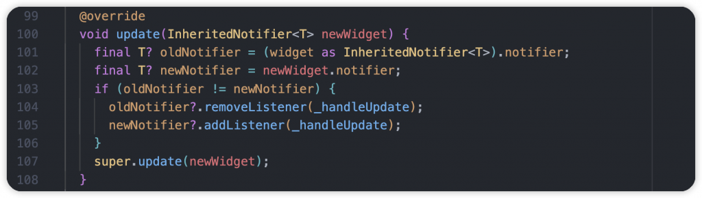
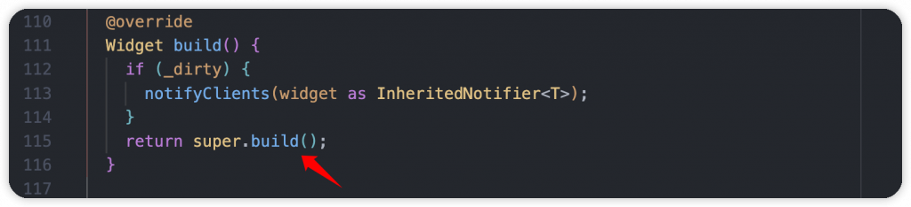
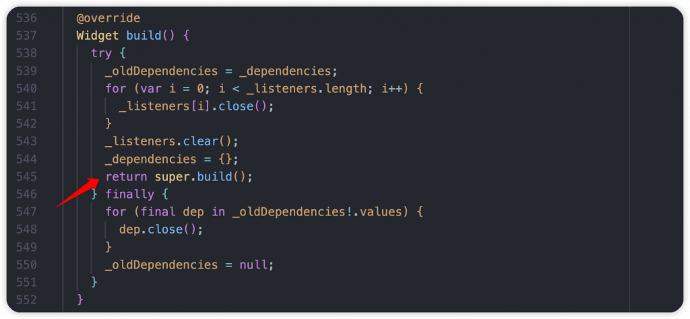

# Day 18: Flutter 狀態管理？Riverpod 的 watch() 實際上如何通知更新？

- 發布時間：2023-10-03 16:18:11
- 原文連結：<https://ithelp.ithome.com.tw/articles/10333398>
- 系列標記：探索 Flutter 由裡到外，三十天帶你前往進階系列 第 18 篇

當我們在專案使用 Riverpod 後， 一定很長使用到 WidgetRef API，例如：`ref.read()`、`ref.watch()`、`ref.listen()`，這些都是很便利的方法。而在熟悉後可能會有點好奇到底內部是如何運作的，以本文的主題 watch()，它是如何在元件裡監聽 Provider 並在狀態更新時即時 rebuild 刷新元件，做到 Data Binding 這件事，很值得花一點時間了解整個過程。

------------------------------------------------------------------------

當我們在 ConsumerWidget 和 ConsumerStatefulWidget 上使用 `ref.watch()` 會發生什麼事？來看一下內部的運作流程：

1.  其中 target 為我們要存取的 Provider，實際上是 **ProviderListenable**。`_dependencies` 為當前 context 所依賴的 Provider 資訊，是一個 Key 為 **ProviderListenable**，Value 為 **ProviderSubscription** 的 Map
2.  如果沒有依賴這個 Provider，就執行 ProviderContainer 的 `listen()`，負責在 Provider 有更新時呼叫 `markNeedsBuild()` 進行 Widget Tree 的重建。並返回 **ProviderSubscription** 物件
3.  如果前面檢查已經有 **ProviderSubscription**，那就直接返回，不需要再創建  
      
    

看到 **ProviderElementBase** 的 `listen()` 方法，參數為要監聽的 Provider，還有一個 `listener` callback ，附帶參數為新舊狀態 。而其中的 `fireImmediately` 代表是否要再監聽開始的時候觸發一次 callback。

1.  一開始先檢查一些狀態、情境是否沒有問題。在大部分的 WidgetRef api 裡都會使用 `_assertNotOutdated()`，主要確認 didChangeDependency 是否為 true，意思是如果再 Provider 更新後但是 Widget 還沒重建之前，短時間無法執行 ref functions  
    

2.  第二個檢查為 `_debugAssertCanDependOn()`，首先需要確保 Provider 本身已經初始化。接著將每個依賴者的 Element 拿出來，確認 `origin` 來源跟現在要監聽的 **ProviderListenable** 不同，否則就像自己依賴和監聽自己，會導致輪迴得狀況，所以拋出 **CircularDependencyError** 錯誤。

> 實際的例子就是 Provider A 依賴 Provider B，但是 B 又依賴了 A，在實際開發中如果沒有搞清楚互動流程，很容易會看這個錯誤發生。

  

經過檢查沒問題後，執行 `addListener()` ，至時候要看到 **ProviderBase**

1.  一樣先使用 `readProviderElement()` 確保 Provider 已初始化
2.  檢查 `fireImmediately` 參數是否為 true，是的話就透過 `handleFireImmediately()` 觸發 listener callback，通知一次
3.  接著執行 `_listenElement()`，這裡的 node 代表 **ProviderContainer**  
    

到 **ProviderContainer**，使用參數創建了 **ProviderSubscription**，添加到此 Element 的 `_externalDependents` 依賴者集合，也就是 Widget，等待資料更新後要拿它來使用，並觸發元件刷新  
  

到這裡我們已經從 WidgetRef 的 `watch()` 和 `listen()` 操作了解到 **ProviderSubscription** 是什麼，接下來當 Provider 更新時就會使用它來通知相關的依賴者也就是元件。

------------------------------------------------------------------------

當元件 `watch()` 的 Provider 有狀態更新的時後就會出發 Element 裡的 `flush()` 方法，並進行 `_performBuild()`，大部分要刷新的操作都會經過 `flush()`，並檢查 `_mustRecomputeState` 是否為 true。這裡的 Element 為 **ProviderElementBase**  

1.  接著到 `_notifyListeners()`，檢查狀態以及 `updateShouldNotify()` 確認是否要進行通知
2.  `_externalDependents` 前面有說過，它就是有使用 `ref.watch()` 的 Widget，也是依賴者，這裡是 `listeners` 集合。當有新的狀態時，通知他們要進行 rebuild。
3.  `subscribers` 是在 Provider 裡進行 `ref.watch()` 的依賴者  
    

重建前的一段過程，到了 **InheritedNotifierElement**，執行 `update()` 以及 `build()`，最後到達 **ConsumerStatefulElement** 的 `build()` 方法，呼叫 `super.build()`，也就是我們熟悉元件上 State 的 `build()`。不管是使用 ConsumerWidget 還是 ConsumerStatefulWidget 背後都是一樣的流程。  
  
  

最終元件的 `build()` 就被觸發了。  

------------------------------------------------------------------------

## 總結

到這裡有更熟悉 `ref.watch()` 嗎？建議有時間的話都可以將完整源碼看過，本文只是重點處分享，稍微講解一下，讓大家對它更有感覺。看源碼的過程我覺得很有趣，不需要急，看不懂沒關係，一步一步去了解實作方式，慢慢地就會知道日常的一些操作原理，讓自己往後在開發上能更清楚自己在做什麼。有機會的話更能貢獻一些你喜歡的開源專案，幫助自己也幫助社群。

## 延伸閱讀

- [Day 17: Riverpod 是什麼？它負責狀態管理嗎？跟著我了解幾個重要角色](https://ithelp.ithome.com.tw/articles/10332717)
- [Day 19: 如何撰寫 Riverpod 測試，使用 Mocktail 來幫助我們吧！](https://ithelp.ithome.com.tw/articles/10333935)
- [Day 20: Riverpod 的開發多元性以及日常使用技巧！Provider 該如何選擇？](https://ithelp.ithome.com.tw/articles/10334626)
