# Day 23: 帶你完整探索 DevTools，聰明的使用 Network、App Size Tool 與 Skia Tool (Debugging with DevTools - part3)

- 發布時間：2023-10-08 18:07:51
- 原文連結：<https://ithelp.ithome.com.tw/articles/10336004>
- 系列標記：探索 Flutter 由裡到外，三十天帶你前往進階系列 第 23 篇


本文為 Debugging with DevTools 系列的第三章，前面談論到了 Flutter Inspector、Performance、CPU Profiler、Memory、Logging，每個工具的細節以及使用方式，搭配實際操作讓大家快速理解，希望讓大家重視 DevTools 的重要性，有興趣的朋友請點擊連結閱讀：

> - [Day 21: 帶你完整探索 DevTools， Flutter Inspector 與 Performance 用法 (Debugging with DevTools - part1)](https://ithelp.ithome.com.tw/articles/10335311)
> - [Day 22: 帶你完整探索 DevTools，重要的 CPU Profiler、Memory 與 Logging (Debugging with DevTools - part2)](https://ithelp.ithome.com.tw/articles/10335918)

到了最後章節，要跟大家分享 Network、App Size Tool 與 Skia Screenshot，對於網路監測也是跟效能與安全性相關，如何確定相關操作都是信任且低成本。再來是分析 APP 每次改版後的安裝包，很適合進行體積優化時運用。最後說明如何了解 Skia 渲染過程的工作。會說明為何使用它們以及如何使用，相信這些工具的價值後，DevTools 能很大程度地給予協助，讓產品變得更好。跟著我繼續探索吧！

------------------------------------------------------------------------

## Network

瀏覽任何 HTTP、HTTPS 或其他的網絡請求，有關網路的事物都可以進行監控。

- 過濾 APP 的所有網路請求，包含 API Call、網路圖像等等
- 檢查 API 請求的操作是否恰當，太多或時間太久可能導致 APP 效能變差
- 根據處理時間來判斷是否後端效能需要優化，時間越短用戶體驗越好
- 可以用來確定第三方套件是否有發出其他陌生請求，確保安全性
- 盡可能減少網路請求，因為第一個它花時間，第二個是有盜竊風險


了解每個請求的消耗時長，不符合期待的話可能就需要進行優化  


額外補充：手動計算非同步任務的耗時，可運用在對後端與資料庫的操作上，方便測量與檢查

``` dart
Future<T> measureTime<T>(Future<T> Function() task) async {
  final startTime = DateTime.now();

  final result = await task();

  final duration = DateTime.now().difference(startTime);
  debugPrint('Time: $duration');

  return result;
}
```

可以針對 `method`、`status`、`type` 進行過濾，以逗點來設置多條件篩選  
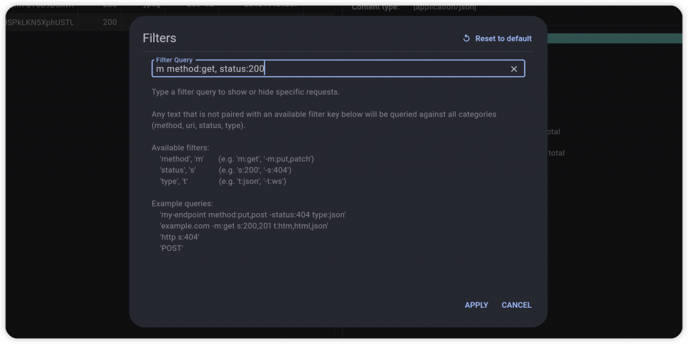

輕鬆瀏覽每個回應，以範例來看就是一個完整的 Json 格式，並且可以直接複製 Json String。  
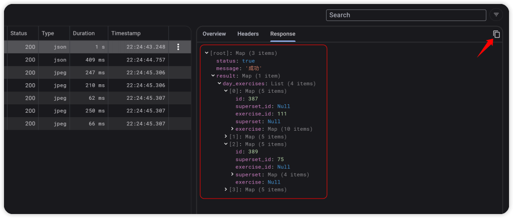

## App Size Tool

瀏覽輸出安裝檔的體積詳細資訊。在進行 AOT 編譯時(Profile、Release) 會使用 **tree-shaking optimization** 去除沒有使用的程式碼，對 APP 體積優化。優化過後的體積資訊，就是工具所分析的內容，包含 **Dart Code**、**Native Code**、**Asset**、**Package**、**Font** 等等，還可用於分析兩個版本的差異，確認優化方向。

> 提醒：不需要運行 APP 就能使用工具，因為主要是讀取生成的報告 json 檔

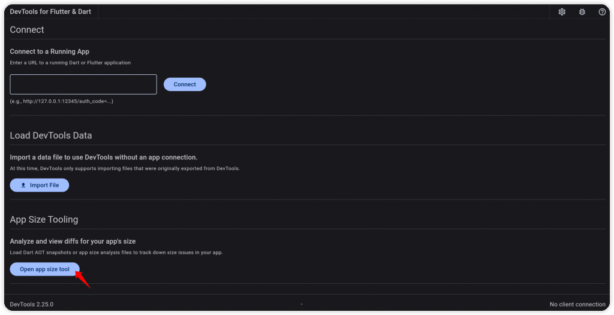

### Command

進行安裝檔分析，完成後會輸出一個檔案，例如：aab-code-size-analysis_01.json

``` bash
# 1. Normal
flutter build appbundle --analyze-size
flutter build ipa --analyze-size
flutter build apk --analyze-size
flutter build linux --analyze-size
flutter build macos --analyze-size
flutter build windows --analyze-size
...

# 2. Use arg '--target-platform'
# android-arm, android-arm64,android-x64
flutter build appbundle --analyze-size --target-platform=android-arm64

# 3. Use flavor file
flutter build appbundle --analyze-size --target-platform=android-arm64 --flavor dev --target ./lib/main_dev.dart
flutter build ipa --analyze-size --flavor prod --target ./lib/main_prod.dart
```


#### Example - Android

完成後會告知分析報告的路徑(例如：aab-code-size-analysis_01.json)，以及檔案的體積大小  
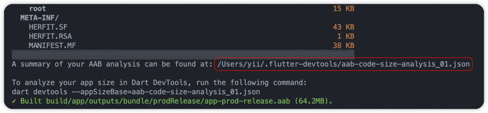

#### Example - iOS

  
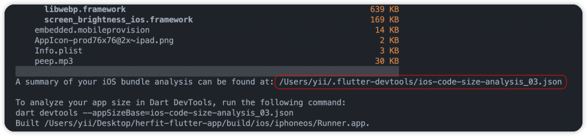

### Tool - Analysis

點擊 **Import File** 按鈕匯入原有的 APP 分析檔案(副檔名 .json)，接著使用 **Analyze Size** 分析 APP 並顯示可視化的階層架構圖。  
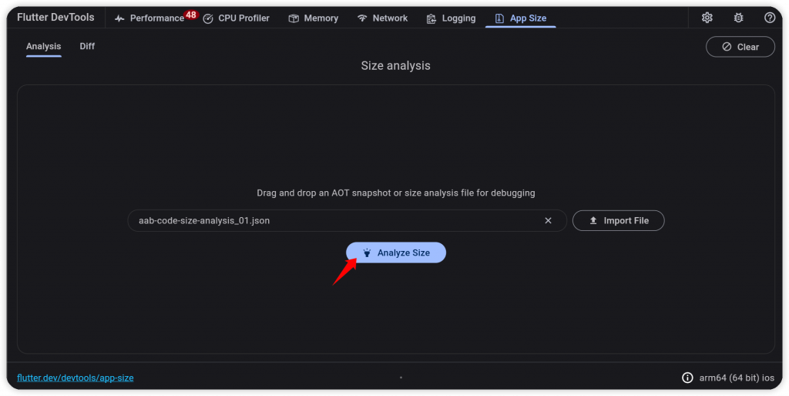

從中可以得知資訊有很多，包括：

- 分析報告的生成時間
- 總體積大小
- 每個元素的大小以及整體佔比，例如：**flutter-assets**、**android-res、flutter(libapp.so/Dart AOT)** 等等
- 套件相關資訊

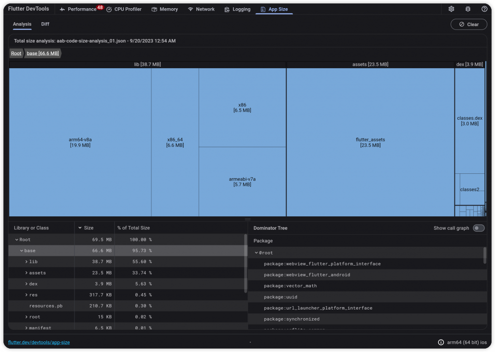

可以輕鬆瀏覽每個目錄、檔案，甚至是程式碼的大小。  
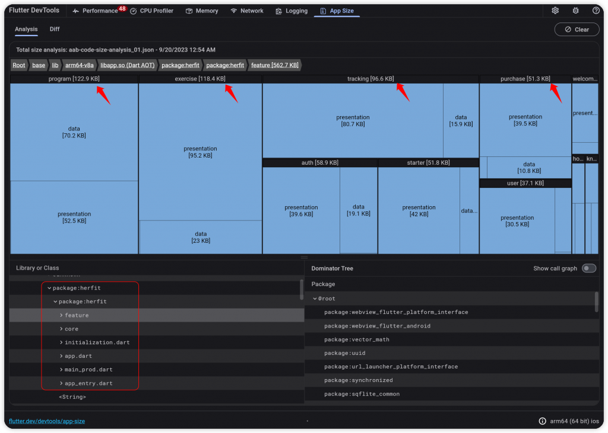  


以範例來看，iOS 比 Android 大了一些，其中 **flutter_assets** 體積佔比較高，可能是圖片和相關資源使用太多，可以從中進行優化。  


### Dominator Tree

由下往上快速尋找根本節點。當發現編譯後出現一些陌生的套件和程式碼，可以簡單地網上尋找的來源。

### Call Graph

瀏覽程式碼和套件的依賴關係，誰使用了誰，可以快速地幫助我們確認。**左邊依賴中間、中間依賴右邊。**  
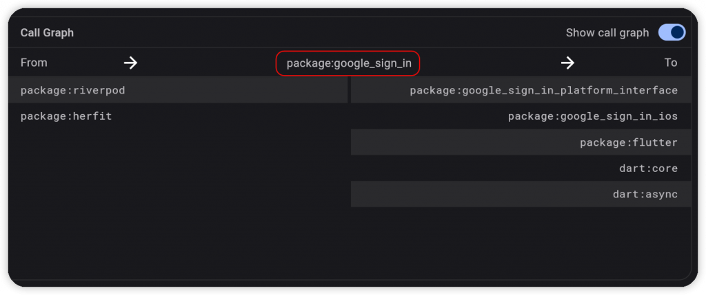

### Tool - Diff

- 兩個版本分析資訊的比較，例如：v1 跟 v8
- 每個部分、每個檔案都會進行比較，**綠色代表大小增加、紅色代表大小減少**。查看是哪些修改才導致有變動

  
  
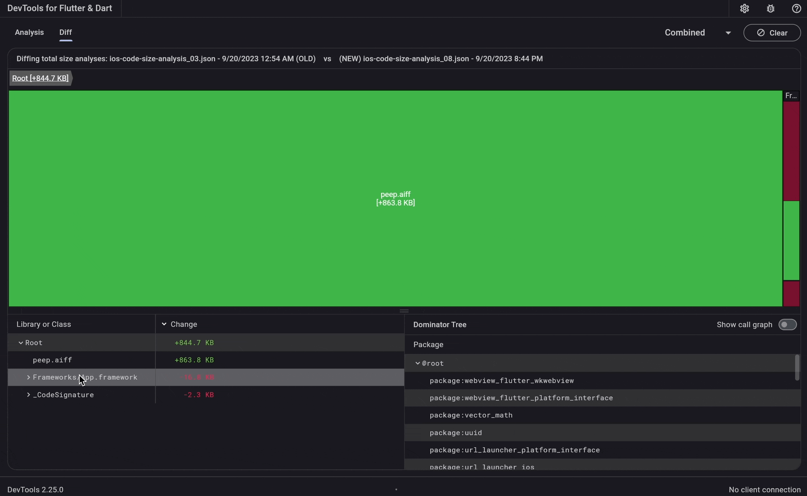

### 如何優化 APP 大小？

1.  刪除沒有使用到的檔案，例如：圖檔、字體、聲音檔
2.  優化、壓縮圖像，例如：PNG、JPG、Webp
3.  使用現代動畫文件格式(Lottie、Rive、Webp)，減少 GIF 使用
4.  自定義字體可使用 `google_fonts` 套件，首次運行時下載遠端字體，緩存在設備中
5.  選擇佔用空間小的第三方套件
6.  混淆 APP 程式碼以降低體積

### 實際商店的下載大小

`flutter build` 指令生成的版本，無法代表最終用戶的下載大小。商店通常會針對不同的情境，重新處理上傳的 APP 檔案，例如：根據手機 DPI 過濾資源、根據 CPU 架構過濾 library。\*\*\*\*

#### Android

在 **Google Play Console** 介面，再上傳點擊 **Android vitals** 裡面的 **App size** 分頁，瀏覽 APP 的安裝大小。但這資訊只是差不多，實際會根據設備而有所差異。  
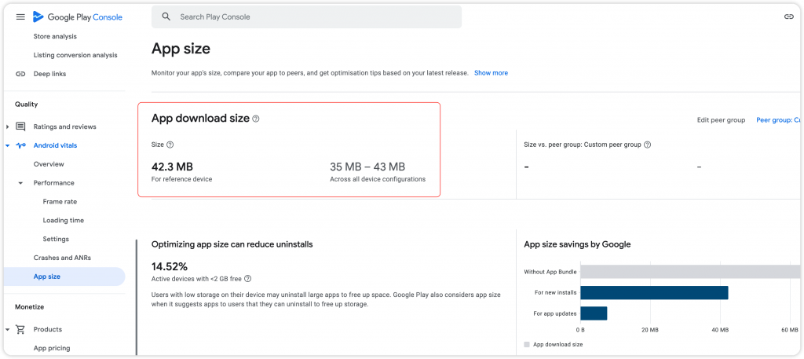

另外，也提供了細節分析，了解資源的大小佔比。  


------------------------------------------------------------------------

## Skia Screenshot

- 查看渲染過程，了解是否有造成內存和計算成本高的地方
- 使用 **Skia WASM Debugger**，載入 Skia Screenshot，副檔名為 `.skp`

``` bash
flutter screenshot --type=skia --observatory-url=[enter url]

# Example
flutter screenshot --type=skia --observatory-url=http://127.0.0.1:63013/WwOC4V-UQvU=/
```

1.  首先執行 Flutter App，成功運行後會有一個本地的幀錯 URL，它就是指令上的 `observatory-url`，在 Terminal 使用指令生成一個 skia 快照檔案，例如：flutter_01.skp

  


1.  在瀏覽器開啟 <https://debugger.skia.org/> 連結，它是 Skia Debugger 工具，開啟剛剛生成出來的 Skia 快照

> [Skia Debugger](https://debugger.skia.org/)

從範例來看，可以左側了解畫面的處理細節，是否有使用到裁剪以及 Save 等等相關操作，尤其是 saveLayer 操作，本身對於 Skia 較昂貴，濫用的話可能會直接影響到性能、表現幀數。

我們也能從右邊的列表了解每個操作的次數，經過程式碼與 UI 的優化後，再回來比對，接著瀏覽 Performance View，確認性能是否提升。  
  
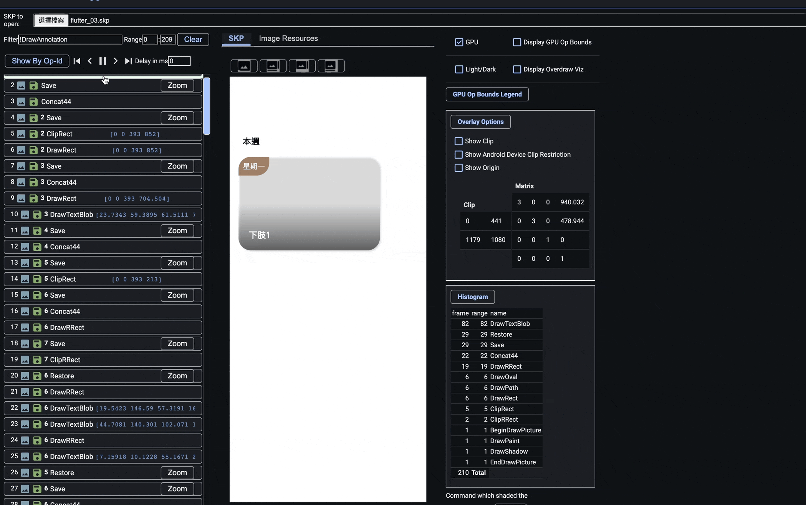

## 💡其他技巧

### debugFillProperties()

- 在自己的 RenderObjectWidget 使用覆寫 `debugFillProperties()`，幫元件新增自訂義的 debug 屬性
- 在 **Widget Details Tree** 最外層顯示屬性，不需要點擊到最深處去了解
- 透過 **DiagnosticPropertiesBuilder** 新增屬性，設置 **DiagnosticsProperty** 子類別

``` dart
StringProperty
DoubleProperty 
PercentProperty #限制在0和1之間
IntProperty
FlagProperty #布林值
EnumProperty
IterableProperty
ObjectFlagProperty #基本描述
ColorProperty
IconDataProperty
```

查看 Column 元件，使用了 MultiChildRenderObjectWidget，其中定義了幾個屬性  
  
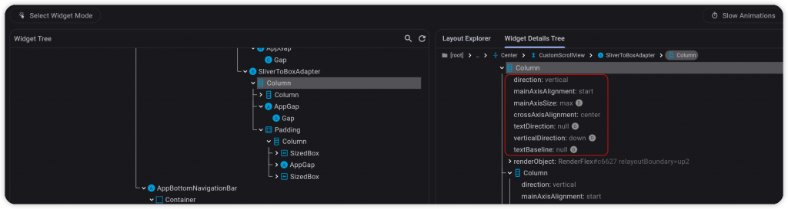

### checkerboardOffscreenLayers

- 檢查畫面上的元件是否有使用到 `saveLayer()` 相關操作，有的話會透過棋盤格呈現
- `saveLayer` 是 Canvas 的高成本、耗性能工作，例如：UI 的透明度、陰影效果、裁切，盡量避免濫用

``` dart
checkerboardOffscreenLayers: true,
```


### checkerboardRasterCacheImages

- 瀏覽圖片光柵緩存的情況，檢查有沒有給靜態圖像做緩存，沒有的話會導致每次 build 都重新繪製，以棋盤格呈現
- 可以幫靜態圖像使用 `RepaintBoundry` 包裹，將包裹的 Widget Tree 做隔離，不受影響，但是此操作是繁重的工作，增加 GPU 負載。引擎會自動判斷圖像是否複雜到需要 RepaintBoundry，協助我們作出優化決策

``` dart
checkerboardRasterCacheImages: true,
```


### debugPaintSizeEnabled

- 瀏覽每個元件的繪製範圍。幫每個 RenderBox 在周圍繪製框線，並且包含 RenderPadding，以不同的顏色呈現。
- 可在 `main()` 進行全局設置

``` dart
debugPaintSizeEnabled = true,
```

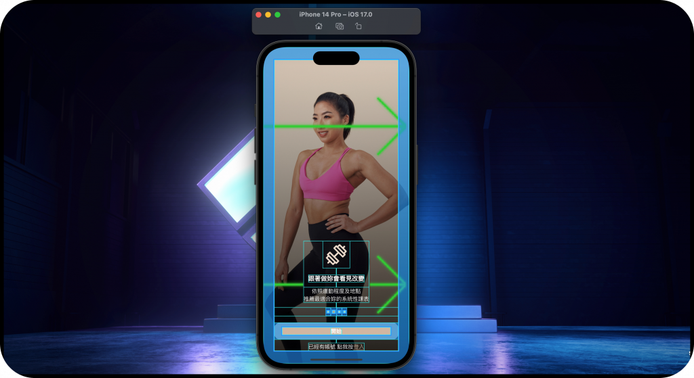

#### 僅繪製指定元件

- 自定義 **SingleChildRenderObjectWidget** 和 RenderProxyBox，自行處理、實作 `paint()` 的工作內容，並且根據狀態決定是否顯示
- 參考 **Simon LightFoot** 分享的開發技巧

``` dart
class RenderShowDebugPaint extends RenderProxyBox {
    RenderShowDebugPaint({required bool enabled, RenderBox? child})
      : _enabled = enabled,
        super(child);

    bool _enabled;
  bool get enabled => _enabled;

  set enabled(bool value) {
    if (_enabled != value) {
      _enabled = value;
      markNeedsPaint();
    }
  }

  @override
  void paint(PaintingContext context, Offset offset) {
    final previousState = debugPaintSizeEnabled;
    debugPaintSizeEnabled = enabled;
    super.paint(context, offset);
    debugPaintSizeEnabled = previousState;
  }
}
```

  
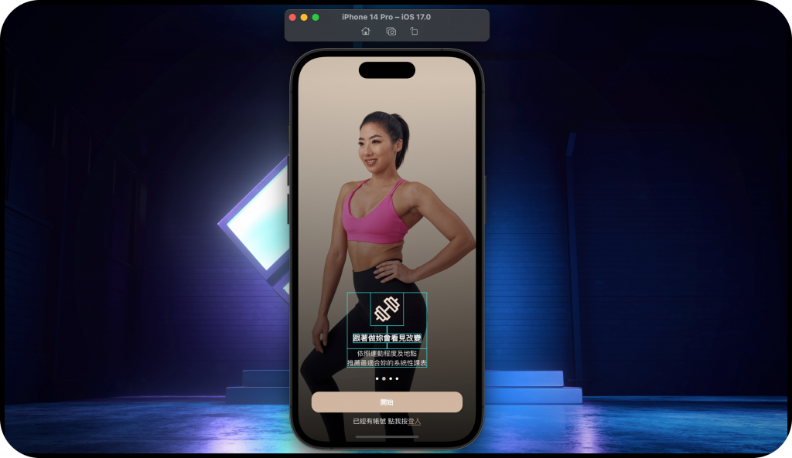

## Performance FAQ

Flutter 官方整理了相關的 Debugging 和 Optimizing 內容，有時間的朋友建議花時間了解，對我們開發很有幫助。

> [Flutter Doc](https://docs.flutter.dev/perf/faq)

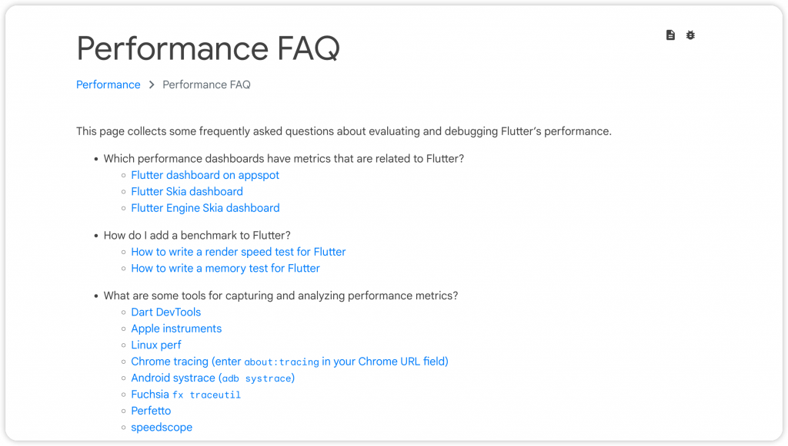

------------------------------------------------------------------------

## 總結

本文完整了 Debugging with DevTools 系列，希望這三章有幫助到大家，這系列沒有什麼艱深的觀念與知識，只是要喚醒大家對於 DevTools 的重視。看到大部分開發者都著墨在開發需求上，完成任務很棒，但如何讓產品變得更好，從中提升品質標準，這部分需要培養與習慣。

> - [Day 21: 帶你完整探索 DevTools， Flutter Inspector 與 Performance 用法 (Debugging with DevTools - part1)](https://ithelp.ithome.com.tw/articles/10335311)
> - [Day 22: 帶你完整探索 DevTools，重要的 CPU Profiler、Memory 與 Logging (Debugging with DevTools - part2)](https://ithelp.ithome.com.tw/articles/10335918)

而除了 Debugging 之外，前面文章也提到了開發技巧與圖片優化，將連結都附在下方讓大家方便閱讀。之後的 DevTools 相關內容，會分享一些實際專案的案例，也歡迎提出來做個交流，或許有什麼好玩的東西還沒發現呢～

## 延伸閱讀

- [Day 14: Flutter 效能優化，良好的開發觀念與技巧！(上)](https://ithelp.ithome.com.tw/articles/10330647)
- [Day 15: Flutter 效能優化，良好的開發觀念與技巧！(下)](https://ithelp.ithome.com.tw/articles/10331424)
- [Day 16: 聊聊 Flutter 圖像使用的良好習慣，記憶體掌握與優化！](https://ithelp.ithome.com.tw/articles/10332083)

## 相關資源

- <https://docs.flutter.dev/tools/devtools/network>
- <https://docs.flutter.dev/tools/devtools/app-size>
- <https://www.youtube.com/watch?v=_EYk-E29edo&ab_channel=Flutter>
- <https://www.youtube.com/watch?v=nq43mP7hjAE&ab_channel=Flutter>
- <https://www.youtube.com/watch?v=vVg9It7cOfY&ab_channel=Flutter>
