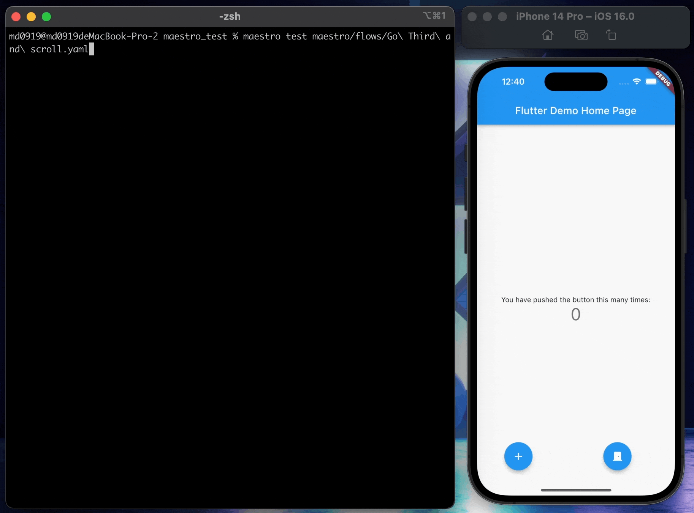
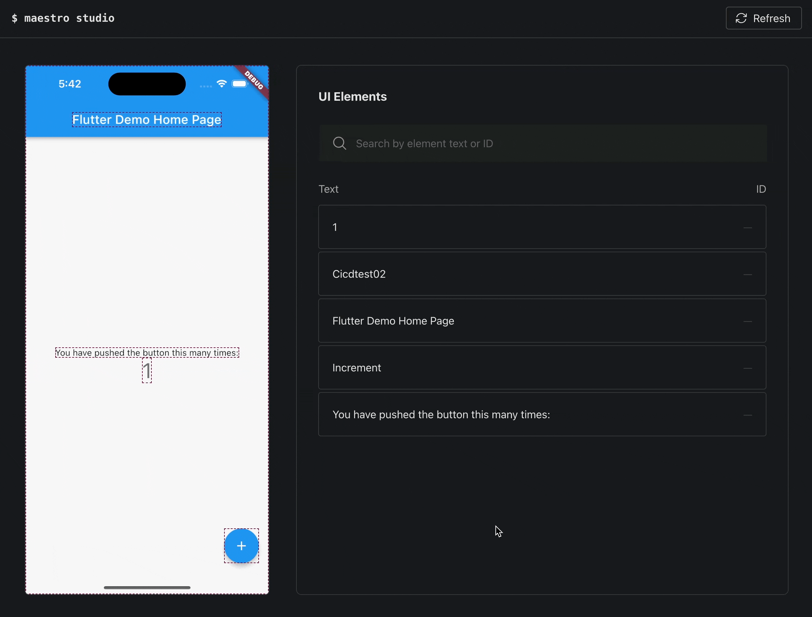

# Day 26: 想跑 Flutter 測試但卻不想寫嗎， 試看看 Maestro UI Testing， 整合 CICD 沒問題！

- 發布時間：2023-10-11 22:45:03
- 原文連結：<https://ithelp.ithome.com.tw/articles/10337944>
- 系列標記：探索 Flutter 由裡到外，三十天帶你前往進階系列 第 26 篇


**Maestro** 是一個完整的 **UI** 自動化測試框架與解決方案，提供豐富的文件和 API 給開發者使用，其中的連續模式就很符合人性化，像是自動 **hot-reload** 一樣，能夠有效幫助撰寫測試，而且讓非開發者也能參與，這點非常加分，整體來說體驗很不錯。

本文除了提供基本的測試範例，也使用 Script 進行自動化多 **flow** 驗證，然後提供結果報告，最後將 Maestro 添加到 Gitlab CICD 中，透過它協助檢查 Flutter 應用。過程會使用腳本啟動本地模擬器、執行多流程驗證並顯示報告、最後關閉模擬器，接著建置 App 安裝檔，然後將它部署到 App Center，讓開發者與 QA 人員可以在手機上操作。

------------------------------------------------------------------------

快速了解 Maestro 的幾個特點：

- E2E 測試框架，使用 yaml 定義測試流程
- 容忍非同步和延遲，預設會自動等待操作完成，無需撰寫 `sleep()`
- 運行後能夠持續監控測試文件的變動，並在它們發生變化時重新運行，不需要再次編譯
- 支援 **CI Integration**，自動上傳到 Maestro 平台進行測試。[link](https://www.notion.so/Maestro-80cfa567d9e94eccbe44f95413f36f52?pvs=21)
- 支援 ****Pull Request Integration****，發 PR 後自動進行測試驗證以及性能分析。[link](https://cloud.mobile.dev/getting-started/pull-request-integration)
- 支援 **Crash Analysis**，每個情況都附有螢幕錄影、Log、StackTrace
- 支援 **APP Size** **Analysis**，了解哪個部分佔比較大，可以進行特定優化
- 支援 **Memory** **Leaks Analysis**，查看洩漏狀況與原因
- 支援 **Performance** **Analysis**，測量啟動時間、執行時間，查看函式的呼叫以及耗時

目前主流 Mobile 平台都有支援：  


- Android - Views
- Android - Jetpack Compose
- iOS - UIKit
- iOS - SwiftUl
- React Native
- Flutter
- Web Views
- NET MAUI iOS
- NET MAUI Android

## 安裝 Maestro CLI

``` bash
curl -Ls "https://get.maestro.mobile.dev" | bash
```


## iOS 設備的前置設定

- 需要 **Facebook IDB(iOS Debug Bridge)** 工具，就像是 Android adb 工具，可以跟設備互動，查看資訊、安裝、監控還能模擬手勢操作，非常適合自動化測試

``` bash
brew tap facebook/fb
brew install facebook/fb/idb-companion
```


💡查看設備清單與ID

``` bash
xcrun simctl list
```

\![https://ithelp.ithome.com.tw/upload/images/20231011/20120687mBNmxvKFOA.png\]

💡啟動要運行測試的模擬器

``` bash
idb_companion --boot <id of the iOS device>
```

💡連結測試模擬器，驗證是否正常，沒問題就可以將此運行關閉

``` bash
idb_companion --udid <id of the iOS device>
```

💡關閉模擬器

``` hljs
idb_companion --shutdown F7CABB3C-DD6F-432D-A86F-5884287D2261
```

> 提醒：測試目前無法跑在實際的手機設備

### 運行 APP

在測試執行前要確保已經有安裝過 APP 到模擬器，Maestro 會根據 **packageName** 或 **bundleId** 自動尋找到指定 APP 並啟動執行測試驗證

1.  IDE 運行安裝 APP
2.  Android 指令安裝
3.  iOS 指令安裝

**Android 安裝**

``` bash
adb install sample.apk
```

**iOS 安裝**

``` bash
xcrun simctl install Booted Test.app
```

### 撰寫測試

請查看我在 Medium 撰寫的文章，有講解所有的操作指令，點擊以下連結跳轉

> [指令與操作](https://medium.com/flutter-formosa/%E4%BD%A0%E7%9F%A5%E9%81%93-maestro-%E5%97%8E-%E5%85%BC%E5%85%B7%E4%BA%BA%E6%80%A7%E7%9A%84%E8%87%AA%E5%8B%95%E5%8C%96%E6%B8%AC%E8%A9%A6%E6%A1%86%E6%9E%B6-flutter-%E5%93%81%E8%B3%AA%E5%B0%B1%E9%9D%A0%E5%AE%83%E4%BA%86-part-2-%E6%8C%87%E4%BB%A4%E8%88%87%E6%93%8D%E4%BD%9C-e6327ed5ac04)

### 執行 Debug 連續測試

- 運行 **Continuous Mode**
- 運行時皆為 Hot reload 模式，即時監聽 yaml 檔案的更新，不需要重新編譯即可重新運行
- 測試過程的檢查條件會根據操作逐一確認
- **Enter** → 點擊後刷新重來

``` bash
maestro test -c flows/LaunchApp.yaml
```

  


當 **yaml** 檔的流程撰寫有誤時，會即時提醒  


### 執行單一 Flow 測試

整個流程會自動執行操作，並完成驗證，最後顯示通過結果

``` bash
maestro test maestro/flows/GoThirdAndScroll.yaml
```



### 執行完整多 Flow 測試

- 測試整個資料夾，每個情境都驗證，並在運行後生成測試報告
- 不包含子資料夾
- 加上 `--format junit` 生成 XML 結果報告
- 加上 `—-output result.xml` 修改匯出名稱

``` bash
maestro test flows/

maestro test --format junit flows/
```

  
  


### 缺點

1.  多 Flow 運行

當需要驗證多個 flow 測試時會無法正常完成，從第二個 flow 開始不會自動操作，例如：點擊按鈕、滾動等互動行為，必須手動操作畫面讓 **Maestro** 檢查，是個很不方便的過程。

這時候就自行優化囉，透過撰寫 Shell Script 來解決問題，逐一進行個別的 flow 驗證，可以查看專案的 `/scripts/run_test.sh` 檔案。

主要的想法就是把測試目錄裡的每個 flow 檔案都進行逐一驗證，並記錄成功與失敗的數量，最後顯示我需要的結果報告，並附帶測試通過率。如果需要的話，後續就能夠接著整合 CI，測試沒問題才能進行後續的 APP 建置。  
  


以下展示透過 script 驗證多個 flow 測試，最後提供結果  
  
  


2.  不支援 Flutter Key 偵測。而如果同時存在 **semanticLabel** 和 **Text Label**，則會以 semantic 優先

3.  無法在 Flutter Desktop 以及 Flutter Web 上運行

### Maestro Studio

- 開發輔助工具，就像是 Flutter DevTools
- 可抓取所有的 UI 元素，也可以搜尋關鍵字
- 生成每個 UI 元素的基本測試指令，讓使用者可以直接複製使用

  
  


### 錄製影片

支援方便的錄影功能，不需要清空桌面與調整視窗位置，Maestro 會自動幫你調整為合適位置並進行錄製，最後產出一個下載連結。非常適合需要向外部展示、分享的時候，是個貼心的功能。

``` bash
maestro record test.yaml
```

  


Maestro 錄製完成的影片，是不是非常方便，搭配簡潔好看的背景，一目了然。  


------------------------------------------------------------------------

## Maestro in CICD

首先我們先看 Maestro Test 整合到 **Gitlab CI** 的樣子，期望除了有 Flutter Test 驗證之外還要多一層防護罩，就是跑使用者流程的操作測試，確認都沒問題後再進行後續的 build 和 deploy，而一但發現有錯誤的話則停止動作，通知負責人員。  


實際就是讓 **Gitlab Runner** 在機器上跑的時候可以主動啟動模擬器，接著開始進行測試驗證，當然如果你的 CICD 環境是在雲端的話可能就沒辦法使用 Maestro 了，除非是官方的 **Maestro Cloud**，很方便很好用，但是跑一個 flow 需要 0.1 美元，結果就是會花很多錢，對我們來說應該不是個很好的選擇。

### Executor

Maestro CI 需要的 Shell Script，我這邊規劃有三個

1.  `boot_simulator.sh` → 啟動模擬器
2.  `run_test.sh` → 執行測試驗證
3.  `shutdown_simulator.sh` → 關閉模擬器

#### boot_simulator.sh

裡面其實很簡單，就是透過 idb 幫我們開啟模擬器，準備待會跑測試。裡面的參數為 Simulator Deivce ID

``` bash
#!/bin/sh

# idb_companion --boot <id of the iOS device>
# excute 'xcrun simctl list' in terminal to check device list.
idb_companion --boot $1
```


### run_test.sh

1.  指令要測試的 `flows/` 目錄
2.  驗證每個 Flow 流程，將失敗和成功的次數記錄下來
3.  顯示自定義的結果報告，包含總次數、失敗次數、成功次數和通過率，根據通過率檢查是否正常，一旦有測試流程失敗的情況則暫停 CICD

``` bash
#!/bin/sh

directory=../maestro/flows/

successedCount=0
failedCount=0

for entry in "$directory"*
do
    number=$(caculate $successedCount+$failedCount+1)
    echo "---------------------- Flow $number ------------------------"
   
    log=$(maestro test "$entry")

    if [[ $log == *"FAILED"* ]]; then
        let failedCount=failedCount+1
        continue
    fi

    let successedCount=successedCount+1

done

echo "------------------------------------------------"
echo

totalCount="$(($successedCount+$failedCount))"
echo "Total: $totalCount"
echo "Success: $successedCount"
echo "Failure: $failedCount"

percent=$(caculate $successedCount/$totalCount*100)
percent=${percent%.*}
echo "Pass: $successedCount/$totalCount, $percent%"

echo

goodEmoji='\xE2\x9C\x85'
badEmoji='\xE2\x9D\x8C'
if [ "$percent" = "100" ] 
then
    echo $goodEmoji$goodEmoji$goodEmoji
else
    echo $badEmoji
fi

echo

if [[ $percent == *"100"* ]]; then
    echo "Maestro tests passed!"
else
    echo "Maestro tests failed."
    echo
    
    exit 1 
fi

echo
```


### shutdown_simulator.sh

顧名思義，就是關閉模擬器，節省機器的資源

``` bash
idb_companion --shutdown $1
```

## Usage

1.  首先取得模擬器的設備資訊，記好要跑測試的 Device ID，Android 或 iOS 設備都可以

``` bash
xcrun simctl list
```


2.  啟動模擬器，參數為要測試的 Device ID

``` bash
./boot_simulator.sh F7CABB3C-DD6F-432D-A86F-5884287D2261
```

3.  運行測試

``` bash
./run_test.sh
```

4.  關閉模擬器，參數為要測試的 Device ID

``` bash
./shutdown_simulator.sh F7CABB3C-DD6F-432D-A86F-5884287D2261
```

## Demo

  


------------------------------------------------------------------------

## 總結

本文的最後提到 CICD，使用 Maestro 整合的部分需要做個補充。在流程開始會先驗證所有測試，都正常才會進行後續的 build 和 deploy，也因為 Maestro 需要模擬器的協助，所以需要確保你的 CICD 可以和自己準備的環境溝通。如果像 Codemagic 服務都在雲端運行的話可能就無法使用 Maestro，還是要根據需求去決定使用哪種方式。

最終，所有的測試還是必須與自動化流程結合，才能有效節省時間成本，而 Maestro 本身有這個能力，它讓不是開發者的其他人也可以很容易地編寫測試細節。如果大家正在煩惱沒時間寫測試，或是現在才知道 E2E Test，Maestro 都值得你和團隊嘗試一次，從中運行過玩過才會知道是否適合產品。

總而言之，Maestro 是一個很完整且穩定的第三方測試服務，官方不僅活躍也有自己的 Slack 空間，有興趣的朋友可以持續關注接下來的進展與版本更新，有任何想法也都歡迎跟我討論哦～

## 相關資源

- <https://maestro.mobile.dev/>
