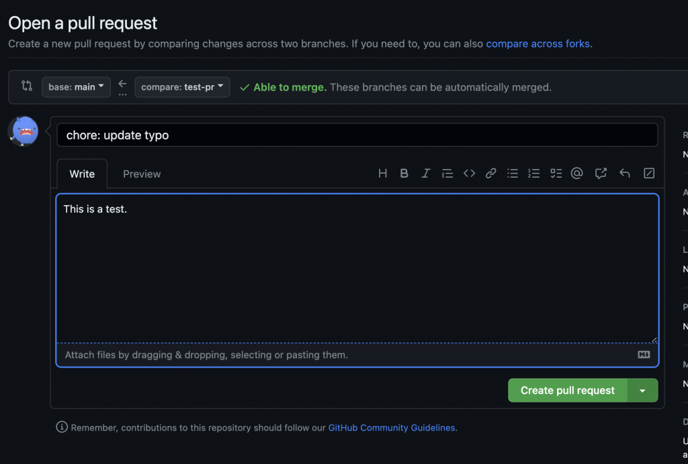
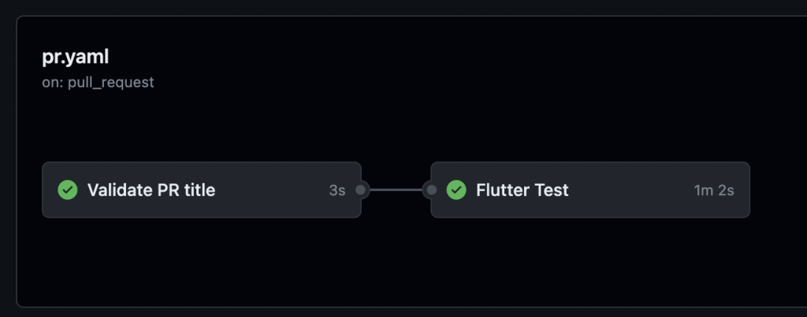

# Day 34：驚！每次 PR 都要測試呀：Flutter CI/CD｜自動化測試｜GitHub Action 2 🎬

> 原文來源：[Day 4：驚！每次 PR 都要測試呀：Flutter CI/CD｜自動化測試｜GitHub Action 2 🎬](https://ithelp.ithome.com.tw/articles/10322739)

在上一篇，介紹了 Github Action 的基礎知識，接下來就要透過 Github Action 把自動化測試串上 Flutter 啦。測試的重要性應該不用多說，有被測試拯救過的人都懂，我們必須承認再怎麼厲害的人也是人，難免會犯錯，測試就是替失誤買下保險。


```jsx
🎬 文章內容包含：
✔ GitHub Action 自動化測試
✔ Semantic-pull-request 幫你檢查 PR title 是否合格

```


## 自動化測試


今天的第一個目標是：在每次有人提出 PR 的時候，就自動開始跑自動化測試，確保進來的 code 不會影響到其他正常的程式碼。


### Flutter 程式碼


因為要測試的目的是提出 PR，所以先切換到另一個 branch，以利接下來的步驟進行。


```bash
$ gco -b pr-test
or
$ git branch pr-test
$ git checkout pr-test

```


然後新增測試的程式碼，到你的 Flutter 專案底下的 `test` 資料夾，新增 `my_test.dart`，裡面的內容如下：


```dart
// my_test.dart
import 'package:flutter_test/flutter_test.dart';

void main() {
test('Success Test', () {
expect(1, 1);
});

test('Failed Test', () {
expect(1, 2);
});
}

```


在上面的程式碼中新增了兩個測試，分別是會導致成功與失敗的測試。如果不熟悉測試的小夥伴，可以敲碗有機會在後面聊到。


💡小知識：只要是在 `test` 資料夾底下任何 `*_test.dart` 都會自動在 `flutter test` 中被呼叫到唷。


### Github Action 程式碼


接下來一樣到 `.github/workflows` ，增加新的 workflow，先取名為 `pr.yaml` ，一樣先上程式碼再解析。


```yaml
# pr.yaml

name: 'PR CI'

on:
pull_request:
types:
- opened
- edited
- synchronize

jobs:
flutter_test:
name: Flutter Test
runs-on: ubuntu-latest
steps:
- name: Checkout
uses: actions/checkout@v2
- name: Setup Flutter
uses: subosito/flutter-action@v2
with:
flutter-version: '3.10.5'
- name: Flutter Test
run: |
flutter pub get
flutter test

```


**`pull_request`**


- 裡面的 Types 表示執行的時機是在有 PR 被打開、編輯、sync 的時候。


**`Checkout`**


- `uses: actions/checkout@v2`：使用 GitHub 提供的 **`checkout`** Action，以便將代碼 clone 到 VM。


**`Setup Flutter`**


- `uses: subosito/flutter-action@v2`：使用由社群提供的 Flutter GitHub Action 來設定 Flutter。

- `with`：指定參數。


`flutter-version: '3.10.5'`：設定要使用的 Flutter 版本為 3.10.5。


**`Flutter Test`**


- `run`：执行 shell 命令。


`flutter pub get`：獲取 Flutter 依賴。

- `flutter test`：運行 Flutter 的單元測試。


💡小知識：除了 `pull_request`，其實還有另外一個很相近的 event 叫做 `pull_request_target`，使用 `pull_request_target` 必須注意他有 base repository 的寫入權限，即有可能被壞壞份子透過 fork 後提有惡意程式的 PR 攻擊你的 repository，要小心確認自己的用途。


### 執行 Workflow


把這些改動 commit 之後，推到 `pr-test` 的 branch 上就完成程式碼的部分摟，是不是很開心 🌝。接下來只要到你的 GitHub 專案底下，選擇提出 PR。





不久後你就能在你的 PR 底下看到設定好的 workflow 已經自動開始執行摟 🎉


因為我們在前面已經設定測試是會失敗的，所以接下來你會看到這個畫面，表示測試沒有全部通過，必須要修改 PR 讓它通過。


只要回到 `my_test.dart`，把兩個測試都改成可以通過的，並 push commit。


```bash
// my_test.dart
import 'package:flutter_test/flutter_test.dart';

void main() {
test('Success Test', () {
expect(1, 1);
});

test('Success Test', () {
expect(2, 2);
});
}

```


在推上遠端後，GitHub 的 workflow 又會被自動觸發，重新跑一次測試。這次的測試就能得到我們預期中的結果，令人身心愉悅的 ✅。如此一來就可以確保所有測試都通過，減少弄壞整份程式碼的機會。


## Semantic-pull-request


在審閱 PR 的時候，常常會希望能一眼看出這個 PR 在做什麼，所以會訂定出統一的標準來描述 PR 的 title。可以選擇現在常見的標準 [Conventional Commits](https://www.conventionalcommits.org/en/v1.0.0/)，加入到 PR workflow 的檢查之中，在 github market 中找到 [semantic-pull-request](https://github.com/marketplace/actions/semantic-pull-request)，跟著他的步驟把檢查加入到我們的 `pr.yaml`。


```bash
jobs:
validate_pr_title:
name: Validate PR title
runs-on: ubuntu-latest
steps:
- uses: amannn/action-semantic-pull-request@v5
env:
GITHUB_TOKEN: ${{ secrets.GITHUB_TOKEN }}

flutter_test:
needs: validate_pr_title
name: Flutter Test

```


可以看到在 `flutter_test`，下面還加入了 `needs: validate_pr_title`，表示在執行 `flutter_test` 之前，必須先通過 validate_pr_title 才會接續下面的測試，通過 needs 可以節省下不必要的時間成本，讓你的 job 之間產生依賴關係。完成後，可以到 GitHub 的 actions 頁面查看效果。





現在就可以確認我們每個 PR 提交後會先檢查 title，並在通過以後 title 檢查後，在執行 Flutter Test，確保一切順利進行。


## 結語


好啦，我們今天聊了一大堆關於如何用 Github Action 來做自動測試，並讓你的程式碼變得更為優雅。實際上，一旦你設置好 Github Action 的工作流程，每次有人丟個 PR 過來時，它就會自動跑測試。這不只是讓程式更穩定，也解放了團隊，讓大家不用手動一個一個去測。


而且呢，還探討了怎麼用 semantic-pull-request 來檢查 PR 標題，讓每個 PR 都容易讀懂，也讓團隊更容易理解它到底在做什麼。這樣一來，大家審查 PR 的時候也能更順暢，工作效率自然就提升了。


我希望這篇文章對你在 Flutter CI/CD 或是自動測試這塊有所幫助。其實，只要用對工具和方法，建立一個穩健的開發環境其實並不是什麼難事，而且還能讓整個團隊的生活變得更輕鬆。


明天將繼續 GitHub Action 的第三部分，也是最重要的如何讓 GitHub 幫你 Build 一個 Flutter App，敬請期待！
