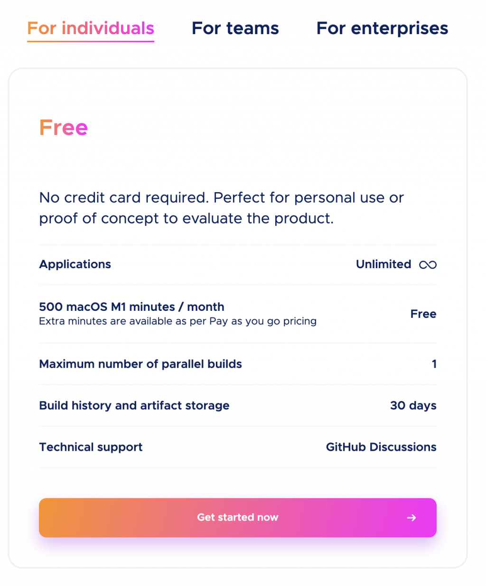
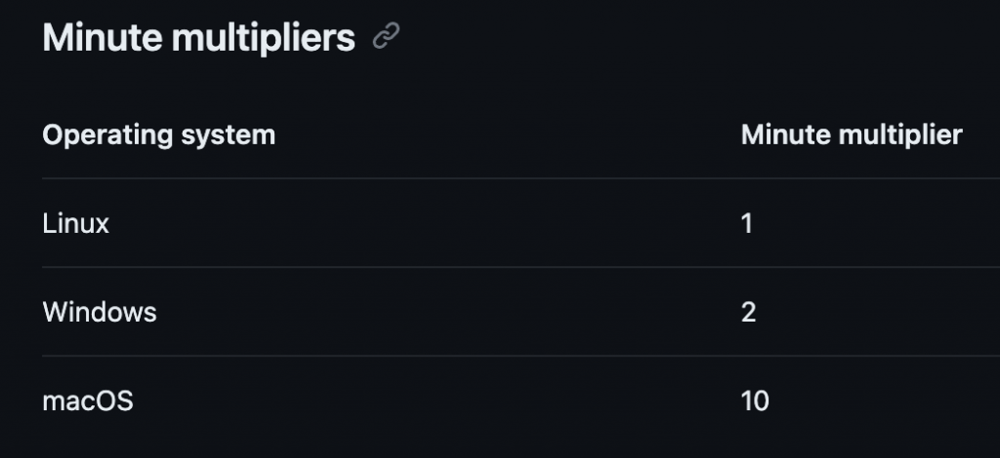

# Day 35：哇！雙平台真的很累人：Flutter CI/CD｜自動化部屬｜GitHub Action 3 🎬

> 原文來源：[Day 5：哇！雙平台真的很累人：Flutter CI/CD｜自動化部屬｜GitHub Action 3 🎬](https://ithelp.ithome.com.tw/articles/10323574)

前兩章回顧了如何使用 GitHub action 並利用他幫助我們做每次 PR 的自動化測試，完成自動化測試之後，接下來要完成持續交付的部分。


```jsx
🎬 文章內容包含：
✔ Code magic 的簡單介紹。
✔ GitHub action self hosted
✔ 在 GitHub action 上面完成自動部署 android app

```


Flutter 因為要同時兼顧 Android 和 iOS 兩個版本，所以這部分的步驟會比較繁瑣，達成的方法也比較多，下面就來說說幾個做法。


## Code magic


code magic 應該是最早開始就對 Flutter 的 CI/CD 提供支援，設置起來簡單順手，Flutter 的官方文件裡面也有推薦他，如果你還是入門新手**強烈推薦**。針對個人開發者而言，他也提供每個月 500 分鐘的免費額度。一個入門級的 App build 所需的時間大該落在 30 分鐘，也就是一個月可以免費使用 16~17 次左右，如果只是拿來做上版使用，也很夠用了。





code magic 的教學可以到 官方文件查看 就有很詳細的說明，只熟悉中文的朋友也可以看看這篇，我的好朋友 Yii 的文章，也有很詳細的教學。


[code magic 教學](https://yiichenhi.medium.com/how-to-cicd-for-flutter-app-f61d35a6d851)


## GitHub Action


GitHub Action 上面跑的話雖然設定起來比較麻煩，但總歸是比較便宜，如果你的公司要同時掌管多個 App 的上架或是需要時常進行上版的工作，那就可以考慮使用 GitHub Action。但是要特別注意一點，在 GitHub Action 上，跑不同的 OS 他算的價格會不一樣。如果跑在 GitHub Action 的 macOS 上跑一分鐘等於消耗十分鐘，所以原先免費 2000 分鐘，如果都是跑在 macOS 上，那就會只剩下 **200** 分鐘，這點要十分注意。





詳細可以參考 **GitHub**


## GitHub Action (self-hosted)


除了 GitHub 自身提供的虛擬機以外，其實我們也可以讓 GitHub action 來連接我們自己的主機，因此如果是公司電腦或是自己本身有多餘的主機，都可以拿來當跑 workflow 的機器十分方便，最重要的他是免費的而且設定起來也不太複雜。如果需要教學文，可以參考強者我學長的文章，裡面也有設定步驟的教學，一下子就可以完成摟。


[Github Action self-hosted](https://ithelp.ithome.com.tw/articles/10264848?sc=iThelpR)


## Build App


先製作 Android 的 app 要跑在 GitHub action 上的 yaml 檔案，先取名為 `build_android.yaml`，檔案一樣必須要放在 `.github/workflows` 底下。


```jsx
name: Build Flutter App

on:
push:
branches:
- main

concurrency:
group: ${{ github.workflow }}-${{ github.ref }}
cancel-in-progress: true

jobs:
build-android:
runs-on: ubuntu-latest
steps:
- name: Checkout code
uses: actions/checkout@v2

- name: Setup Flutter
uses: subosito/flutter-action@v2
with:
flutter-version: '3.10.5'
- name: Setup Java
uses: actions/setup-java@v3
with:
distribution: 'zulu'
java-version: '12.x'
cache: 'gradle'
id: java

- name: Build Android app
run: |
flutter build appbundle --flavor dev -t lib/main_dev.dart
shell: bash

```


💡 `concurrency`: 是一個很方便的工具，可以幫助識別當前是否有一樣的 workflow 正在進行，cancel-in-progress 設定成 true 表示如果有正在進行的重複 action 會把舊的 cancel 掉。


到目前為止，和上一篇 `pr.yaml` 的步驟其實差不多，只是多了 `Setup Java` 和 `Build Android app` 來幫助我們完成在 ubuntu 上面運行，並在最終 Build 出需要的 aab 檔。


接下來就要完成上傳的步驟，可以透過社群製作好的 GitHub Action [upload-google-play](https://github.com/r0adkll/upload-google-play)，把他加入到現有的 `build_android.yaml` 的最後一個步驟中。


```jsx
jobs:
build-android:
runs-on: ubuntu-latest
steps:
- name: Checkout code
uses: actions/checkout@v2

- name: Setup Flutter
uses: subosito/flutter-action@v2
with:
flutter-version: '3.10.5'
- name: Setup Java
uses: actions/setup-java@v3
with:
distribution: 'zulu'
java-version: '12.x'
cache: 'gradle'
id: java

- name: Build Android app
run: |
flutter build appbundle --flavor dev -t lib/main_dev.dart
shell: bash

- name: Upload Android aab
uses: r0adkll/upload-google-play@v1
with:
serviceAccountJsonPlainText: ${{ secrets.SERVICE_ACCOUNT_JSON }}
packageName: com.example.MyApp
releaseFiles: build/app/outputs/bundle/devRelease/app-dev-release.aab
track: production
status: inProgress

```


[upload-google-play](https://github.com/r0adkll/upload-google-play) 的用途便是透過 `SERVICE_ACCOUNT_JSON` ，幫我們把 aab 上傳到 google play console ，除了上傳 aab 以外，還提供了 what’s new 的文字檔案上傳，和其他更細緻的調整都可以做設置。不過到這裡大家可能會有疑問 `SERVICE_ACCOUNT_JSON`是從哪裡來的，因為這不是本部分的重點，詳細步驟可以參考[這裡](https://docs.appcircle.io/account/adding-google-play-service-account/)。主要就是到 google play，找到  API 存取權，並依照他後續的設定取得 json 檔案。


在取得 `SERVICE_ACCOUNT_JSON` 之後，需要讓他放在一個安全的地方，只在需要用到的時候去呼叫，直接放在 git 裡面並不是一個好的做法。好在 GitHub 有為我們提供了 GitHub Secrect，他讓我們把機密資料存放在 secrect 中，透過 GitHub 的權限管理，讓其他開發人員無法直接看到 `SERVICE_ACCOUNT_JSON` 是什麼。


## GitHub Secret


首先打開 GitHub 頁面，選到 Secret and variables → Actions，在這個頁面下我們就可以點擊 New repository secret，然後把剛剛得到的 `SERVICE_ACCOUNT_JSON` 貼進去，這樣就完成設定的動作摟，接下來只要再跑一次 workflow 就可以使用最新的 secrets 啦 🎉 用法就如上面的程式碼 `${{secrets.SERVICE_ACCOUNT_JSON}}` 就可以瞜。


## Build and Upload iOS


因為 iOS 的部分手邊沒有帳號去做測試，這次就先省略，但還是附上 code magic 幫大家整理的內容，可以大概了解要如何實作，後續有機會再回來補充這篇。


[Codemagic vs GitHub Actions | Codemagic Blog](https://blog.codemagic.io/codemagic-vs-github-actions-comparison/)


## 結語


在這篇文章中，我們深入探討了如何使用 Flutter、GitHub Action，以及其他工具來實現 CI/CD。從設置基本的自動測試，到針對 Android App 的自動化建構和上傳，每一個步驟都是為了讓軟件開發流程更為順暢和高效。


我們看了 Code Magic、GitHub Action 和自主主機的 GitHub Action 的各自優缺點，讓你能根據需求來選擇最適合的方案。無論是個人開發者還是大型團隊，這些工具都有相對應的解決方案。


此外，我們也了解到如何妥善管理機密資料，例如 Google Play 的 **`SERVICE_ACCOUNT_JSON`**，以保護你的重要信息。


希望這篇文章能對你的 Flutter 開發之旅提供有價值的指引和資訊。如果你有任何問題或者有其他主題希望深入了解，請隨時留言或聯繫我。謝謝大家的閱讀，期待在下一篇文章見到你！


Happy Coding！🎉
