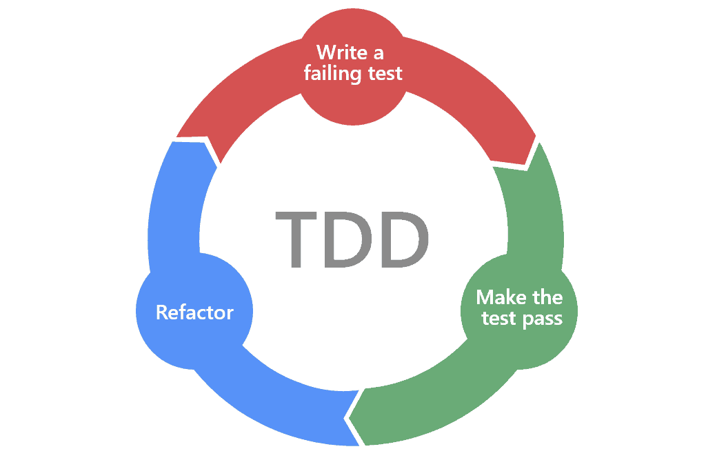

# Day 50：來聊聊測試這件事（上）｜Flutter TDD

> 原文來源：[Day 20：來聊聊測試這件事（上）｜Flutter TDD](https://ithelp.ithome.com.tw/articles/10334688)

在軟體開發中，當我們需要照顧的 Scope 越來越大，就會發現要維護程式碼品質這件事情越來越力不從心。所以測試的需求就應運而生，當我們越來越依賴測試來維護品質以後，於是就有一個新的概念油然而生 **TDD**。從先完成需求後依賴測試維護品質的開發，變成先寫完成測試再依邊完善功能的模式。那話不多說，我們趕快一起來看 TDD 的功能吧！


TDD 的過程包括三個步驟：


### 1. 編寫一個失敗的測試：


首先，編寫一個測試，這個測試應該測試一個尚未實現的功能或者一個已經存在但是需要改進的功能。這個測試會失敗，因為這個功能尚未實現或者還需要改進。


### 2. 編寫代碼以通過測試：


接下來，編寫足夠的代碼來通過這個測試。這個代碼不需要完美，但是應該足以通過這個測試。


### 3.重構代碼以改善其設計：


最後，重構這個代碼以改善其設計。這可能意味著提取重複的代碼、簡化複雜的邏輯或者改進代碼的可讀性等等。完成重構之後，再次運行測試以確保這個功能仍然正常運作。





接下來就根據上面的三步驟，來用實際的程式碼舉例給大家看：


需求：我們要實現一個功能計算機的，這個計算機會告訴我們兩個整相加會等於多少。


有了這個概念以後，就可以開始第一個步驟：**編寫會出錯的測試**。並不是故意要讓他出錯，而是他在這個階段被允許出錯，不用一開始就完成整個功能。


首先先定義要測試的功能，有一台 `Computer` 要實現 `.plus` 然後希望輸出是如我們所預期。


```dart
test('plus', (){
final computer = Computer();
final result = computer.plus(1,2);
expect(result ,3);
})

```


進入第二步驟，**編寫代碼以通過測試** :我們知道現在還沒有 `Computer` 也還沒有 `plus` 這個方法，所以先編寫能讓他通過的代碼。


```dart
class Computer{
@override
int plus(int a, int b){
return a+b;
}
}

test('plus', (){
final computer = Computer();
final result = computer.plus(1,2);
expect(result ,3);
})

```


最後第三步，**重構代碼以改善其設計**：在這個步驟你可以重新審視你的程式，發現有哪裡不足的地方可以重構，在這階段為了讓未來可能會實作多種計算機，我們就幫忙加上 abstract 增加一些彈性的機會。


```jsx
abstract class ComputerAbstract {
int plus(int a, int b);
}

class Computer implements ComputerAbstract{
@override
int plus(int a, int b){
return a+b;
}
}

test('plus', (){
final computer = Computer();
final result = computer.plus(1,2);
expect(result ,3);
})

```


完成三步驟的循環以後，就可以開啟下一輪循環，我們新增一個會失敗的測試。


```dart
test('plus', (){
final computer = Computer();
final result = computer.plus(1,2);
expect(result ,3);

final result2 = computer.plus(1.2, 1.5);
expect(reslut2, 2.7)
})

```


在這個測試中，發現上面只允許 int 相加可能不符合我們的需求。就可以接著修改我們的程式碼以符合測試需求：


```dart
abstract class ComputerAbstract {
float plus(float a, float b);
}

class Computer implements ComputerAbstract{
@override
float plus(float a, float b){
return a+b;
}
}

test('plus', (){
final computer = Computer();
final result = computer.plus(1,2);
expect(result ,3);

final result2 = computer.plus(1.2, 1.5);
expect(reslut2, 2.7)
})

```


接下來再看看，有沒有我們可以 Refactor 的地方，如果沒有的話也沒關係，就繼續進行下一輪編寫新的測試。


至此我們就完成兩個測試驅動的循環嘍，希望透過上面的例子能讓大家對怎麼進行有點概念。接下來要講的 Mocking 是幫助我們在 TDD 開發的過程中，能夠快速的產生需要測試的資料！


# TDD - 測試驅動開發中的 Mocking 技術


在測試驅動開發（TDD）中，Mocking 是用於測試代碼的一種技術，它可以模擬尚未存在的物件或組件。本文將介紹幾種常見的 Mocking 技術，包括 Dummy、Stub、Spy、Mock 和 Fake。這些技術可以幫助開發人員更好地進行 TDD，以確保開發的代碼符合所需求並具有高質量。


```jsx
abstract class AuthServiceInterface {
bool auth(String uid);
}

```


- **Dummy** 物件只是為了滿足方法而存在，但是它不會被測試代碼使用。

```jsx
class AuthService implement AuthServiceInterface {
@override
bool auth(String uid){
return null;
}
}

```

- **Stub** 物件被用來代替實際的物件以回傳預定義的值，以測試代碼的特定情況。

```jsx
class AuthServiceInterfaceReject implement AuthServiceInterface {
@override
bool auth(String uid){
return false;
}
}

class AuthServiceInterfaceAccept implement AuthServiceInterface {
@override
bool auth(String uid){
return true;
}
}

```

- **Spy** 物件是一個真實的物件，它可以記錄它的方法被調用的次數和參數，以便於後續的斷言。

```jsx
class AuthService implement DatabaseInterface {
int count;
bool result = false;

@override
bool auth(String uid){
count++;
return result;
}

void setResult(bool newResult) {
result = newResult;
}
}

final service = AuthService();
service.auth(false);

print("auth called ${service.count} times");


```

- **Mock** 物件是一個可以模擬真實物件行為的物件。它可以跟踪方法調用，模擬方法調用的回傳值和拋出異常。

```jsx
class AuthService implement DatabaseInterface {
String expectedUId = '123';

@override
bool auth(String uid){
return uid == expectedUId;
}
}


```

- **Fake** 物件是一個完整的實現，但它是為了測試目的而實現的。例如，在測試環境中，可以使用測試數據庫來替換實際數據庫，從而實現快速和可重複的測試。

```jsx
class AuthService implement AuthServiceInterface {

@override
bool auth(String uid){
List aprrvedUser = ['123','12323',];
return aprrvedUser.contain(uid);
}
}

```


談了那麼多，大家應該已經看到了，TDD不只是一堆技巧或工具，它更像是開發的一種「心態」。有了Mocking，咱們就可以輕鬆地「假裝」某些部分已經完成，確保其他部分是正確的！但說實話，要真正理解 TDD，只懂技巧還不夠，還得懂它的「內心世界」。接下來，我們就來聊聊TDD裡的一個有趣的概念 - 「不確定原理」，看看它是怎麼影響咱開發的。


# TDD 不確定性原理


在軟體開發的世界裡，「不確定性」這兩個字經常讓開發者頭疼。畢竟，當我們踏入一個新的項目或功能，很多事情都還是未知數。那麼，怎麼確保在這片濃霧中，我們不會走錯路，或是走得太慢呢？答案可能就藏在TDD的這個核心理念裡 -「不確定性原理」。有趣的是，對於這個原理，不同的大佬有不同的見解。今天，我們就來聊聊這兩種觀點，看看它們分別怎麼幫助我們應對開發中的不確定性。


### 倫敦派觀點


倫敦派著重開發的確定性 > 靈活性，每次只實現一個實例。由外向核心業務邏輯開發。


倫敦派將重心放在開發的確定性上，他們認為每個開發步驟都應該有明確的方向和目的。這意味著在開發過程中，他們會一步步地前進，從最外層的界面或API開始，逐步深入到系統的核心邏輯。


這種方法的好處是，開發者可以先建立起用戶或其他系統與軟體互動的部分，然後再實現具體的邏輯和功能。這確保了每次開發的功能都是用戶真正需要的，並且可以即時得到反饋。


舉例來說，如果要開發一個演算法，倫敦派會首先確定如何輸入資料，然後確定演算法的基本運作方式，最後再進行優化。這種逐步確定性的方法可以確保每一步都是必要的，且能即時解決出現的問題。


輸入邏輯→演算法實踐→演算優化


### 芝加哥派觀點


倫敦派著重開發的靈活性 > 確定性，由內向外開發，或同時開啟好幾個實例，並且會先測試業務歸則，必要時才向外對接 ui 介面。


與倫敦派相反，芝加哥派更看重開發的靈活性。他們認為，在開發過程中，我們應該允許一些不確定性和探索。這意味著他們會從核心邏輯開始，然後再考慮如何將這些邏輯接入到具體的界面或API。


這種方法的優點是，開發者可以先確保核心邏輯的正確性和效率，然後再考慮如何呈現給用戶或其他系統。這確保了軟體的核心部分是穩健和高效的，且可以靈活應對未來的變化和需求。


例如，在開發演算法時，芝加哥派會先確定演算法的運作方式，然後進行優化，最後再考慮如何輸入和輸出資料。這種內向外的方法可以確保在對接界面或API時，核心邏輯已經是最佳的狀態。


演算法→演算法完善→輸入的邏輯


不論是倫敦派還是芝加哥派，他們的目的都是為了更有效地進行測試驅動開發。雖然每一派都有其獨特的方法和哲學，但最終，它們都試圖讓我們的軟體更可靠、可維護。


聊玩哲學接下來再談點具體的，如果我們要開始寫測試，測試應該怎麼寫，有哪些基礎的規矩可以依循嗎？那麼就不得不提TDD中的三個核心步驟：Arrange、Act、和 Assert。這三個步驟簡單地指引著我們如何設計、執行和驗證每一個測試，確保它能夠有效地反映出我們的代碼是否達到了期望的效果。


# 3 個 A 安排 行動 斷言


在 TDD 中，有一個三步驟的法則幾乎成為了每個開發者的日常生活。這就是著名的「三個A」原則：Arrange、Act 和 Assert。通常使用三個 A（Arrange、Act、Assert）來安排測試、執行測試和驗證測試的結果。


- **Arrange (安排)**：這是所有事情的起點。在這一階段，我們準備並安排測試所需的一切。想像一下，這就像在烹飪前先將所有食材和工具放在檯面上，準備好了就可以開始料理。在軟體測試中，這意味著創建對象、初始化變量、或設置任何我們預計在測試中使用的模擬物件。

- **Act (行動)**：這是真正的「動作」階段。在此，我們運行函式或方法，實際上是執行被測試的部分。就像將事先準備好的食材放入鍋中開始烹飪一樣，這是看到結果的時候。

- **Assert (斷言)**：最後，但同樣重要的是，這是我們確認一切都按照預期進行的階段。當我們嚐試自己做的菜肴確保它的味道正確時，這就像在確認我們的函式或方法是否正確返回了我們期待的結果。


這三個 A 通常是 TDD 中最基本的步驟，它們可以幫助開發人員確保代碼的正確性和穩定性，並且可以幫助開發人員更好地進行 TDD。


舉例來說，如果你正在開發一個計算器應用程序，你可以使用三個 A 來測試 `addOne` 方法的功能：


```dart
int addOne(int value) {
return value + 1;
}

```


- **Arrange**：創建一個計算器對象，並將兩個整數作為參數傳遞給 `addOne` 方法。

- **Act**：調用 `addOne` 方法，將兩個整數相加。

- **Assert**：驗證測試的結果是否等於預期的值。


```dart
import 'package:flutter_test/flutter_test.dart';

void main() {
test('addOne function should return value plus one', () {
// Arrange
final inputValue = 4;
final expectedOutput = 5;

// Act
final result = addOne(inputValue);

// Assert
expect(result, expectedOutput);
});
}

```


在這個例子中，Arrange 步驟是創建計算器對象和設置參數，Act 步驟是調用 `addOne` 方法，Assert 步驟是驗證結果是否正確。


透過使用三個 A，你可以更加清晰地安排測試，並確保測試的結果是正確的。其他人也能快速讀懂你的測試邏輯哦！


## 結論


探索了TDD的奧秘後，不難發現其背後不只是「寫測試」這麼簡單。TDD是一種開發思維，幫助我們有條不紊地進行開發，並確保程式的品質。從基本的「三個A」步驟，到不同派別的策略，都是為了讓開發流程更為暢順。最後，希望大家在TDD的道路上能夠走得更加順利，並找到適合自己的節奏。Happy coding! 🚀🎈
