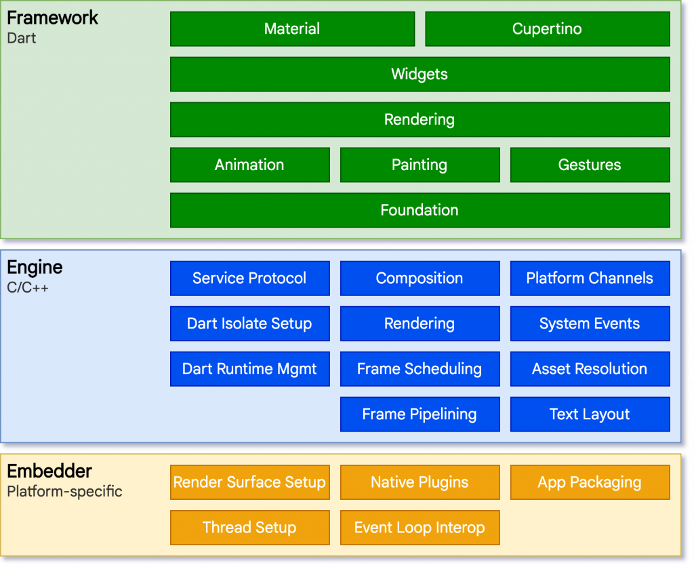
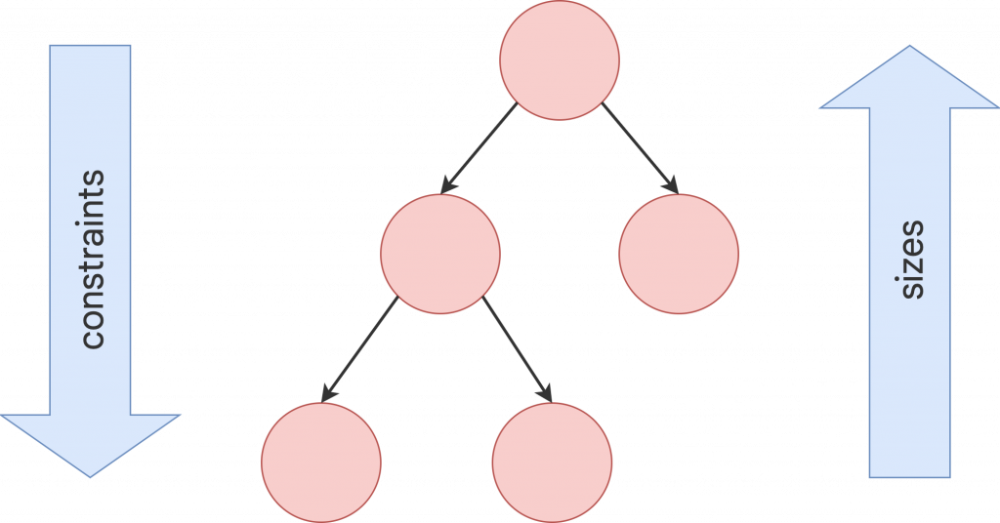

# Day 59：Flutter 架構概覽｜前世與今生

> 原文來源：[Day 29：Flutter 架構概覽｜前世與今生](https://ithelp.ithome.com.tw/articles/10339045)

### 出生背景


在理解 Flutter 的架構以前，我們先來聊一下出生背景。Flutter 的前身稱為 “Sky”，於 2015 年首次亮相。它早期的目標是開發用於 Google Fuchsia 操作系統的 SDK。後來，Flutter 不斷發展壯大，成為一個獨立的開源項目。（而 Google Fuchsia 呢？感覺準備退出歷史舞台）


有興趣可以看看 Flutter 初次露出的珍貴影像：


[](https://www.youtube.com/watch?v=PnIWl33YMwA)


Google Fuchsia 本來的立意就是想打造跨平台的 OS，所以 Flutter 這些得天獨厚的條件都要感謝 Fuchsia 。


## Flutter 架構概覽


有興趣的人可以到 [Flutter](https://docs.flutter.dev/resources/architectural-overview) 網站上看，我這裡只做重點的節錄：


## Architectural layers：


Flutter 的架構分為三個主要的層，分別是：Embedder 層、Engine 層和 Framework 層。下面是這些層的詳細說明：


- **Embedder 層**：

這是 Flutter 架構中的最底層，主要負責與特定操作系統交互，使 Flutter 可以運行在不同的平台上。

- Embedder 層負責處理必要的操作，以便將 Flutter 語言與特定操作系統相互翻譯。

- 管理事件循環（Event loop）。


- **Engine 層**：

Engine 層主要是用 C/C++ 編寫的，所以有在各個平台支援的能力，讓 Flutter 可以被帶到各個平台。

- 負責光柵化（rasterizing）組合好的場景。

- 此層負責低級 API 的實現，管理幀的渲染，網絡支持等。


光柵化指的是把向量圖繪製成點陣圖的過程，在 Flutter 就是 RenderObject 組成 Layer 後再繪製到畫面上的過程。


- **Framework 層**：

Framework 層是用 Dart 程序語言編寫的，開發者主要在此層中工作，以理解和使用 Flutter。

- 此層提供了豐富的 widgets 和庫，使開發人員可以高效地開發 Flutter 應用程序。


Flutter 的架構可以想像成一座由下至上建造的大樓，每一層都依賴於它下面的層，就像大樓的每一層都需要依賴於它下面的結構。這樣的架構讓 Flutter 有很好的擴展性和組織性。


每個層都不是單一的結構，而是由一系列獨立的庫組成，這些庫只依賴於它們下面的層的功能。這樣的設計讓第三方開發者能夠輕鬆地添加擴展到 Flutter SDK，並且這些層的結構使得每個層都不具有對下層的特權訪問，每個層只能使用由下層公開的 API。





## Rendering and layout


如開頭講到 Flutter 的目標是讓開發者能夠用一套代碼來開發多平台的應用，而不需要為每個平台編寫不同的代碼。而且開發初期，是以 OS 為目標所以 Flutter 的初始做法就不是去考慮要發佈在 Android 或 iOS 上，而是直接操作渲染引擎。這裡 Flutter 團隊可能參考的就是 Android 的做法：


**Android 渲染：**


- 在傳統的 Android 應用中，當你想要繪制某些東西（比如一個按鈕或者文字）時，你會首先使用 Android 的框架（主要是用 Java 寫的）來告訴它你想要繪制什麼。

- 接著，Android 會使用一個叫做 Skia 的圖形引擎（用 C/C++ 編寫）來真正的繪制你想要的畫面。

- 最後，這個繪制好的畫面會由你的手機的 CPU 或 GPU 顯示出來。


**其他跨平台 Framework 作法（如：React Native）：**


- 大多數跨平台框架會在 Android 和 iOS 的原生 UI 庫之上加上一層“包裝”，讓開發者可以用一套代碼來編寫應用。

- 但這種方式會增加一些額外的步驟和開銷，因為你的代碼（通常是用 JavaScript 寫的）需要通過這層“包裝”來與原生的系統庫交互。


**Flutter 的獨特之處**:


- 不同於其他跨平台框架，Flutter 選擇了一條不同的路。它有自己的小部件庫，不依賴於原生的 UI 庫。

- 你的 Flutter 代碼會直接編譯成本地代碼，並且利用 Skia 來繪制畫面。這樣就避免了那些額外的“包裝”步驟，提高了效率。

- 這也意味著，不管你的應用是在 Android、iOS 還是其他平台上運行，它的性能都會很不錯，因為它直接與底層的繪圖引擎交互，避免了很多不必要的開銷。


通過這種方式，Flutter 能夠提供高效的渲染效能，並且讓開發者能夠用一套代碼來開發多平台的應用，節省了很多時間和精力。


## Build: from Widget to Element


假設我們現在有一個 Widget 長得像下面這樣：


```dart
Container(
color: Colors.blue,
child: Row(
children: [
Image.network('images/1.png'),
const Text('A'),
],
),
);

```


我們知道， 在 Flutter 裡面每個 Widget 都有可能包含其他 Widget 。到 Container 的 build 方法裡面可以找到，如果 color ≠ null 他會回傳一個 ColoredBox 的 Widget 給我。


```dart
if (color != null)
current = ColoredBox(color: color!, child: current);

```


這也就是為什麼你在用 Flutter Inspector 的時候， Widget Tree 會比你寫的程式碼要長的多。


在各種 Widget 追到最後，會發現他們被分為兩種：


- `ComponentElement`, 其他 Element 的 host。

- `RenderObjectElement`, 參與佈局或繪畫階段的 Element。


他們之間的關係可以被理解為： **`RenderObject`** 是負責渲染的基本組件，而 **`ComponentElement`** 是負責創建和管理 **`RenderObject`**


以圖片來看就是像下面這樣：


接下來就到繪製的步驟了：**佈局和渲染**的過程主要涉及以下幾個步驟：


- **佈局**：Flutter 首先需要對 widget 層次結構進行佈局，確定每個元素的大小和位置。

- **建立 Render Tree**：通過 `RenderObject` 和 `RenderObjectElement` 來建立渲染樹，每個節點在渲染樹中對應一個 `RenderObject`。

- **繪製**：`RenderObject` 定義了繪製的抽象模型，例如 `RenderParagraph` 用於渲染文本，`RenderImage` 用於渲染圖像，而 `RenderTransform` 用於在繪製其子元素之前應用變換。


更深入的講解可以看 Flutter 的官方頻道：


[](https://www.youtube.com/watch?v=996ZgFRENMs)


## Render 場景


**Aggressive composability**


Flutter 採用了一個叫做 **Aggressive composability** 的策略，它盡可能地讓每個 Widget 都是其他 Widget 組合而來。而這些 Widget 本身則是由越來越基礎的 Widget 組合而成。例如，Padding 是一個 Widget ，而不是其他 Widget 的屬性。


**Aggressive composability**  這個哲學貫穿了整個 Flutter 的設計思想，從架構到底層實現都是統一遵照這套邏輯。


**Sublinear layout**


為了要貫徹 **Aggressive composability**，不可避免的就會讓我們的 Widget Tree 越來越龐大。所以 Flutter 必須依靠更快速的渲染流程來支持，也需要更好的方式來管理 Widget 避免出現錯誤，Flutter 有了下面幾個解套方案：


- **由上到下的渲染：**
Flutter 的佈局算法每幀執行一次，並且在單次傳遞中完成。
在每一幀中：

Constraint 由父對象通過調用其子對象的 layout 方法向下傳遞。

- 子對象遞歸地執行自己的 layout，然後通過從其 layout 方法 return 要繪製的幾何圖形。


因此佈局期間，每個渲染對象最多被訪問兩次：一次是在樹向下的過程中，另一次是在樹向上的過程中。





- **immutable Widget：**
我們可以看到在 Flutter 中 每個 Widget 實際上都是 `immutable`的，所以我們建立 Widget Tree 之後，他是無法被修改的，這樣有這些好處


**效能**: 有助於 Flutter 高效地重建 UI。每次狀態改變時，Flutter 可以快速地比對新舊 widget 來確定實際需要重繪的部分。

- **狀態管理的簡化**: 通過將 UI (widget) 和狀態分離，Flutter 鼓勵使用更預測和可維護的狀態管理模式。在 Flutter 中，當狀態改變時，你會創建一個新的 widget 樹。與此同時，狀態本身可能會被存儲在 **`State`** 對象中，這是 mutable 的，但它的生命週期和相關的 widget 生命週期是分開的。

- **減少錯誤**: 不可變性減少了由於多處修改同一個物件而引起的錯誤。因為 widget 是不可變的，你不必擔心其他代碼意外地修改它。

- **Functional Programming**: Flutter 的不可變 widget 設計也體現了 Functional Programming 的一些理念。它鼓勵使用純函數和不可變數據結構。這有助於減少副作用，使代碼更易於理解和測試。


```dart
@immutable
abstract class Widget extends DiagnosticableTree {
...
}

```


- **Linear reconciliation**
如上所說，每個 Widget 的內容並不能直接被修改，我們要做的更新或移除，都是發生在整個 Widget Tree 上面，而 Flutter 採用的方法並不是常見的 tree-diffing algorithm（在最壞的情況下，比較兩棵樹的時間複雜度是 O(n^3)，n 是節點的數量）。而是通過一些其他方法來達到理想上是 O(n) 的情況：
**最佳化場景**：

舊的子列表是空的。

- 兩個列表完全相同。

- 列表中只在一個地方插入或移除了一個或多個小部件。

- 如果每個列表都包含具有相同鍵的小部件，則這兩個小部件會被匹配。


在比對過程中，會把新舊兩個 Widget Tree 拉出來，並透過比較裡面所有 Widget Key 組成的 hash 值，來確認 Widget Tree 是否有被變動過。另外還能透過被稱為 tree surgery 的方法，來重用那些被你移動的 Widget Tree，來提高畫面效能減少重新繪製！


根據上述的分析，我們可以看出 Flutter 在渲染和佈局方面的策略有別於其他框架。不僅如此，由於其特有的 “Aggressive composability” 和 “Sublinear layout” 策略，Flutter 在多平台應用開發中表現出顯著的效能優勢。


## 結論


透過對 Flutter 架構的深入探討，我們可以看到其設計之巧妙。Flutter不僅僅是一個開發框架，它更是一種哲學，鼓勵 **Aggressive composability**、高效的渲染流程和 immutable 的 Widget 設計。這些特性使得Flutter既能確保性能，又能保持代碼的組織性和維護性。最終，不管你是開發者還是終端用戶，Flutter都提供了一個順暢、高效和獨特的體驗。
